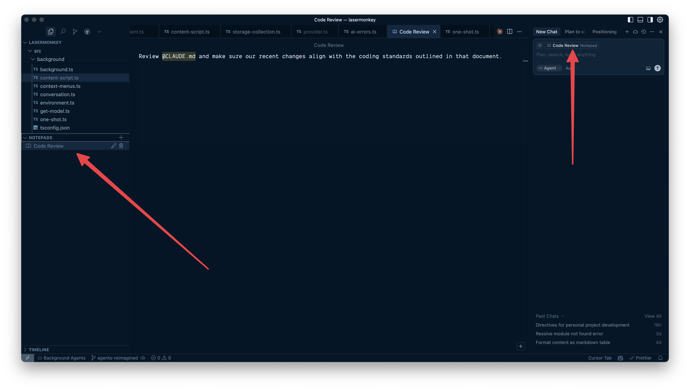

Cursor Notepads are essentially **drop-in Markdown pads that can bundle prompts, documentation links, file references, and rules**. They extend the capabilities of `.cursorrules` files by offering reusable contexts for your development process. Notepads accept rich text and can include `@file` mentions, allowing you to pin code or documents directly within the pad. They are accessible by their name using the `@` syntax (e.g., `@NotepadName`).

## Why Are Notepads Useful?

Notepads offer several significant benefits for developers using Cursor:

- **One-Click Context Reuse**: Instead of manually tagging multiple files for every session, you can tuck them into a Notepad once and simply reference the Notepad, this can be _huge_ time-saver.
- **Cleaner Mental RAM**: They help keep recurring prompts and complex instructions organized within a tidy module, rather than cluttering your chat history.
- **Agent Mode Booster**: Cursor's Agent mode respects Notepads, allowing your autonomous refactoring tasks to automatically inherit the standards and context defined within them.
- **Team Knowledge Hub**: Notepads can function as a "personal dev toolbox" for reusable code snippets, and they can be invaluable for onboarding new team members by providing architectural overviews, style guides, and relevant links in one place.
- **Dynamic Boilerplate and Templates**: You can create templates for common code patterns, store project-specific scaffolding rules, and ensure consistent code structure across your project. They can also drive Standard Operating Procedures (SOPs) and dynamic boilerplate generation without manual editing.
- **Centralized Documentation**: They are useful for storing architecture documentation (e.g., frontend specifications, backend design patterns, data models) and development guidelines (coding standards, project-specific rules, best practices, team conventions).
- **Saving Suggestions and Research**: Notepads can be used to save AI-suggested improvements or research findings, especially when web search results might be outdated. You can also embed `@docs` within notes to create specialized prompts for third-party libraries.

## How To Use Notepads

To get started with Cursor Notepads:

1. **Create a New Notepad** In the sidebar, locate the "Notepads" section and click the **"+" button**. Give your Notepad a meaningful name.
2. **Add Content** Populate your Notepad with Markdown text, add `@file` or `@folder` references, include web links, or attach images to provide context.
3. **Reference in Chat/Composer** To use the content of a Notepad, simply type the `@` symbol followed by the Notepad's name in any chat or Composer prompt (e.g., `@API_Guide`). Cursor will then inject the Notepad's content into the AI's context for that query.
4. **Synchronization** Notepads automatically sync across your local Cursor workspaces.

## Best Practices for Using Notepads

To maximize the effectiveness of Notepads:

- **Use Descriptive Names** Name your Notepads clearly, like "Auth_Rules" or "API_Guidelines," rather than vague personal notes, to make them easy to find and understand.
- **Keep Content Atomic** Since Notepads are not (yet) directly editable by the AI, it's best to split large documents into smaller, themed Notepads. This prevents "scroll hell" and keeps context focused.
- **Version Critical Information in Git** While Notepads are convenient, they are not stored directly in your Git repository. For information requiring version history or team-wide sharing, consider mirroring it in standard Markdown files within your codebase.
- **Curate and Lint Content** Treat Notepad content like code: use clear headings, bullet points, and avoid unnecessary fluff. Junk context can inflate your token usage and dilute the AI's focus.
- **Bundle Repeated Prompts** Store frequently used prompts (e.g., "write exhaustive unit tests") in a Notepad. This can lead to faster workflows and reduce AI hallucinations.
- **Combine with `.cursorrules`** Use project-level `.cursorrules` files for always-on constraints (e.g., "always use TypeScript") and Notepads for "sometimes-on" or dynamic context (e.g., "legacy Stripe migration details").
- **Regularly Audit** Schedule periodic reviews of your Notepads to remove stale links or outdated rules, preventing "context rot".
- **Avoid Sensitive Data** Do not store temporary notes, version control information, or sensitive credentials directly in Notepads.

## Current Limitations and Caveats

- **No In-Place AI Editing**: The AI cannot directly rewrite or modify the content of Notepads.
- **Token Cost**: Larger Notepads can still contribute to higher token usage, impacting cost and latency.
- **Storage and Sharing**: Notepads are stored in local SQLite databases (e.g., `AppData/Roaming/Cursor/User/workspaceStorage/{some_uuid}/state.vscdb` on Windows). This makes sharing them across different machines or with teams cumbersome, as they are not version-controlled by Git and lack built-in import/export functionality.
