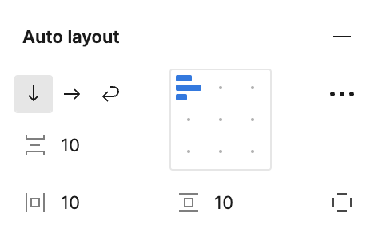
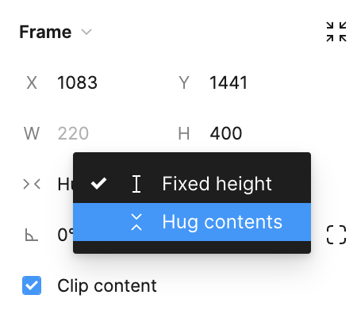

Manually adjusting everything is hard and we certainly don’t arrange our UIs by pixel in the browser. Imagine if everything you already know and love about [flexbox](https://developer.mozilla.org/en-US/docs/Web/CSS/CSS_flexible_box_layout/Basic_concepts_of_flexbox) was available to you? Well, it is. It just goes by the name auto layout.

> [!WARNING] Frames only
> Auto layout is only available in [Frames](layers.md#frames).

## Shortcuts

- **`Shift-A`** will turn any frame into an Auto Layout frame.
- **`Option/Alt-Shift-A`** will remove Auto Layout from a frame.
- **`Shift` and drag a handle**: Drag padding/spacing with big nudge steps
- **`Option` and drag a handle**: Drag padding from both sides
- **`Shift+Option` and drag a handle**: Drag padding from all sides
- **`Option` and click on the padding area**: Edit both padding sides
- **`Shift+Option` and click on the padding area**: Edit all padding sides
- **`Command/Control` and click on the padding input field**: Edit all padding in design panel
- **Double click on the edge**: Set hug contents
- **`Option` and double click on the edge**: Set fill container
- **`Option` and select Fixed Size for text**: Set text resizing to text truncation
- **Click on the alignment widget + `Up`, `Down`, `Left`, or `Right`**: Set alignment stepwise
- **Click on the alignment widget and press `W`, `A`, `S`, or `D`**: Set alignment to edge
- **Click on the alignment widget and press `V` or `H`**: Set alignment to center vertically or horizontally
- **Click on the alignment widget and press `B`**: Toggle baseline alignment
- **Click on the alignment widget and press `X`**: Toggle space between

## Understanding Auto Layout

Auto layout adds a structure to your frames and components, allowing them to resize content automatically based on the properties you define. It's particularly useful for designing interfaces that need to be responsive or adapt to content variations, such as text changes, navigation bars, or dynamic lists. As I mentioned above, if you think you might use flexbox in your implementation, then you'll probably choose to use auto layout in Figma.

Looking at the screenshot above, you can see the following controls:

- The ability to set the direction of the elements in the auto-layout. You can think of this as similar to `flex-direction` in CSS.
- The gap between the times. This is similar to the `gap` property in CSS.
- The horizontal and vertical padding of each item. To no one's surprise, this is similar to `padding` in CSS, but applied to each of the items from one place. You can also set the individual padding by using the little square icon located at the bottom-right of the control pane.
- In the grid that it's the center, you can set the alignment and justification. This is similar to `justify-items` and `align-items` in CSS.

There are also some advanced settings hiding out in the little menu along the right-side of the control panel.

## Setting Up Auto Layout

To apply auto layout, select a frame or group of objects and click the "Auto Layout" button in the right-side panel. From here, you can define properties such as spacing, alignment, and direction (horizontal or vertical), which determine how the elements within the frame will behave.

The really cool thing about using auto layout is that you no longer need to resize your frames in order to accommodate new items.

This works because in this case, sizing is controlled by the `Hug` value in the frame size. This instructs the frame to adapt to the size of its children.

You can control this by using the caret next to the value.

## Minding the Gap

When you're basing the size of the frame based on it's children, then you can provide a value that represents how many pixels you want in between each child. Alternatively, if you want to use a fixed size, then you can set the `gap` to auto. This will spread the children out evenly across the entire height or width of the parent frame. You can think of this like using `justify-items: space-between` in flexbox when using CSS.

> [!TIP] Keyboard shortcut
> You can quickly switch between fixed and automatic spacing using **Command+X**.

Now, the you can resize the frame and the elements will distribute themselves evenly. The ability for frames to adapt to the size of their children and be able to maintain consistent spaces are basically two of the most common use cases for using auto layout.

## Adjusting the Padding

Trying to grab the corners of the frame to resize it will switch the horizontal and/or vertical resizing from **Hug** to **Fixed**. However, if you want to click to change the padding, you can do that as well, you just need to be a _little bit_ more precise as to where you click to drag.

## Accounting for Strokes

When determining the size of objects for auto layout, strokes are not considered, so they do not impact the parent frame or other nearby elements.

This might not be the best approach for developer handoff since it doesn't show how CSS displays borders accurately.

To address this, you can decide if strokes should occupy space within an auto layout frame. Simply access the advanced layout settings and use the dropdown menu next to **stroke** to choose between **included in layout** or **excluded from layout**.

## Nesting Auto Layouts

Nested Auto Layouts in Figma help designers create layouts that adjust smoothly to different content and device sizes. By nesting Auto Layout frames within each other, designers can blend the benefits of Auto Layout with complex designs, making layouts that adapt easily to changing content.

### Selling Points of Nested Auto Layouts

1. **Responsive Design:** Nested Auto Layouts automatically adjust design elements to fit various screen sizes, crucial for responsive designs.
2. **Content Flexibility:** Perfect for designs with changing content needs, like dynamic lists or user-generated content, without requiring manual adjustments.
3. **Organized Design:** Nested Auto Layouts keep your Figma layers tidy and structured, simplifying the management of intricate designs.

### Some Pro-Tips for Working with Nested Auto Layouts

- **Learn Auto Layout Features:** Understand how properties like spacing and padding impact layout design, especially when nesting layouts.
- **Plan Your Design:** Map out your component structure before nesting layouts to ensure elements relate properly and adjust as needed.
- **Utilize Variants:** Pairing variants with nested Auto Layouts boosts component flexibility and reusability, expanding design possibilities.

### Practical Applications

- **Forms and Lists:** Ideal for creating forms and lists that adapt to varying content lengths or additions.
- **Responsive Navigation Menus:** Craft navigation menus that adjust to different screen sizes, showing more items on larger screens and simplifying on smaller devices.
- **Cards and Tiles:** Design card components or tiles that resize based on content, maintaining consistent spacing and padding.
