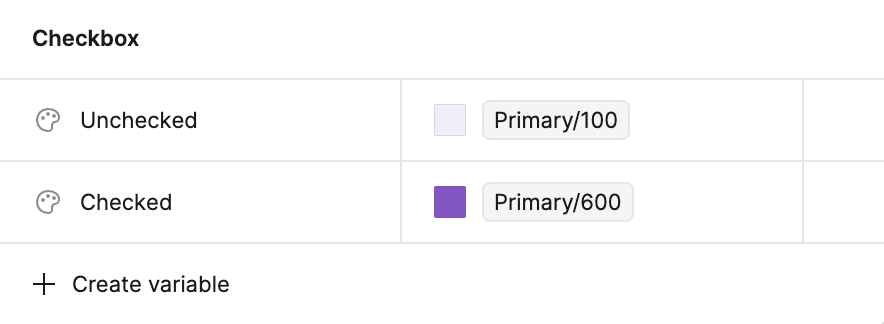
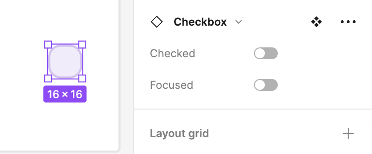
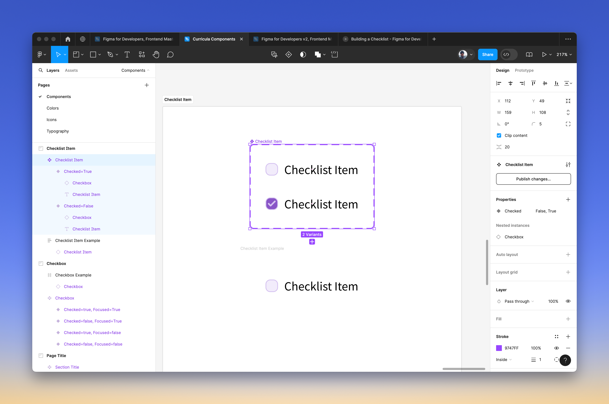

> [!success] Solution
> This is the solution for the exercise in the section on [interactive components](interactive-components.md).

Let's start by setting up some color variables. I have long given up have the smallest possible set of variables for colors humanly possible. I now aim for the smallest set _practically possible_. So, I'll probably make two variables for the background colors of the checkbox.

I going to make a few variations:

- **Checked** can either be true or false.
- **Focused** can either be true or false.

I'll end up with something like this.

And now, we want to create a component set. Since I did a good job with my naming, we should get a fair amount for free here.

Next, we want to add an interaction to the component.

If you wanted to, you could try to simulate the focused state with a hover transition, but that feels a little forced, so I'm not going to.

You can see in action [here](https://www.figma.com/proto/k2WU0bJ53LG4Kl6hoBCITR/Curricula-Components?page-id=0%3A1&type=design&node-id=22-1009&viewport=-5532%2C-4146%2C5.6&t=AyXsLsPZMzFZrDNN-1&scaling=min-zoom&mode=design).

<iframe width="100%" height="450" title="Figma Checkbox Component" src="https://www.figma.com/embed?embed_host=share&url=https%3A%2F%2Fwww.figma.com%2Fproto%2Fk2WU0bJ53LG4Kl6hoBCITR%2FCurricula-Components%3Fpage-id%3D0%253A1%26type%3Ddesign%26node-id%3D22-1009%26viewport%3D-5532%252C-4146%252C5.6%26t%3DAyXsLsPZMzFZrDNN-1%26scaling%3Dmin-zoom%26mode%3Ddesign" allowfullscreen></iframe>

## Expanding the Component

Next, we're going to expand our checkbox to be a checklist item. This isn't anything we haven't seen before. We just need to create a component that also has some text and [auto-layout](auto layout.md).

**The problem** with this component is that only the checkbox is interactive. We want to make clicking the element itself interactive.

Instead, we need to do something similar to the checkbox component and create two variants and connect their interactions. The **good news** is that we _still_ inherit from the **Checkbox** component in terms of style. But, I haven't found a good way to pass component properties through.

Now, the next logical thing to do is to make a checklist component with multiple checklist items. But, for that, we'll need to leverage a technique called [cropped grid components](cropped-grid-components.md).
