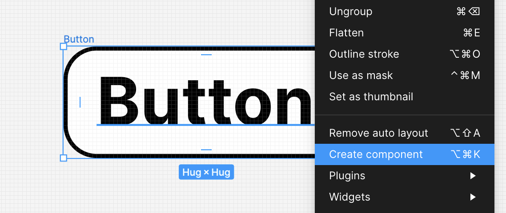

Components in Figma are like handy tools that help designers create elements they can use again and again in different projects. These elements, ranging from simple icons to more complex UI sections, make designing easier by keeping everything looking consistent and saving time. Let's dive into how to make the most of components in Figma to improve your design process.

In Figma, a component is a reusable element that you can use in all your design files. Once you create a component, you can add copies of it anywhere in your designs. Any changes you make to the original component automatically update all its copies, keeping your design consistent throughout.

**TL;DR**: If you're going to be using it more than a couple of times, you should consider making it a component.

I probably don't need to sell you on the value of using components in your designs (or your implementations for that matter), but let's list out some of the high-level benefits—if only in the name of completeness:

1. **Consistency:** Components help keep elements like buttons and icons looking the same on all pages and projects.
2. **Efficiency:** By reusing components, you save time instead of recreating them every time.
3. **Flexibility:** You can customize instances without changing the master component, striking a balance between uniformity and creativity.
4. **Collaboration:** Shared component libraries help teams work with a common design language and make it easier to hand off designs to developers.

Your available components can be found in Assets mode in the left-pane of your workspace. That said, until you've created some components, there isn't much to see here.

## Creating Components

To make a component, just choose the element you want to use and click the "Create Component" button or use the shortcut `Ctrl/Cmd + Alt + K`. This element becomes a master component, and you can easily add copies from the Assets panel to your canvas.

You can create a component using the context menu by right-clicking on the object that you want to turn into a component.

You can also create a component using the center of the toolbar menu when you're selecting an object.

## Using Instances

Copies of the master component are called instances and they keep the same properties. You can change specific details in each instance (like text or color) without changing the master component. This way, you can have different designs while keeping the main properties consistent.

Once you've created a component, you can see it in that pane that we looked at earlier that was empty.

Simply drag the component onto the canvas to use it. Changing the main component will cascade down to the individual component, but you can also override certain properties on the instance component. In the example below, we'll create a component and then override its text content as well as its background color.

### Detaching an Instance from a Component

If you no longer want an instance of a component to inherit properties from the main component, you can choose to detach it from the component—effectively breaking the prototypal inheritance chain.

The shortcut for detaching an instance is `Option/Alt-Shift-B`.

## Organizing Components

Figma's Assets panel is where you can keep all your components organized. You can create a library of components to share with your team, making sure everyone uses the same elements. Naming them well and grouping them helps you find and use components quickly.

[Sections](layers.md#sections) are useful not only for marking whether or not a given component is ready for development, but also add a layer of organization to your [Assets](getting-started.md#assets) panel.
