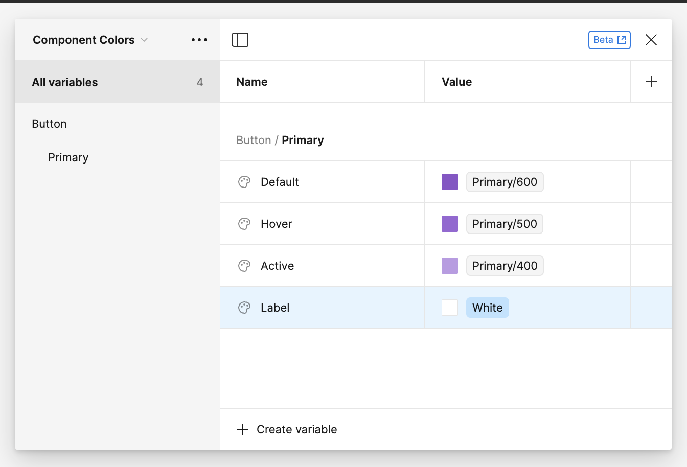
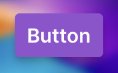
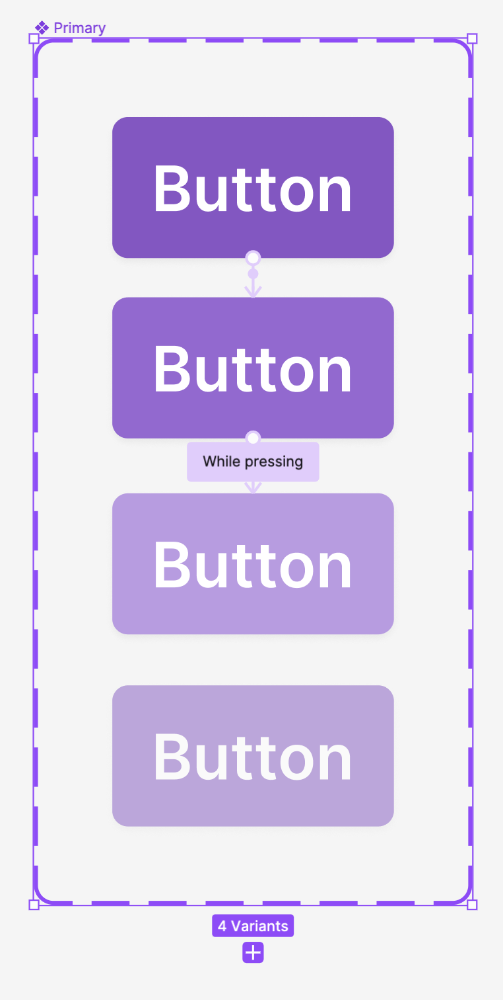

Let's walk through the steps of creating a button component in Figma. One of the things that makes the button component particularly interesting to work on is the sheer numbers of flavors that it comes in.

We're likely going to have a few major types of buttons in our design system.

- Primary
- Secondary
- Destructive
- Ghost

Each of those buttons is going to have some different states that it can be in.

- Default
- Hover
- Active
- Disabled

That's already 16 buttons and we haven't even begun to consider that they can come in various sizes.

- Extra Small
- Small
- Medium
- Large
- Extra Large

## Breaking Ground

The first and easiest thing to do is start with some text for the label of the button.

Next, we'll convert to an [auto-layout](auto layout.md) layer by pressing **Shift-A**. Figma will do its best to set some padding, but we'll need to do some adjustments.

We'll give the following values:

- Horizontal padding: `10px` or the `2.5` spacing token.
- Vertical padding: `6px` or the `1.5` spacing token.

This, of course, is only for the default button, which for our purposes, will be medium.

We'll use the **primary** variant as our default as well. I can hear an argument that we should use the **secondary** variant as well. You're welcome to go down that path if you'd like.

> [!tip] Create specific variables for the component color
> I can reference my color directly, but what I like to do here is create a new variable that references my color token. My thinking here is that I might have other kind of button that are not variations of this button _and_ if I need to go to a different shade, then I don't want to have to change all of them. For me, this also maps to how I might think of it in code.

> [!question] Could I go as far as to extend this to my spacing and border radii?
> I probably could and maybe I should. The only thing stopping me is that I have a number of other sizes that I might have to deal with and I have some fears that things will get out of control.
>
> My general feeling is that I'd rather wait to see if I can can cull the larger list of tokens and just have a more limited set that I can rely on and change throughout my design.

Some other little tweaks:

- I'll use the `rounded` variable to give it some rounded edges.
- I'll use the `shadow-sm` to give it a slight shadow.
- I'll use a semibold font weight for the label.

## Creating the Variants

I'll create a component and then give it three variants for the state. I'll name the layers as follows:

- **Primary Button/State=Default**
- **Primary Button/State=Hover**
- **Primary Button/State=Active**
- **Primary Button/State=Disabled**

When I got to make the component set, it'll automatically know the correct names and values for the attributes.

## Setting Up the Interactions

Let's get the interactions in place now so that like is easier when I begin to make copies of the component.

While hovering, we'll transition to the hover state and when hovering, we'll transition to the active state.

## Creating the Other Buttons

Creating a secondary button isn't much different. I added a variable for the border as well. Arguably, I could/should do this for the primary button as well but with a transparent border. But, it's probably not necessary—other than a bizarre need for consistency.

The same process should do the trick for the other variations as well. To do this, I'll both duplicate the groups of variables and then also duplicate the components.

## Next Steps

There are two next things we can do:

- [Supporting a dark theme with modes](adding-a-dark-theme-to-the-button.md)
- [Adding icons to our button](adding-icons-to-our-button.md)
