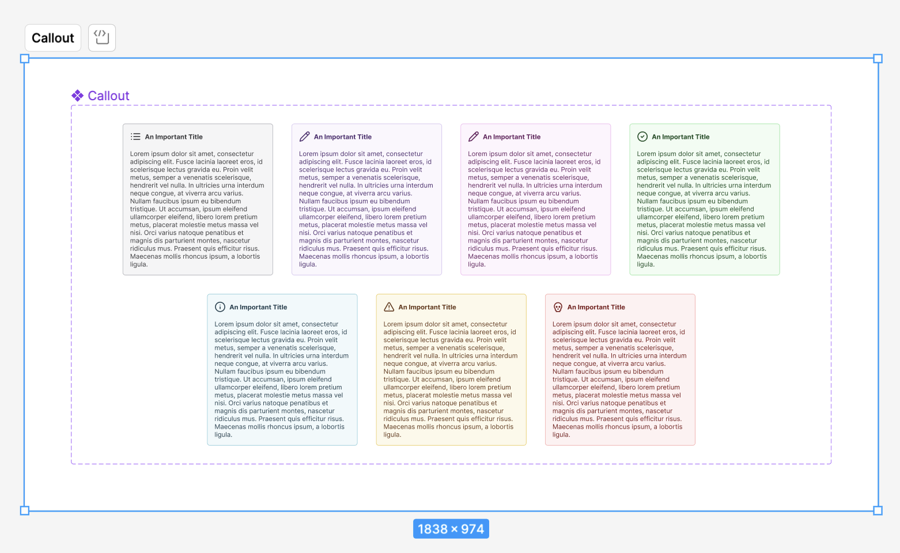
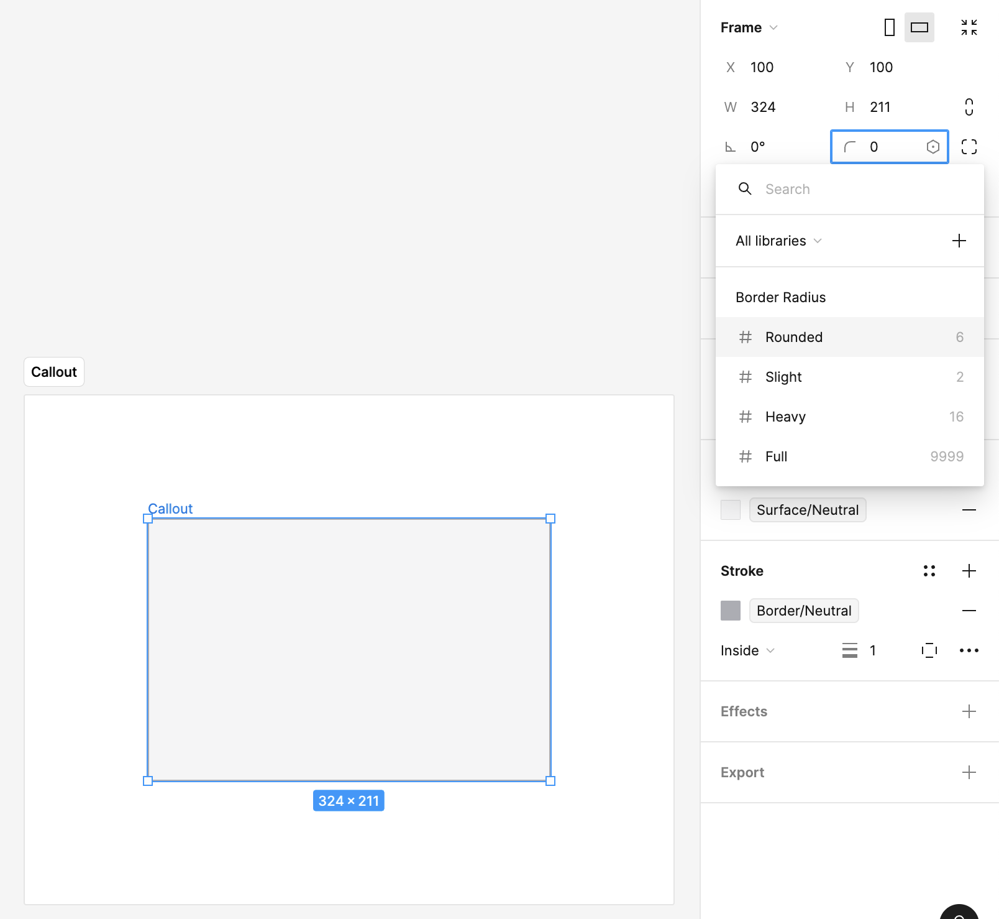
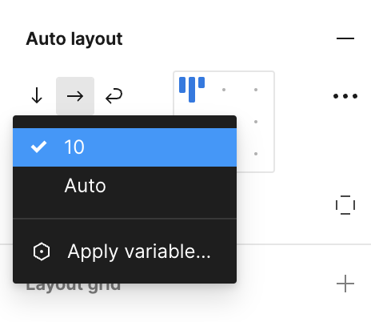
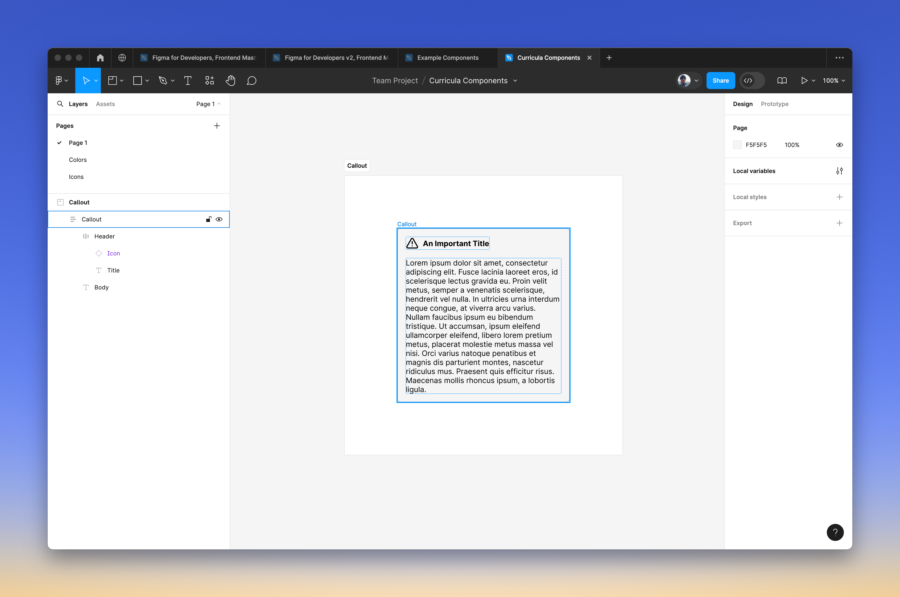
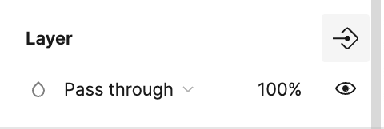

Let's look at taking some of the concepts we've learned so far and creating a **Callout** component that we can use in our designs. Our end result will look _something_ like this.

## Surface and Border Colors

We'll start with a basic frame, but we want to give it the background and border variables that we set up in the [semantic colors](semantic-colors.md) section.

## Border Radius

Next, we'll attach our [border radius variable](number-variable-tokens.md).

## Using an Auto Layout

We're probably going to end with two auto layouts.

- One between the icon and title and the body text. This one will be the component itself.
- One for the icon and title.

Pressing **Shift-A** on the component will turn it into an auto layout frame.

From here we'll use our [spacing variables](number-variable-tokens.md) to set the padding and gap on the auto layout.

We'll use that **slight** spacing between the icon and the title and then our **base** spacing for the padding of the callout and the spacing between the title and the body.

We now have a pretty good stating place for our callout component.

We're ready to go ahead and select **Create a component**.

## Setting up the Properties

We're going to want to expose some properties of our component in order to make it easier to work with.

Let's expose the nested properties from the **Icon**. Click the **+** next to **Properties** and select **Expose properties from Nested Instances**.

## Hiding and Showing the Body

We might not always want to show the body. In this case, we can connect it to a boolean [component property](component-properties.md) in order to create a toggle.

On the layer for the text of the body of the component, click on the little icon in the upper-right.

You'll then see a prompt that has most of what you want in place.

## Adding Variants

We now want to add the following variants:

- Primary
- Secondary
- Success
- Info
- Warning
- Danger

You can create [variants](variants.md) where you adjust the colors according to the [semantic-colors](semantic-colors.md) that we set up earlier. You can also go ahead and set a default icon for each—this can be overridden with the nested properties that we set up earlier.

## Extensions

In the name of time we're going to move on, but if the spirit moves you—or, if it ends up moving me. You can take your component and apply the following:

- Some kind of shadow effect to the callout itself.
- Apply our [typography](typography.md) styles to the title and body.
