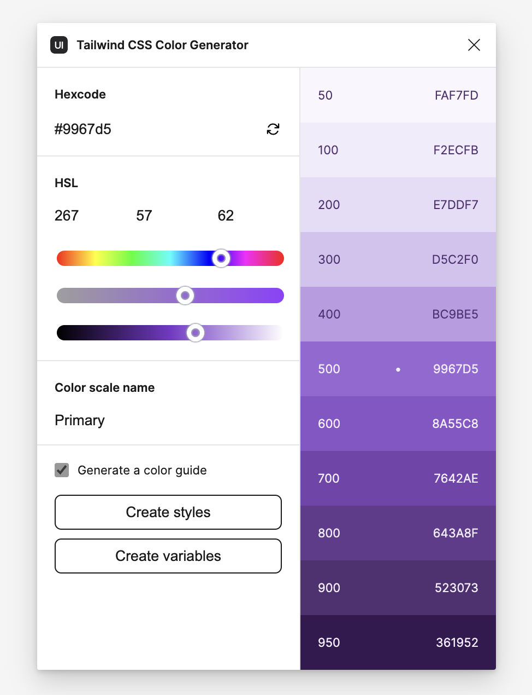

> [!TIP] Coming up with a color palette
> Color theory is a bit outside of the topics we're going to cover today, but I did want to point you towards a few tools that I use when I am trying to come up with a color palette. **Disclaimer**: I am an engineering and _not_ a designer.
>
> - [UIColors.app](http://uicolors.app)
> - [Coolors](https://coolors.co/)
> - [Paletton](https://paletton.com/)

There are two—well, really just one and a half—primary techniques for creating a color palette:

- Take some non-semantic tokens and just derive your semantic colors from there.
- Skip that step and just go with some semantic colors.

On a long enough timeline, you'll probably end up using a lot off different colors throughout your application, so it makes sense to go with the first approach, but you always want to end up with something closer to the second.

> [!EXAMPLE] The case for semantic colors
> Here is a **thought exercise**: Let's assume your company's brand is some kind of red color. So, you use `red` throughout your code and designs. And then, the corporate powers that be decided to do a rebrand or there is some kind of merger or acquisition. You're going to be a lot happier as a person/team if you used `brand` or `primary` instead of `red` everywhere. The same goes for things like success, error, information, and danger states.

I usually start with the following semantic colors:

- **Information**: Often represented by a blue color, signaling clarity and calm.
- **Success**: Green is commonly used, suggesting safety and "go-ahead".
- **Warning**: Orange or yellow, indicating caution but not immediate danger.
- **Dangerous Information/Actions**: Red, as it universally signals stop or error.

## Generating Color Variables

There are _a lot_ of tools out there for generating a color palette. I really like [uicolors.app](https://uicolors.app). They have a [really cool plugin for Figma](https://www.figma.com/community/plugin/1242548152689430610/tailwind-css-color-generator) that allows you to generate a color palette that aligns with [Tailwind](https://tailwindcss.com)'s semantics. You don't have to use Tailwind to use it either. It's definitely a nice jumping off point to begin with.

As you can see, instantly create [styles](styles.md) and [variables](variables.md) along the way. You can also check **Generate a color guide** to create a component that allows you to easily see your color palette.

## Exercise

Let's generate a color palette with the following semantic colors:

- **Primary**
- **Success**
- **Information**
- **Warning**
- **Danger**

Optionally, you can create a set **Neutral** and **Secondary** colors. Use a frame and [auto layout](auto-layout.md) to create a style guide for your tokens. It should look something like this.

## Using Colors in Code

You can hook these colors up to [dev-mode](dev-mode.md) or export the variables, but you can also use [**UI Colors**](https://uicolors.app) to create either a Tailwind theme or CSS variables that you can use in your actual code.

Clicking **Export** makes it easy to grab your styles as code in the format you need it.

There are also a number of other tools that you can use to get your variables out of Figma.

- [Token Variable Export](https://www.figma.com/community/plugin/1264267851877180830)
- [Advanced Variable Export](https://www.figma.com/community/plugin/1260472771849439434)
