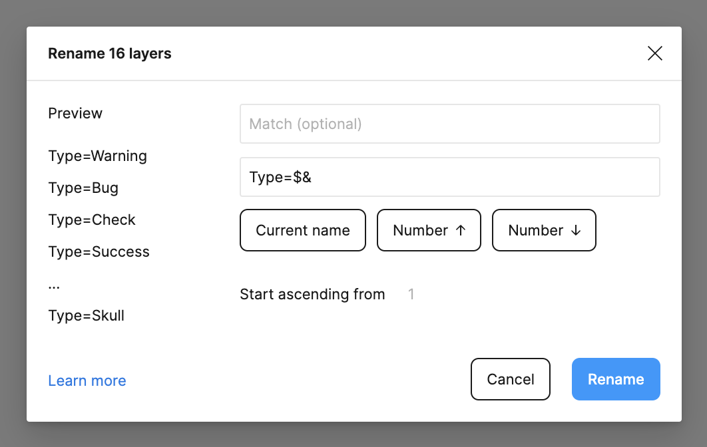
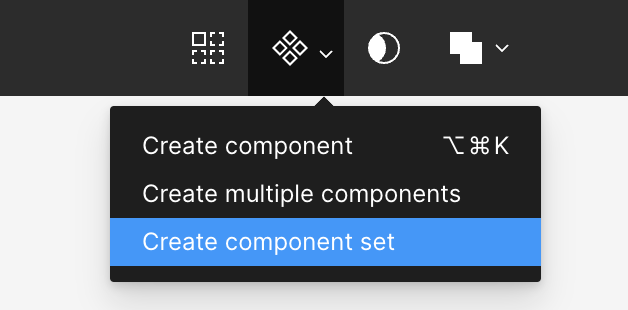

Any design system or application comes with a certain amount of iconography. This is always a tricky dance, you typically want **as many as you need and as few as you can get away with**. Again, I'll leave the philosophy and theory to the experts and we'll focus on the practical parts of how you can go about generating an icon library in Figma—and in [another course](../storybook/README.md), we'll look at how implement these in code.

For starters, I like [Lucide](https://lucide.dev) as a starting point for my icon library. At the time of this writing, it's got 1,452 icons, which seems like more than enough for our purposes.

Here is our plan of attack:

1. We'll go through [Lucide](https://lucide.dev) and select some icons that we want to use.
2. We'll create an **Icon** component in Figma.
3. We're make each icon a variant of that component.

## Bring an Icon into Figma

There are plugins for Figma, but honestly, it's super easy to just grab an icon as an SVG and paste it into Figma.

I'm going to copy in the following icons:

- [Triangle Alert](https://lucide.dev/icons/triangle-alert), which I will name **Warn**
- [Bug](https://lucide.dev/icons/bug)
- [Check](https://lucide.dev/icons/check)
- [Circle Check](https://lucide.dev/icons/circle-check), which I will name **Success**
- [Clipboard List](https://lucide.dev/icons/clipboard-list)
- [Flame](https://lucide.dev/icons/flame)
- [Circle Help](https://lucide.dev/icons/circle-help), which I will name **Help**
- [Info](https://lucive.dev/icons/info)
- [List](https://lucive.dev/icons/list)
- [Pencil](https://lucive.dev/icons/pencil)
- [Quote](https://lucive.dev/icons/quote)
- [X](https://lucive.dev/icons/x)
- [Zap](https://lucive.dev/icons/zap)
- [Plus](https://lucive.dev/icons/plus)
- [Trash 2](https://lucide.dev/icons/trash-2), which I will name **Trash**
- [Skull](https://lucive.dev/icons/skull)
- [External Link](https://lucive.dev/icons/external-link)
- [Link](https://lucive.dev/icons/link)
- [Hash](https://lucide.dev/icons/hash)

> [!TIP] I did the tedious part for you
> You can—and should—just [steal my icons from here](https://www.figma.com/file/1v4uGneHKyq6SfxPWI7KJc/Figma-for-Developers-v2%2C-Frontend-Masters?type=design&node-id=6-1296&mode=design&t=xaxtUNN7AZ04byvE-4).

## Creating the Components

If you want to make your future life easier—go and rename all of the components and prefix them with **Type=**, you can do this easily with **Type=$&**.

Next, we'll select **Create component set**.

You will now have an component that you can rename to **Icon**. This give you a quick and easy list of approved icons for use in your design system.
