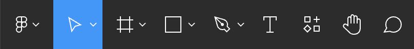
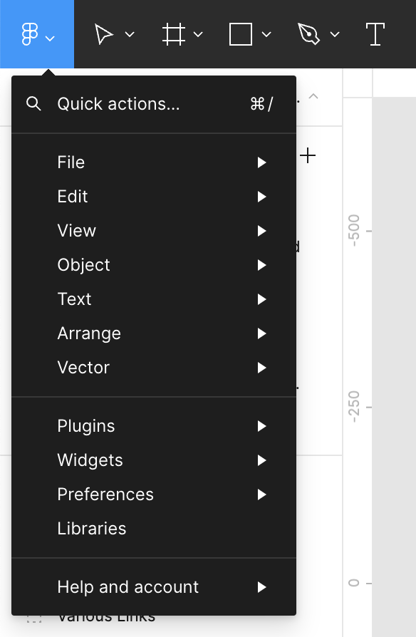
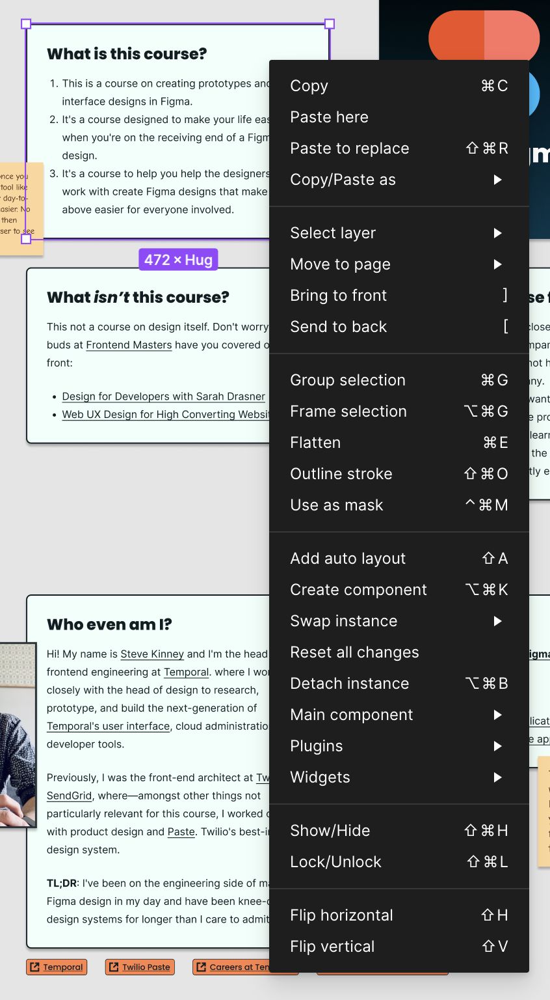

When you first enter Figma, you're greeted with the option to either create a new project or select a recent one.

Upon entering a project, you're presented with an interface similar to the screenshot below. Almost everything that you're going to do in Figma is going to be in this workspace.

In the center, you have the Canvas. Here are some helpful tips for navigating around the canvas:

- **Pan Around the Canvas**: Hold the `Space` bar and drag or do a two-finger drag on your touchpad.
- **Zoom In/Out**: `Command/Control +` or `Command/Control -`, hold the `Command` key while scrolling, or pinch on the touchpad.

## The Toolbar

The toolbar, located along the top, is where you find essential tools for drawing shapes, creating layers, adding comments, and more. A small caret next to some of the icons reveals a sub-menu with additional tools.

- **Move Tool (V):** The default tool for selecting and moving objects.
- **Frame Tool (F):** Creates frames, which are containers for other objects, useful for entire screens or components.
- **Shape Tools:** Includes Rectangle (R), Line (L), Ellipse (O), Polygon (P), and Pen (P) tools for drawing basic shapes and custom paths.
- **Text Tool (T):** Adds and edits text elements.
- **Hand Tool (H):** Pans around the canvas, can be temporarily activated with the Spacebar.
- **Zoom Tool (Z):** Zooms in and out of the canvas, also zoomable via keyboard shortcuts or trackpad gestures.
- **Comment Tool (C):** Facilitates collaboration by enabling comments on the design.

### The Figma Menu

At the toolbar's leftmost end is the **Figma menu**. In the [desktop application](https://www.figma.com/downloads), this menu combines application menu bar items with additional preferences.

The **Quick Actions…** menu item opens a command palette (using `Command/Control-/`) that lets you quickly search for and execute commands.

### File Options

When you haven't selected any layers, you'll see information about the current file in the center of the toolbar.

The center of the toolbar displays the current file name, surrounded by various file-related options. Figma tracks revisions, allowing access to version history.

### Layer Options

Selecting a layer changes the toolbar center to display a set of layer-specific tools. You'll no longer see the name of the file in the center of toolbar until you deselect whatever layers that you've chosen.

These options allow you to reset changes, create components, use masks, combine selections, and mark designs as ready for development.

### Account, Sharing, and Dev Mode

The right end of the toolbar shows account information, sharing options, and a switch for [Dev Mode](dev-mode.md).

We'll talk a little bit more about [Dev Mode](dev-mode.md) in a little bit, but I'd be remiss if I didn't point out that this feature is only available on paid plans and is _not_ available on free plans.

## Left Side Panel: Layers and Assets

This panel has two sections:

- **Layers Panel:** Displays the design's hierarchical structure, crucial for organizing elements.
- **Assets Panel:** Houses reusable components and styles for efficient and consistent design.

### Pages and Layers

Figma allows you to organize your designs into pages. Within a page, you can see a list of all of the layers and objects in the currently selected page. The interface's left side lets you navigate between pages and view layers for the selected page.

### Assets

The Assets Panel is a repository for managing reusable components and styles, supporting team collaboration through shared libraries. This feature streamlines the design process and ensures design consistency.

## Right Side Panel: Design and Prototype

This panel features two modes:

- **Design Tab:** Contains properties for the appearance of selected objects.
- **Prototype Tab:** Offers tools for creating interactive prototypes by defining user flows and interactions.

> [!NOTE] Inspect Mode
> Previously, Figma had a third mode, called **Inspect**, in this pane. This functionality has been moved into [Dev Mode](dev-mode.md) and is now only available for paid accounts.

### Design

This is where the magic happens. The right side provides options for adjusting the properties of selected layers.

### Prototype

The **Prototype** tab enables the creation of detailed, interactive prototypes, enhancing the design process and facilitating user testing by simulating real user flows.

## Context Menu

Right-clicking a layer opens a context menu for layer-specific actions just like it does in many other applications. The tasting note here, of course, is that this is clearly a bespoke context menu and is available both in the Web UI as well as in the Figma desktop application.

## The Command Palette

Hitting `Command-P`/`Control-P` _or_ `Command-/`/`Control-/` will allow you to pull up the Command Palette, which makes it easy to search for and jump to any command that you need. This is also a great way to learn about some of the keyboard shortcuts that are available for common tasks.

## Keyboard Shortcuts

You can either use the Command Palette _or_ press `Control-Shift-?` and pull up this helpful guide for learning all of the keyboard shortcuts supported by Figma.

## Moving Around

You have a few options when it comes to moving around:

- Hold the `Space` key and then drag and round.
- Use two fingers on your track pad.
- Switch to the Hand Tool and drag around. (This is basically the same as holding down`Space`)
