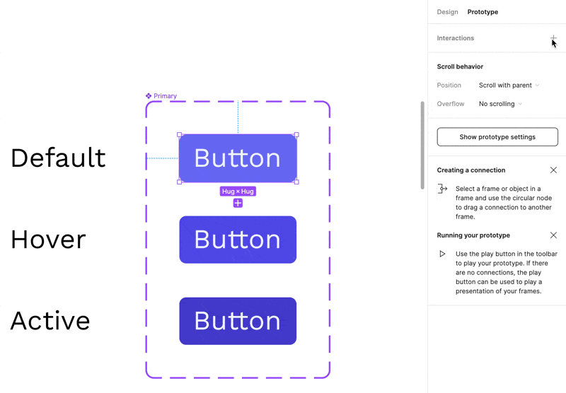

It turns out that users like to interact with these web pages that we build. Sometimes, they go as far as to expect that they'll behave like "Applications," I've been told. Interactive Components give us and our designer friends the ability to create components that are—umm—interactive.

Not only can we have lots and lots of different types of buttons, those buttons can be in different states based on user interaction. Consider this simple button for a moment.

We want our buttons to behave in our prototypes as they would in the browser. This is where that Prototype mode in the right sidebar comes into play.

## Setting Up Interactions with Variants

One option at our disposal is to swap between variables based on the user interaction.

And with that you should be able to see your button in action and interact with it.

> [!Example] Exercise
> Can you build a checkbox component that can be clicked to check the checkbox? You can find [the solution here](building-a-checkbox-component.md).
