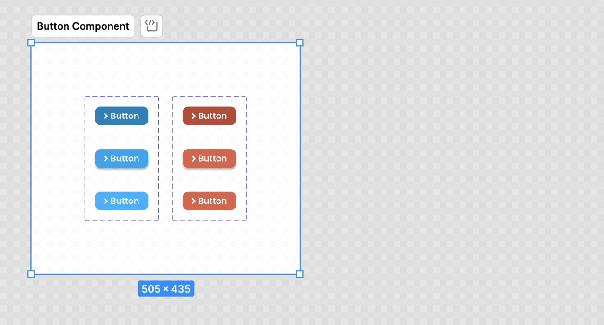

[Figma](https://figma.com/) features three key tools that appear similar at first glance: [**frames**](https://help.figma.com/hc/en-us/articles/360041539473-Frames-in-Figma), [**groups**](https://help.figma.com/hc/en-us/articles/360039832054-The-difference-between-frames-and-groups), and [**sections**](https://help.figma.com/hc/en-us/articles/9771500257687-Organize-your-canvas-with-sections). Each serves a unique purpose in organizing and designing within the platform. Let's delve into these tools to understand their differences and best use cases.

- [**Groups**](#groups) are ideal for quick, temporary arrangements and applying uniform styling across multiple elements.
- [**Frames**](#frames) serve as the fundamental structure for your design, accommodating everything from screen layouts to components.
- [**Sections**](#sections) offer a new, top-level organizational layer, perfect for enhancing collaboration and streamlining navigation and presentation.

## Groups

**Groups** are collections of elements that you've bundled together. This functionality is particularly useful for managing multiple objects simultaneously, reducing the repetitive task of selecting each one individually.

- They are simple and lack features like constraints or relative positioning.
- Ideal for temporary organization and simplifying the layers panel.
- Useful for applying effects to multiple elements at once.

To make a group:

- `Command/Control-G`: Makes a group out of the currently selected objects.
- `Command-Shift-G` or `Control-Shift-G` _unmakes_ either a group or a frame.

## Frames

A **frame** is a high-level grouping of objects. At the risk of sounding hyperbolic, they're the foundation of your designs in Figma. It's an area where you're going to create your design. You can set a frame's size to be any number of popular device sizes as well a custom size. You can also nest frames inside of frames. You might know a frame by any of the names that something similar might go by in some of the other tools out there: canvas or art board come to mind.

Frames are _way more_ powerful than groups, but with great power comes great responsibility, so sometimes it’s just easier to use a group.

- Frames can contain other frames.
- Frames can have their own height and width separate from then objects they contain.
- Frames support things like [Layout Grids](layout-grids.md), [Auto Layout](auto-layout.md), and [Constraints](constraints.md).
- Frames support [prototyping](prototyping.md).

When should you use frames?

- **Screen or Component Design:** Use frames to design the layout for different device screens, such as mobile phones, tablets, and desktops. They're also useful as the container for all of the elements that make up a component that you're designing in Figma.
- **Component Creation:** Frames are ideal for creating reusable design elements like buttons, icons, and input fields. They can be nested within each other, allowing for complex component structures.
- **Grids and Layouts:** Apply layout grids to frames to maintain consistent spacing and alignment throughout your design.

You can create a frame in any of the following ways:

- Use the **Frame tool**—by either selecting it from the toolbar or pressing the `F` key—and either pick a predetermined size from the right sidebar or click and drag to whatever size you’re looking for.
- Select a bunch of layers and press `Command-Option-G` or `Control-Alt-G` to create a frame around those layers.

## Sections

Sections are relatively new feature to Figma. Before sections were introduced, we tended to use frames to create logical groups. Additionally, you'd use stuff like emoji or other clever ways to signify if something was ready for development or not. Sections fill in for these two purposes.

Sections are visually distinct from frames _and_ they allow you to denote if something is ready for development or not.

Sections are also a good choice in the following scenarios:

- **Prototyping:** Organize and group prototypes effectively, linking different parts of the prototype for a cohesive flow.
- **Presentations:** Improve user tests by ensuring Figma remembers the last viewed frame within a section, streamlining the presentation experience.

To create a section, press `Shift-S` or select it from the toolbar.
