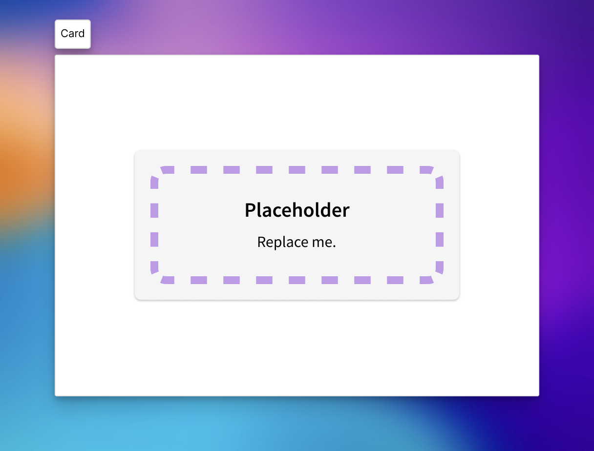
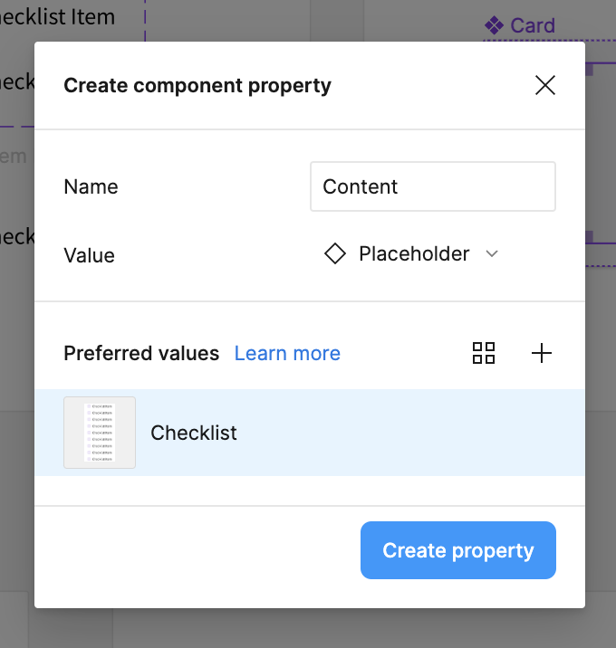

Once of the things we learned with components is that we can't have open slots. We can only do one-for-one replacements of components. One trick is to have an otherwise-useless, placeholder component.

I like to make two:

- A very obvious placeholder component
- And a variant with zero height.

Your placeholder components can look like anything, this is what one that I whipped up real quick looks like.

And then I can create something like a generic card component where I want to be able to swap in a component.

> [!Warning] Make sure to set the placeholder to fill the container for both width and height.

## Setting Up an Instance Swap

With my component in place, I want to set up the ability to do an instance swap of the placeholder component

And now, you can select any components that you want to as preferred components, but honestly, this is just a shorthand, you can pop in any component that you want.

And now you can swap in some other component into this card. This is also a reasonable strategy for [base components](base-components.md), but it _definitely_ still feels like a hack—so, I'd probably use it sparingly.

