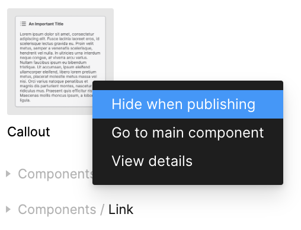
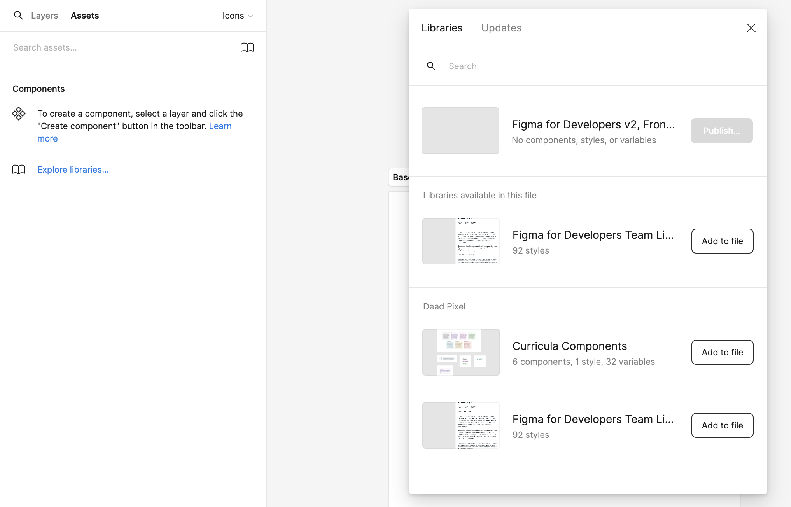

You've done all of this work to create your tokens, variables, and components. Now, we want to publish those libraries for use across your organization. You can publish the library from the center of the toolbar.

From there, you can select what components that you want to publish. For example, you might not want to publish your [base components](base-components.md) or primitive tokens. If there are any components that you _don't_ want to publish, you can select **Hide when publishing**.

Once you're ready to publish, you can select which changes you want to publish.

## Using a Library

Now, from within any project inside of Figma, you can easily add that library to your project.

## Updating Libraries as a Consumer

If a library that you rely on updates, you'll see it in the toolbar. This will allow you to review the changes before they're automatically applied.

