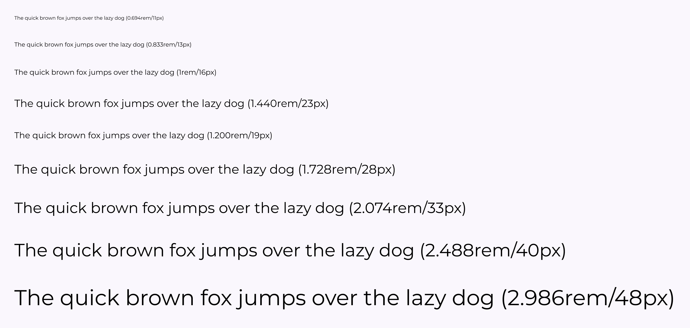

> [!warning] Text properties currently do not support variables
> [Variables](variables.md) are still in beta in Figma. At the time of this writing, there is no support for styling text using variables. However, it _is_ on the roadmap and variables _will eventually support variables_. But, for now, we must use [styles](styles.md).

We can save any styling we do the text of a layer as a [style](styles.md). This allows you to update the style and then have any layers that use that style immediately inherit the changes.

> [!TIP] Using a slash in the title of style will help organize them
> As with a lot of different things in Figma, using a slash in the title of the style adds a layer of organization.
>
> 

## Viewing and Editing Text Styles

You can view, edit, and organize your text styles by clicking on the workspace (e.g. not any of your layers) and then looking in the **right sidebar**.

This technique works if you have an existing type system that you're looking to port into Figma. The other alternative is to generate your own typography system.

## Generating Your Own Typography System

### Typescales

There are a number of plugins out there for generating a typography system. One way to get started is to use the [Typescales](https://www.figma.com/community/plugin/739825414752646970) plugin.

This will create a layer that you can further style with the font you want and then create styles for.

### Typescale

Another approach is to use the [Typescale](https://www.figma.com/community/plugin/967802396210455992) plugin. The difference here is that we start with a base style and then let it do some math to figure out the rest of our typography system.

The end result needs a little bit of massaging, but you can quickly get it looking nice using [auto layout](auto-layout.md).

## Bulk Creating Styles

With some kind of type system in place, you can use the [Styler](https://www.figma.com/community/plugin/820660579767995949) plugin to bulk create styles. The Styler plugin will use the names of your layers in order to name the styles and it's much easier to rename layers than it is to rename styles (e.g. using **Command/Control+R**). The good news is that if you mess up, you can rename the styles and run the plugin again. Styler is smart enough to figure out that you're just renaming some styles.

> [!Example] Exercise
> Go ahead and create a set of bold fonts based on your current type system—or generate a new one if you want. Use **Styler** to bulk create your styles.
