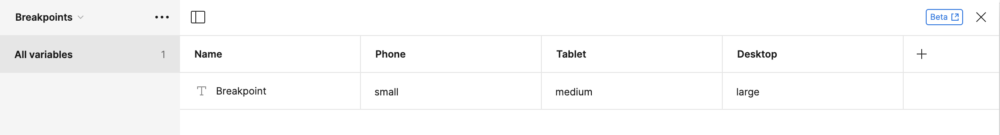
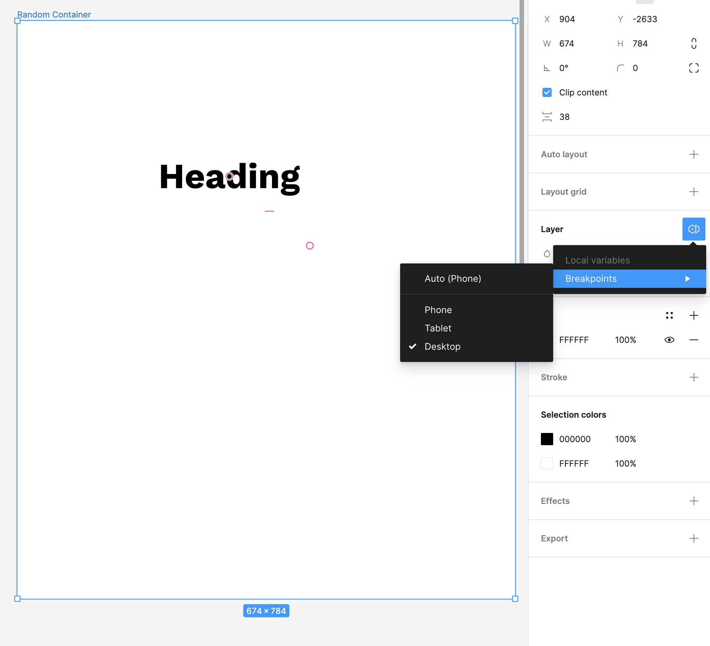

Let's start with a component that looks something like this:

In the example above, we have one heading component that has three different variants: One for each size.

Next, we'll set up a variable that has one of three modes: **Phone**, **Tablet**, and **Desktop**. The important part is that there should be a direct mapping from the variable's value in each mode and the name of the variant.

Now, here is where the magic happens. Let's treat our initial component as a [base component](base-components.md). You can rename it to **Base Heading** if you want.

Create an instance of your base component and assign the variant to your new variable.

Create a component out of that new instance you just created.

We're not going to use the base component anymore at this point. Just our new **Heading** component. Now, you can set the mode of any parent frame and all of your components will instantly switch to the variant with that name.

