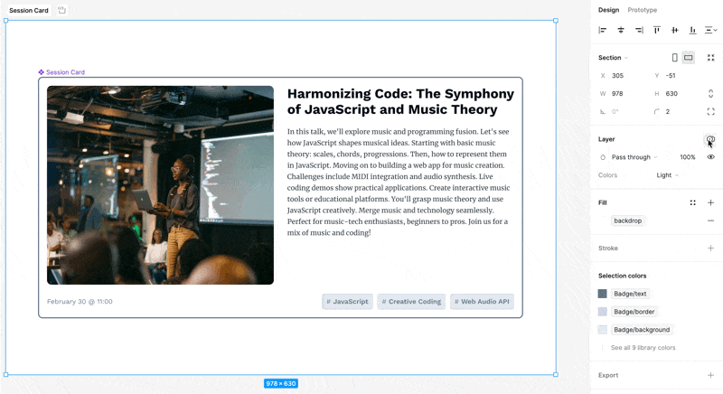

Just like in JavaScript, variables in Figma act as placeholders that store specific—and reusable—values. These values can be anything from color codes, font sizes, spacing measurements, to text strings. Once defined, these variables can be applied to properties of different design elements within your Figma files.

> [!NOTE] Release Status
> As of the time of this writing, Variables are still in beta. Variables aren't available for everything—just yet. But the list of things that support variables is likely to increase over time.
>
> There is also some overlap with [styles](styles.md), you can read more about the differences [here](styles-vs-variables.md).

- Variables are local to the file that you'e currently working in.
- You can publish your variables as a [library](libraries.md) like you would publish components.
- You can have one or more collections of variables.
- You can organize your variables into groups.

## Setting Up Variables

Creating variables in Figma is straightforward. You define a variable and assign it a value, such as a HEX code for a color or a numerical value for spacing. These variables are then available to be applied to any relevant property in your design, such as fill color or padding.

You can create a variable and see a table of all of your local variables can be seen by clicking on the Canvas and the selecting **Local Variables** from the **Design** panel.


Your variables must be one of the following types of values:

- Colors
- Numbers
- Strings
- Boolean

> [!NOTE] More Variables Are Coming Soon
> According to Figma support for gradients, images, and typography is [coming soon](https://help.figma.com/hc/en-us/articles/4406787442711-Figma-beta-features#Coming_soon).


Once created, your variable will be available in a table for you to adjust as needed.


Now, for values that accept whatever variable type that you're using, you can opt to use your new variable instead of a hard-coded value.


Now, when you adjust that variable, anything referencing that variable will update accordingly.


> [!TIP] Duplicating variables
> **Shift+Return** will create a new variable with the same properties.

### Scoping Your Variable to Particular Properties

If you don't only want your variable to be available to particular properties—or, you want a quick cheat sheet to see what properties your variables support, then you can check out the scoping of the variable.


You can also adjust the name of the variable in [Dev Mode](dev-mode.md).


Let's say you used something like the screenshot above, the output of the CSS in Dev Mode, would now look something like this.

```css
border-radius: var(--rounded);
border: 1px solid #000;
background: #fff;
```

What's even better is now, you can use a plugin—like this [CSS Variables Generator](https://www.figma.com/community/plugin/1271829798610738782), for example, to generate a manifest of all of the CSS variables used in the design. The output of the plugin looks like this:

```css
:root {
	--rounded: 16px;
	--rounded-rem: 3.125rem;
}
```

> [!TIP] Bulk editing variables
> You can change the properties of multiple variables by selecting them and right-clicking.

## Grouping Variables

It _is_ possible to put variables into groups. Simply select some of your variables and right-click on the selection.


And now you're variables will be a neat little group for you.


> [!info] Naming things is hard
> On my team, we've struggled a lot with what to name our variables. This existence of light and dark modes certainly add a lot of extra complexity. For example, it's hard to call a color variable, `red-light`, if it's actually _darker_ when in dark mode. I don't hate the naming conventions that [Twilio uses for the design tokens in their Paste design system](https://paste.twilio.design/tokens/list).

## What Are the Difference between Styles and Variables?

In the past—e.g. before Variables were introduced—it has been common to use [styles](styles.md) in order to share colors—and other properties—between elements. So, how are a variables and styles different and which should you use when?

Think of variables are one single unit or a primitive, while styles can be a composite of multiple colors or even images. A style can be made up of multiple variables.

The most salient bit, is that variables make it easier to do theming. Let's talk more about that below.

## Modes and Theming

The values of a given variable can be split into one or more modes. The most common use case for this light and dark modes, but these modes could be used for any number of different themes. You could also create a "comfortable" and "compact" mode as seen in Gmail.


### Dark Mode

But, the most common case that we might find is adding the ability to theme a component—more specifically to set it up to support a light and a dark mode. You can do this by setting up two different modes for your color variables. Once this is set up, you can easily toggle between the two modes in the Layers pane in the right sidebar.



What's really cool about this is that all of the nested objects will inherit mode of the parent—unless you intentionally override it.


## Boolean Variables

Boolean variables are useful when you want to show or hide something. Lets's start by making a boolean variable. We can then use the modes associated with this boolean variable based on what mode we're in.

## Variables, Modes, and Inheritance

Modes are inherited from their parent. Components that are set to `auto` will inherit from the mode that that parent layer is set to.

## Aliasing Variables

You can also have variables reference other variables. This is mostly useful for when you want to have a wide rang of primitive values and then a few semantic variables that are based off of those primitive values.


Once, you've set up the aliasing, you'll see a clear visual indicator of the link in the UI. You can still tweak all of the settings as to where the variable can be used as well as the output as seen in Dev Mode.


## Some Limitations

Here are some limitations that I've noticed while using Variables in Figma. As I mentioned above, Variables are still in beta, so this list will _hopefully_ be out of data at some point.

- You can't use mathematically expressions either with Variables or when defining variables. For example, you can type "300-32" as in the width box, and Figma will compute that down to 268, but you can't put you couldn't for example, put in a "300 - `spacing-4` \* 2" or create a set of variables that take a base REM value and multiply it when defining a new variable. There is an [open thread](https://forum.figma.com/t/using-expression-as-a-variables-value/45743) or [two](https://forum.figma.com/t/using-expression-as-a-variables-value/45743) requesting this as a feature.

## Importing and Exporting Variables

Figma doesn't support importing to exporting variables out of the box, but there is a plugin that you can use called [Export/Import Variables](https://www.figma.com/community/plugin/1256972111705530093/export-import-variables).

> [!tip] You might choose to use this with [the author's](https://www.figma.com/@honzatmn)'s [Tailwind CSS Variables](https://www.figma.com/community/file/1255212493834031845) design file.
