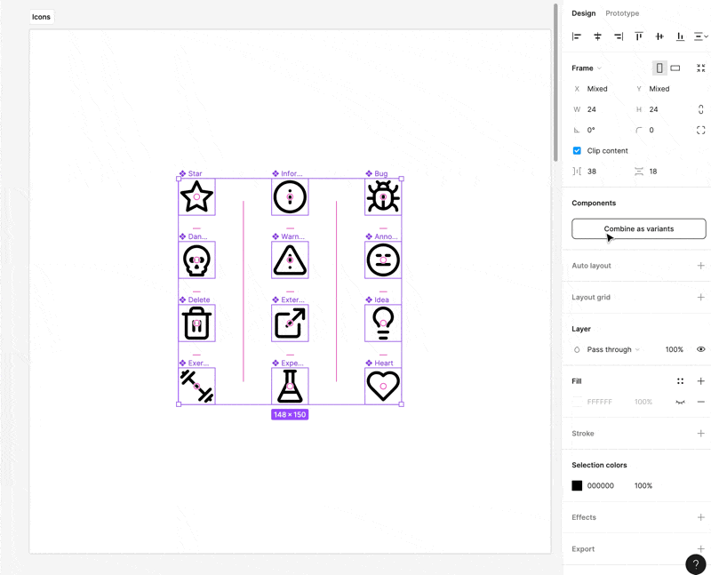

We all know that there usually isn't just _one_ button. Buttons come in lots of shapes and sizes.

**TL;DR**: A variant is just a different version of a component. You can have a **component set** of made up of multiple variants.

Figma's variants are a super handy for handling different versions of components. It groups variations together, making it easier to pick the right one.

They're _particularly helpful_ when it comes to [prototyping](prototyping.md). But, we'll talk more about that in a bit.

> [!warning] Variants vs. Instance Swapping
> Not only does Figma support variants, but it also supports this idea of making it easy to swap out a component with another—similar—component. When to use each approach can be a little nuanced. But, we'll get into that in a bit.

## What Are Variants?

You don't want to have a million versions of the button component. You want one button (or so buttons) and the ability to toggle between their various—umm—variants.

Variants reduce clutter by housing related components together. They streamline the process of applying consistent changes and make it easier to experiment with different component states or styles.

1. **Simplified Organization:** By consolidating related components, variants reduce clutter in your Assets panel, facilitating easier and quicker access.
2. **Efficient Iterations:** Variants allow for rapid testing of different component states or styles within your designs, promoting a more dynamic and fluid iteration process.
3. **Consistency Across Designs:** Variants help maintain a cohesive design language across your project by ensuring consistent usage of different component versions.
4. **Enhanced Collaboration:** For teams, variants offer clear, organized options for different component states or styles, improving the usability of design systems.

## Creating and Using Variants

### Adding a Variant to a Component

The easiest way to do this is similar to what we saw using [Component Properties](component-properties.md).

You're variants are effectively key/value stores. They all need to have the same names for the given nature of the variant and then you can have a bunch of names for actual iterations.

I won't bore you with the implementation details of each component. But, you can take a lucky guess. The "Small" variant has reduced padding and a slightly smaller font size.

### Creating Variants for Existing Components

Consider this collection of random icons. I want to create an **Icon** component with a bunch of different variants.

I can do this as follows:

1. Turn each item into a component.
2. Select the components you wish to group as variants.
3. Right-click and select “Combine as Variants”.
4. Figma will place your components into a new frame, turning them into variants.
5. Give your new property a name.
6. Name the new composite component appropriately.

#### Streamlining Variant Creation with Names

If you really want to show off, you can cut at least one tiny step out of this whole process by naming your variants as follows: `Property=Value`. This will give them all the correct variant property name instead of `Property 1` or whatever.

## Swapping Variants with the Instance Swap Component Property

Consider this button that has an icon. Let's say that we wanted to allow the consumer of this button swap out the icon for another icon—but _only_ another icon. How would we do this?

As long as the Icon is a component, we can use the "Expose properties from Nested Instances" option to surface the variants of the Icon up to the top.

Now, when we have an instance of the component, we can easily switch between variants of the underlying components.

### Conditional Nested Variants

For extra fun, you can combine the above technique with [component-properties](component-properties.md#boolean-properties) to conditionally show the nested variant.

