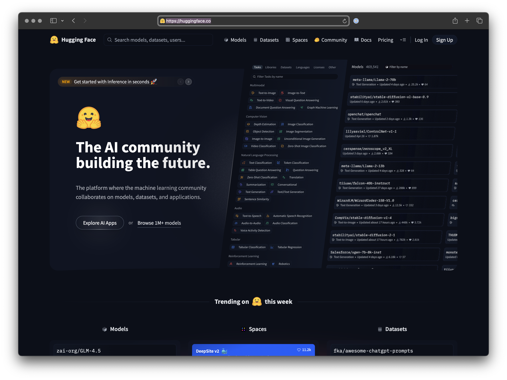

> [!NOTE]  Our main interaction today will be with the libraries.
> We'll mostly be using Hugging Face's `transformers` and `diffusers` libraries.

[Hugging Face](https://huggingface.co) is a **AI company and an open-source community** that focuses on Natural Language Processing (NLP) and Artificial Intelligence. It initially began as a chatbot company before pivoting to develop cutting-edge open-source NLP technologies. Its primary goal is to **democratize AI technology**, making it accessible, open, and easy for everyone, which helps reduce computation costs and allows users to leverage state-of-the-art models without training them from scratch.

The Hugging Face ecosystem is built around its **collaborative platform, the Hugging Face Hub**, which functions similarly to GitHub for machine learning assets. Key components of this ecosystem include:

- **Models (Model Hub)**: Hugging Face hosts a vast repository of **thousands to hundreds of thousands of pre-trained, open-source AI models**. These models are available for a wide range of tasks across various modalities, including text classification, text generation, translation, summarization, speech recognition, image classification, computer vision, audio processing, and multimodal learning. Both the community and Hugging Face contribute to this growing collection.
- **Datasets Library**: Hugging Face provides a library with **thousands of datasets** (text, audio, image, and tabular data) that are useful for machine learning and integrate seamlessly with their other tools like Transformers and Tokenizers.
- **Spaces**: This platform allows users to **build, deploy, and share interactive machine learning demos and applications** directly on the Hugging Face website. Spaces support various frameworks like Streamlit, Gradio (which Hugging Face acquired). Free and paid options are available.
- **Transformers Library**: This is Hugging Face's **flagship and core Python library**. It offers APIs and tools to easily download, manipulate, run, and fine-tune state-of-the-art pre-trained models that are based on the Transformer architecture. It simplifies complex NLP tasks by abstracting away the intricacies of training or deploying models in lower-level machine learning frameworks like PyTorch and TensorFlow.
- **Tokenizers Library**: A separate, fast, and efficient library designed for **tokenizing text**, a crucial step in NLP. It breaks down text into smaller units (words or subwords) and converts them into integer token IDs, often used in conjunction with the Transformers library.
- **Other Libraries**: The ecosystem also includes other libraries such as 🤗 Accelerate, 🤗 Evaluate, 🤗 Diffusers, and Sentence Transformers, which further support tasks like distributed training, model evaluation, image/video generation, and creating sentence embeddings.
- **Paid Offerings**: Hugging Face also provides paid services for advanced users and enterprises, including Pro Accounts, the Enterprise Hub, and Inference Endpoints, which offer features like private model hosting, advanced collaboration tools, and dedicated support.
- **Community and Collaboration**: Hugging Face fosters a **strong community** of developers and AI enthusiasts who contribute to and benefit from the shared resources and tools within its ecosystem.
