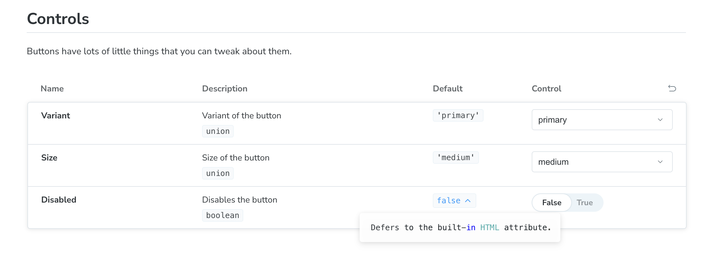

## Adding Metadata to `argTypes`

Storybook tries it's best to infer as much as it can, but the more data you add, the better table you're going to get. Let's walk through this example.

```ts
const meta: Meta<typeof Button> = {
	title: 'Button',
	component: Button,
	args: {
		children: 'Button',
		variant: 'primary',
		size: 'medium',
		disabled: false,
	},
	argTypes: {
		children: {
			name: 'Label',
			control: 'text',
			description: 'Text to display on the button',
		},
		variant: {
			name: 'Variant',
			description: 'Variant of the button',
			control: 'select',
		},
		size: {
			name: 'Size',
			control: 'select',
			description: 'Size of the button',
		},
		disabled: {
			name: 'Disabled',
			control: 'boolean',
			description: 'Disables the button',
		},
	},
};
```

## Configuring the Controls Table

Each `argType` takes a set of parameters that isn't necessarily about the argument or prop itself, but more about how you'd want Storybook to render the control in the table.

### Hiding a Control

It's not super helpful to have a control for the button label. We know how this works. So, we might want to hide it.

```ts
const meta: Meta<typeof Button> = {
  // Other metadata…
  argTypes: {
    children: {
      name: 'Label',
      control: 'text',
      description: 'Text to display on the button',
      table: {
        disable: true,
      },
    },
    // The rest of the argTypes…
};
```

## Displaying a Default Value

Storybook tries it's best to infer what a value is by default by analyzing your code, but you can also help it where it falls down. For example, we don't ever really mentioned the `disabled` prop in our code, because we're just using the built-in HTML attribute. We _could_ add some extra information to the table.

```ts
const meta: Meta<typeof Button> = {
  // Other metadata…
  argTypes: {
    disabled: {
      name: 'Disabled',
      control: 'boolean',
      description: 'Disables the button',
      table: {
        defaultValue: {
          summary: false,
        },
      },
    },
    // The rest of the argTypes…
};
```

Additional, you can add even more detail, but you probably don't need to.

```ts
const meta: Meta<typeof Button> = {
  // Other metadata…
  argTypes: {
    disabled: {
      name: 'Disabled',
      control: 'boolean',
      description: 'Disables the button',
      table: {
        defaultValue: {
          summary: false,
          detail: "Defers to the built-in HTML attribute."
        },
      },
    },
    // The rest of the argTypes…
};
```

This will render a little tooltip with your additional detail.



Here is a summary of our changes so far for those of you keeping track at home.

```diff
diff --git a/src/components/button/button.stories.tsx b/src/components/button/button.stories.tsx
index 4348e02..34ba94e 100644
--- a/src/components/button/button.stories.tsx
+++ b/src/components/button/button.stories.tsx
@@ -16,21 +16,39 @@ const meta = {
       name: 'Label',
       control: 'text',
       description: 'Text to display on the button',
+      table: {
+        disable: true,
+      },
     },
     variant: {
       name: 'Variant',
       description: 'Variant of the button',
       control: 'select',
+      table: {
+        defaultValue: {
+          summary: 'primary',
+        },
+      },
     },
     size: {
       name: 'Size',
       control: 'select',
       description: 'Size of the button',
+      table: {
+        defaultValue: {
+          summary: 'medium',
+        },
+      },
     },
     disabled: {
       name: 'Disabled',
       control: 'boolean',
       description: 'Disables the button',
+      table: {
+        defaultValue: {
+          summary: false,
+        },
+      },
     },
   },
 } satisfies Meta<typeof Button>;
```

## Additional Controls

You can also use the `category` and `subcategory` properties on `table` to section. In order to further organize your controls. We don't have a lot to organize _right now_, but I wanted to put it on your radar.


