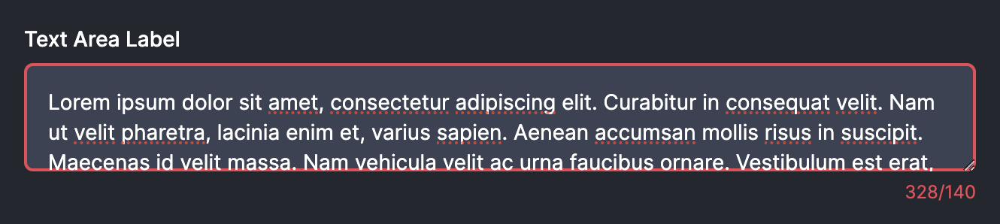

Consider this text area for a moment.


If a `maxLength` attribute is passed in, then we display a character count at the bottom. In fact it has an extra feature: we'll add styling to the text area in the event that the user blows past the character count.



What we'd like to do is verify this state. I suppose that we could cheat and have stories that put it in each state, but this has the drawback of needing to make sure look at the story every time we modify the component.

Instead, we can use a **Play** function to simulate a user interaction.

Let's start by writing a story that checks to see if the length count works at all.

```tsx
export const MaxLength: Story = {
	args: {
		maxLength: 140,
	},
	play: async ({ canvasElement }) => {
		const canvas = within(canvasElement);
		const textArea = canvas.getByRole('textbox');
		const count = canvas.getByTestId('length');

		const inputValue = 'Hello, world!';

		userEvent.type(textArea, inputValue);
		expect(count).toHaveTextContent(inputValue.length.toString());
	},
};
```

## Accessing Args

We even have access to `args`.

```ts
export const LengthTooLong: Story = {
	args: {
		maxLength: 140,
	},
	play: async ({ canvasElement, args }) => {
		const canvas = within(canvasElement);
		const textArea = canvas.getByRole('textbox');
		const count = canvas.getByTestId('length');

		const inputValue = 'H' + 'e'.repeat(140) + 'y!';

		await userEvent.type(textArea, inputValue);
		expect(count).toHaveTextContent(inputValue.length.toString());
	},
};
```

We can even expand this to check for stuff like classes, styling, or accessibility attributes.

```tsx
export const LengthTooLong: Story = {
	args: {
		maxLength: 140,
	},
	play: async ({ canvasElement, args }) => {
		const canvas = within(canvasElement);
		const textArea = canvas.getByRole('textbox');
		const count = canvas.getByTestId('length');

		const inputValue = 'H' + 'e'.repeat(args.maxLength || 140) + 'y!';

		await userEvent.type(textArea, inputValue);

		expect(count).toHaveTextContent(inputValue.length.toString());
		expect(textArea).toHaveClass('ring-danger-500');
		expect(count).toHaveStyle({ color: 'rgb(237, 70, 86)' });
		expect(textArea).toHaveAttribute('aria-invalid', 'true');
	},
};
```

> [!important] Quick Exercise
> Can you write a test to check for the following:
>
> - A disabled text area is—in fact—disabled.
> - Typing in the text area does not change the value of the text area.
>
> A potential solution can be found [here](text-area-disabled-play-function-solution.md).
