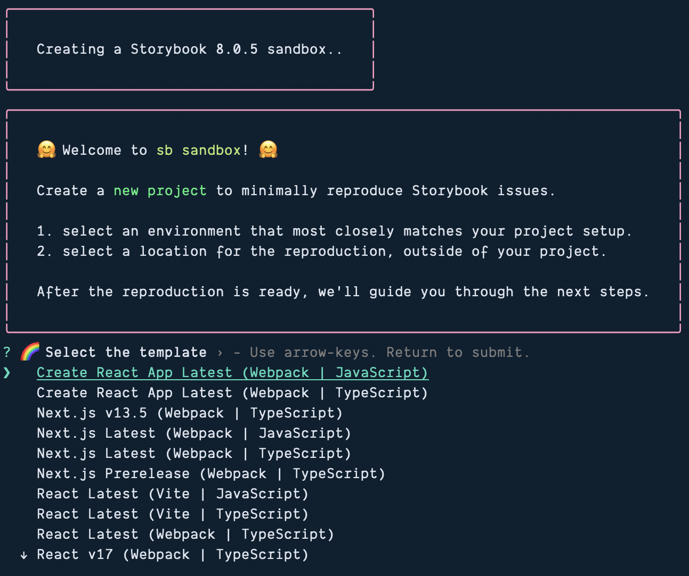

> [!NOTE] We'll be using our own repository for this course
> That said, Storybook Sandboxes are _really_ cool for trying out new things without all of the overhead of needing to install Storybook into your current project or spinning up a whole new project _just_ to install Storybook. So, I wanted to give them a special callout here. And, who know? We might end up spinning one up at some point.

Storybook allows you to set up pre-configured sandboxes. This is useful if you just want to test something out or—hypothetically—if you're teaching a workshop and want to spin up a quick example.

```ts
npx storybook@latest sandbox
```


