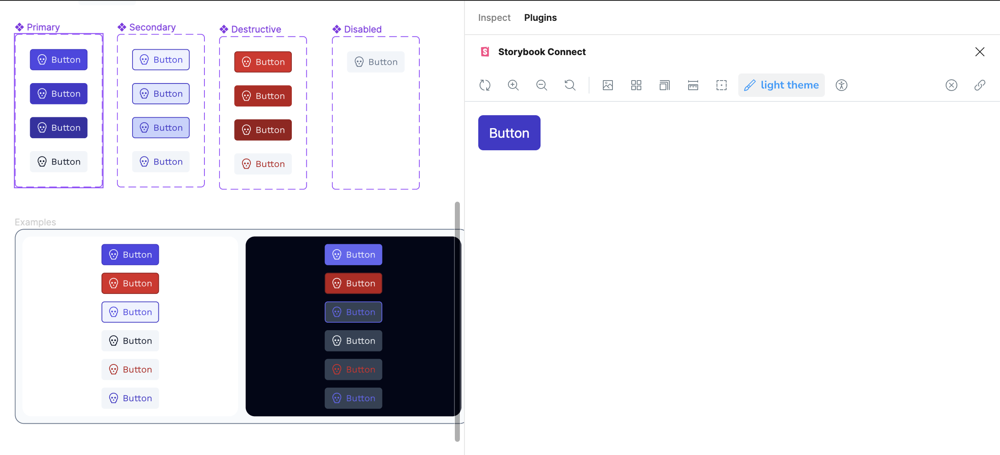

You'll need to have your project published on [Chromatic](visual-tests.md). But, once you have that in place, go to your project and copy the URL the particular component that you want to link up with Figma.

In [Figma's Dev Mode](../figma/dev-mode.md), go to the plugins pane and search for Storybook. You'll need to connect Figma to Chromatic, but after that you'll be able to paste in the link to your story and see them side by side.

