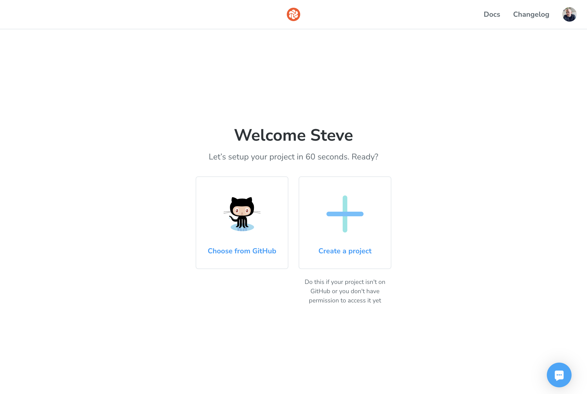
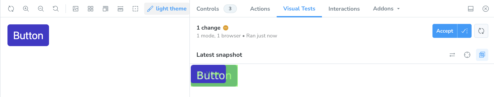

[Chromatic](https://www.chromatic.com/) is a cloud-based software tool created by the maintainers of Storybook that automates visual testing for UI components and web applications. Since it's made by the maintainers of Storybook, you can imagine that It integrates seamlessly with Storybook and allows you to capture snapshots of every story and compare them across different commits to identify visual changes.

Here is a run down of the key features:

- **UI Review and Collaboration**: Chromatic provides a place where developers, designers, and stakeholders can work together to review UI changes visually. It allows for comments and discussions directly on the visual snapshots, making it simple to collaborate and approve changes.
- **Visual Regression Testing**: Chromatic helps by capturing images of your components in different states and comparing them over time to spot visual differences. This enables teams to identify and fix visual bugs before they impact the final product.
- **Cloud Hosting for Storybook**: With Chromatic, you can effortlessly host and share your Storybook online. This feature allows teams and stakeholders to easily access and interact with the UI components without the need for a complex local development setup.
- **Component Documentation and Exploration**: In addition to visual testing, Chromatic acts as a platform where teams can document, explore, and understand the UI components in their project. This boosts the discoverability and reusability of components, aiding in project success.

## Setting Up Chromatic

You'll need to make an account if you don't already have one. The good news is that this is easy enough since you can just use your [Github](https:/github.com) account to authenticate.

Once you're in, you can either choose an existing project or create a new one.



In the even you're creating a new project, you'll be asked what kind of project you're looking to integrate. In our case, this is going to be Storybook.

You'll then get a unique project key to use to associate your Storybook with this newly-created project in Chromatic.


In your project, run the included command: `npx chromatic --project-token=` with your project token. The Chromatic CLI will take care of the rest and you'll your component and stories in the summary.


Now, of course, the real magic comes when we want to see what changed. In order to do this, you'll need to make some kind of change. Any kind of change that has a visual impact on the component will do.

Once, you've made that change, push up your changes the same way you did earlier and Chromatic will run a set of visual regression tests to see what changed.


You can review the changes to determine if they were intentional or note.


Chromatic is a great tool that can really help teams boost their UI development process, work together better, and maintain the look of their apps. It makes visual testing easier and offers a place for UI feedback and notes, so teams can create top-notch user interfaces with ease.

## Adding Chromatic to Storybook

You can also pull Chromatic intro Storybook using an addon. This typically comes pre-installed with new installs of Storybook, but I'll include the command here for good measure.

```sh
npx storybook@latest add @chromatic-com/storybook
```

Once you've got installed (or, if you already had it installed), we're ready to enable Chromatic's visual regression tests from inside Storybook.


Once you walk through the steps, you'll be able to see your component in Chromatic and it will show you if you're component has any visual regressions form the previously approved version.

If there are no changes, you'll see that reflected in Chromatic.


Similarly, if there _are_ changes, you'll be to not only see them in the story, but you'll also be able to accept the changes if they _were_ intentional.


