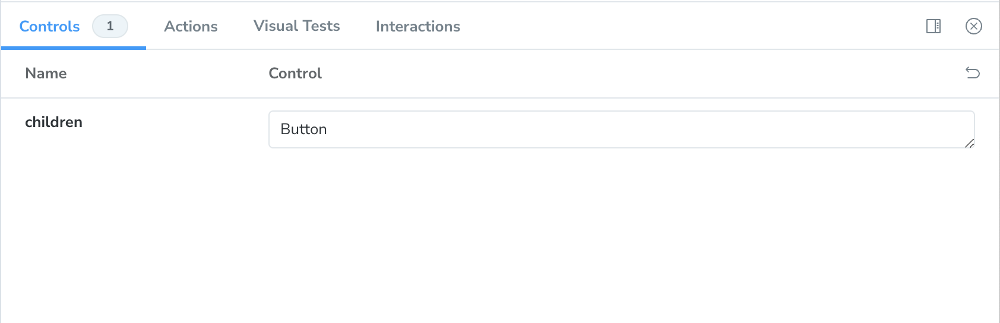

Consider this super-naïve button component. Let's say that this is in `src/components/button.tsx`.

```tsx
import { ComponentProps } from 'react';

type ButtonProps = ComponentProps<'button'>;

export const Button = (props: ButtonProps) => {
	return <button {...props} />;
};
```

Next, we'll create our first story called—unsurprisingly—`button.stories.tsx`.

First, import the `Meta` and `StoryObj` types to get some sweet, sweet autocompletion in TypeScript stories as well as the very responsible type safety.

```tsx
import type { Meta, StoryObj } from '@storybook/react';
```

Next, let's import a component. In this case, the `Button` component.

```tsx
import { Button } from './button';
```

The default export, `Meta`, contains metadata about this component's stories. The title field controls where stories appear in the sidebar.

```tsx
const meta: Meta<typeof Button> = {
	title: 'Button',
	component: Button,
};

export default meta;
```

Each named export is a story. You'll need at least one named export if you want to see anything.

```tsx
type Story = StoryObj<typeof Button>;

export const Primary: Story = {
	render: () => <Button>Button</Button>,
};
```

All-in-all, your story should look something like this:

```tsx
import type { Meta, StoryObj } from '@storybook/react';

import { Button } from './button';

type Story = StoryObj<typeof Button>;

const meta: Meta<typeof Button> = {
	title: 'Button',
	component: Button,
};

export default meta;

export const Primary: Story = {
	render: () => <Button>Button</Button>,
};
```

If you run Storybook using `npm run storybook`, you'll see something like the following:


It's not much to look at, but it's our first story and I suppose that we had to start somewhere, right?

## Using `args`

Instead of rendering the component itself, you can choose to use to an `args` object that will be used for the `props` of the component being rendered in the story. This takes advantage of [Storybook's Component Story Format](https://storybook.js.org/docs/api/csf).

```tsx
export const Primary: Story = {
	args: {
		children: 'Button',
	},
};
```

You'll notice that you can adjust the `props` in the **Controls** tab.



## Our Basic Button

Here is the end result of our button at this point:

```tsx
import type { Meta, StoryObj } from '@storybook/react';

import { Button } from './button';

type Story = StoryObj<typeof Button>;

const meta: Meta<typeof Button> = {
	title: 'Button',
	component: Button,
};

export default meta;

export const Primary: Story = {
	args: {
		children: 'Button',
	},
};
```

Right now, our `Button` component doesn't do much of anything and it's _pretty ugly_. Let's add some to the button. Let's add some [variants](adding-variants.md) to the story.
