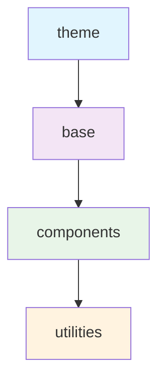

As of Tailwind 4 and later, Tailwind fully embraces modern CSS—cascade layers, OKLCH colors, container queries, and native CSS variables. The framework stays out of your way if you keep a utility-first mindset and lean on configuration rather than custom CSS.

## Lean on the Layer Stack



`@import "tailwindcss";` injects the four layers in that order. Write custom code where it belongs:

- `@layer theme` — Design token variables
- `@layer base` — Element resets and typography
- `@layer components` — Reusable overridable patterns
- `@utility` — One-off helpers that behave like core utilities

> [!WARNING] It's not that important.
> Never use `!important` on utilities—reconsider the layer placement.

## Configure in CSS, Not JavaScript

Declare design tokens in `@theme` blocks:

- Define tokens ( `--color-primary`, `--spacing-4`, `--font-brand` ) inside `@theme` using native CSS custom properties.
- Reuse across all layers for single-source-of-truth styling
- Keep documentation near consuming code; no JavaScript config needed

## Responsive, State, and Container Variants

- Mobile-first: default rule, then `md:`, `lg:` prefixes
- Combine state and media: `md:hover:bg-primary-600`
- Use `cq` prefix for container queries with `container-type: inline-size`

## Accessibility Defaults

- Use `focus-visible:outline-none` instead of `outline-none` for keyboard accessibility
- Built-in helpers: `sr-only`, `not-sr-only`, `motion-safe:*`, `selection:*`
- Prefer semantic HTML over ARIA gymnastics; Tailwind styles elements, it doesn’t fix semantics.

## Performance Hygiene

- List all template paths in `content` for tree-shaking
- Use `safelist` for dynamic classes (user-generated colors)
- Enable `future: { hoverOnlyWhenSupported: true }` for modern CSS

> [!warning] Legacy browsers
> Tailwind 4 depends on cascade layers. If you must support anything older than Safari 15.4, Chrome 99, or Firefox 97, stay on Tailwind v3.x.

## Keep an Eye on the Future

Experiment with new CSS behind feature queries:

```css
@supports (background: color-mix(in oklab, red 30%, white)) {
  .link {
    background: color-mix(in oklab, var(--color-primary-500) 90%, white);
  }
}
```

- Remove proprietary prefixes (grid, flexbox): modern build targets don't need them.
- Move stable features (OKLCH) to `@theme` block
