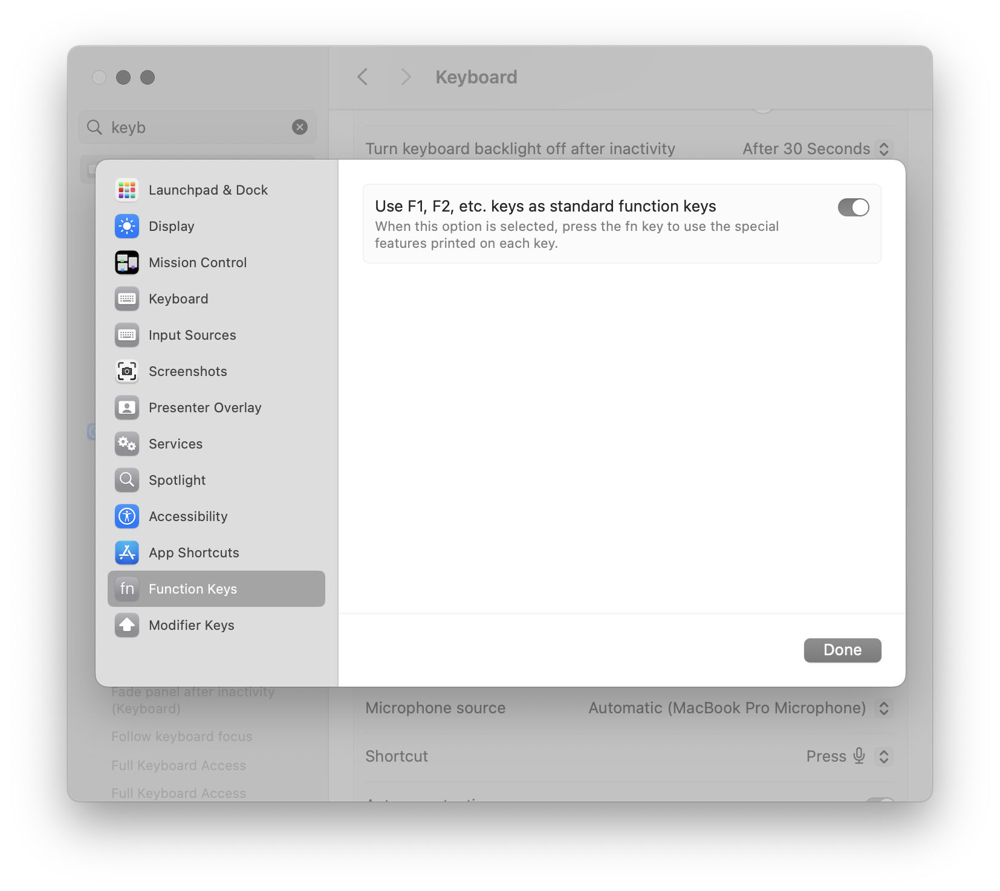

Navigating large codebases can feel like exploring a maze. I have a long rant about how one of the best skills you can learn is how to drop into a large codebase and quickly get your bearings. Visual Studio Code offers a range of tools to help you zip around files and symbols—quickly tracking down definitions, references, and more. Let’s take a closer look at these essential navigation features.

## An Aside: A Free Trick for macOS Users

Visual Studio Code makes a lot of use of the function keys. The problem is—so does macOS. You _could_ hold down the `fn` key on your keyboard. Alternatively, you can switch it so that your functions keys are `F1`, `F2`, etc. and only change your screen brightness when you press the `fn` key. This is one of the first things that I do when I set up a new Mac.

## Go to Definition, Declaration, Implementation, and Type Definition

Pressing `F12` to go to a symbol’s definition is a well-known Visual Studio Code trick, but it doesn’t stop there. For many languages, especially TypeScript and other popular languages, you can also jump to a symbol’s declaration, implementation, or type definition. Right-click a function, class, or variable name to see commands like `Go to Definition`, `Go to Declaration`, `Go to Type Definition`, or `Go to Implementation`. This lets you quickly investigate where a piece of code originates or how it’s structured, without manually hunting through files.

> [!TIP] In many projects, the difference between “definition” and “declaration” can be subtle. If one option doesn’t reveal what you need, try the other. You might discover a hidden interface or an abstract class behind the scenes.

## Find All References

Sometimes, you want to see every nook and cranny where a particular function, method, or variable is used. By pressing `Shift+F12` (or selecting `Find All References` from the right-click menu), Visual Studio Code collates a list of every location in your codebase referencing the selected symbol. This is extremely handy when refactoring or analyzing the impact of changes before you break something by accident.

## Peek Definition

If you love context switching as much as you love your dentist visits—which is to say, not at all—try `Alt+F12` (`Option+F12` on macOS). This opens a small inline window showing the symbol’s definition without leaving your current file. It’s perfect for quick checks: you can confirm a function’s parameters or a class’s properties, then close the peek view to continue coding uninterrupted.

## Breadcrumbs

Breadcrumbs appear at the top of your editor and show the nesting structure of your code. They let you navigate through symbols like classes, functions, and methods within the current file. If you’re working on a hefty TypeScript file, simply click a breadcrumb element to jump straight to that part of your code. You can enable or disable them in `Settings` by looking up `breadcrumbs.enabled`.

> [!TIP] If you don’t see breadcrumbs, press `View -> Appearance -> Show Breadcrumbs` or search for `breadcrumbs` in the Command Palette. They’re a quiet but powerful way to move around complex files.

## Outline View

The Outline view (accessible from the Explorer sidebar or via `View -> Outline`) offers a structured outline of all symbols in the current file—functions, classes, constants, and more. This is especially useful when you have a monstrous file or want a quick overview of everything defined. Clicking a symbol in the Outline jumps straight to its location in the editor. It’s like a table of contents for your code, minus the dog-eared pages.

## Go to Symbol

In-file symbol navigation is speedy with `Ctrl+Shift+O` (`Cmd+Shift+O` on macOS). Start typing the symbol’s name, and Visual Studio Code will filter the list in real-time. Select the symbol you want, press Enter, and land exactly where you need to be.

For a broader, workspace-wide search, press `Ctrl+T` (or `Cmd+T`). This scours every file in your workspace for a matching symbol, which is particularly helpful in large projects. Quickly jump into that function declared 42 files away—no rummaging through folder structures needed.

## Bookmarks

Despite the best navigation features, sometimes you want to mark your place. Extensions like `Bookmarks` let you drop bookmarks at specific lines in any file. Think of them as digital Post-it notes: once set, you can hop back with a simple shortcut. This is great for tasks like:

- Tagging a spot where you need to continue refactoring.
- Flagging a chunk of code awaiting a coworker’s feedback.
- Tracking multiple to-dos without sprinkling `TODO:` comments everywhere.

Bookmarks live alongside the rest of Visual Studio Code’s UI, so you can manage them similarly to breakpoints or search results.

> [!WARNING] Less is More
> Don’t become bookmark-happy; too many can clutter your editor. Use them sparingly for maximum effectiveness—your future self will thank you.
