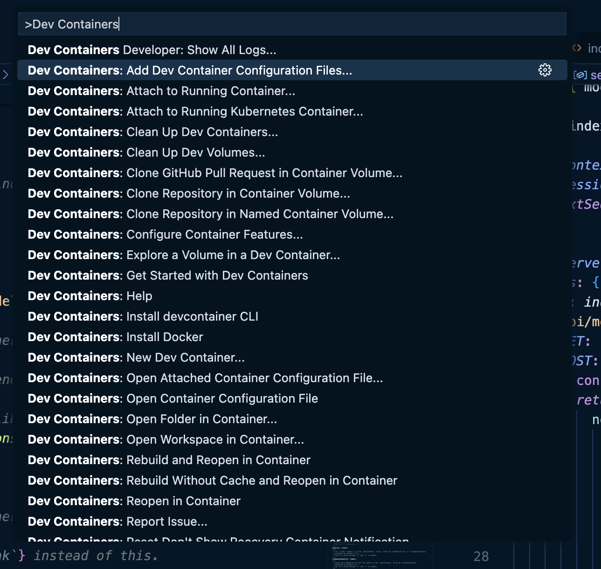
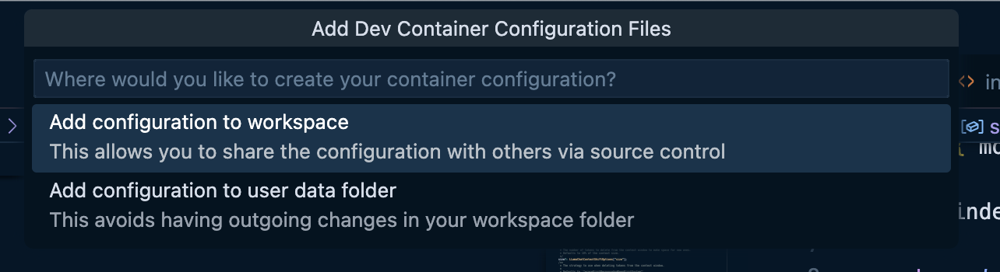
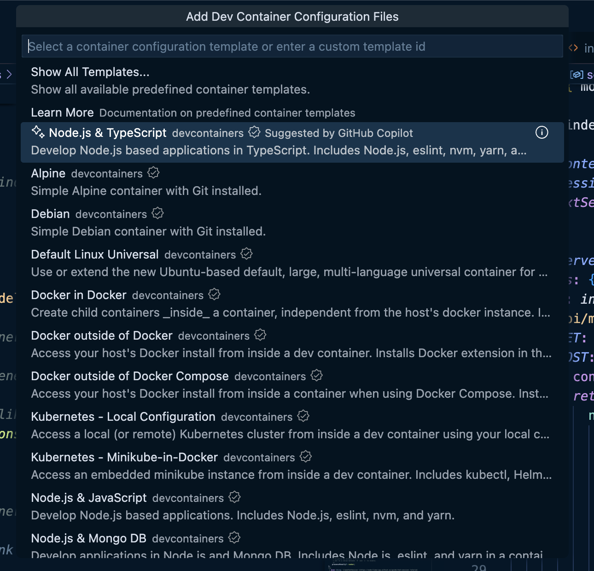
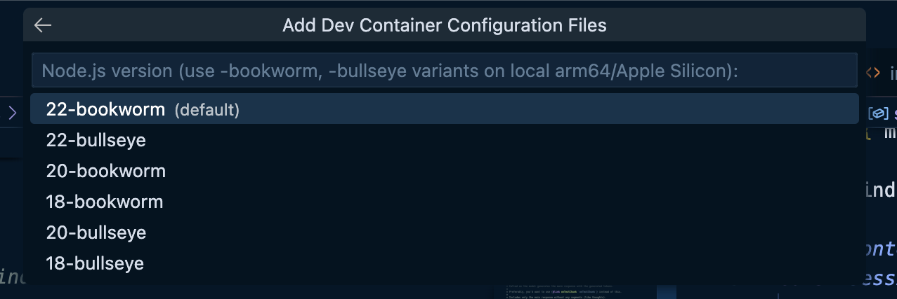
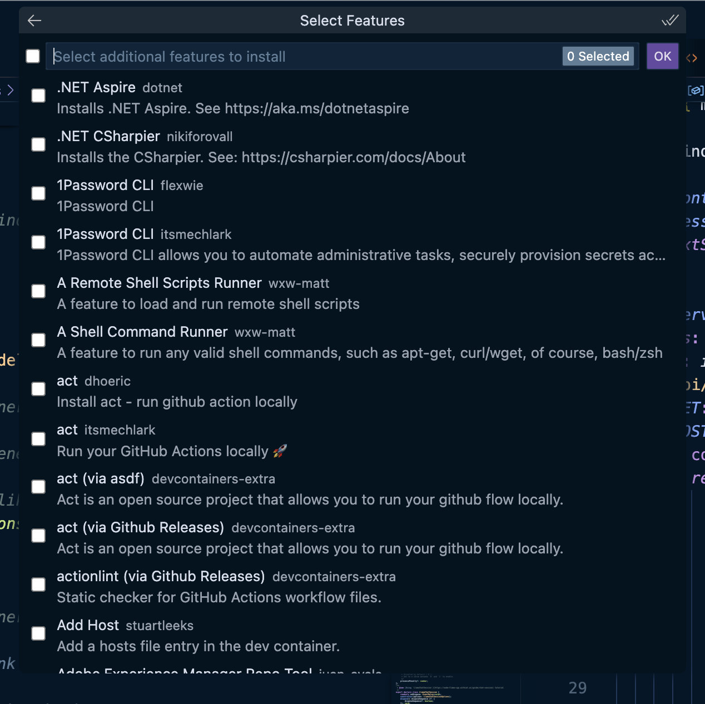
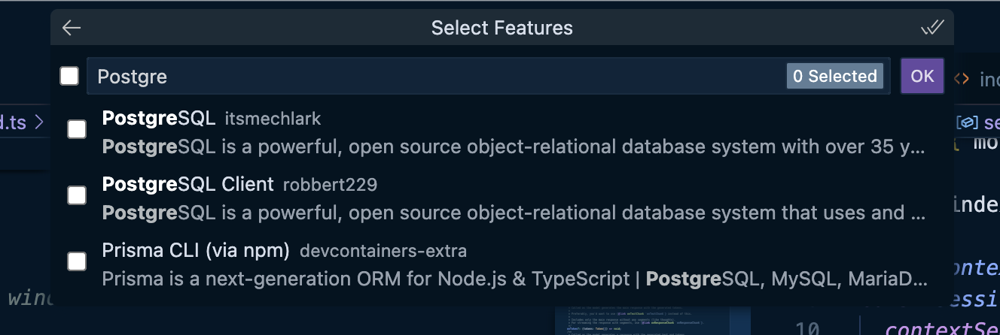
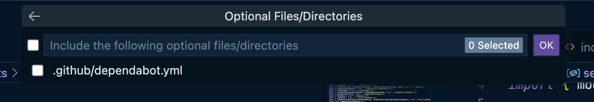

VS Code and the community provide a rich collection of pre-built Dev Container definitions. These are incredibly useful for quickly setting up common development environments without writing `devcontainer.json` from scratch.

**Accessing Pre-built Definitions:**

1. **When Creating a Dev Container:** When you use the "Dev Containers: Add Dev Container Configuration Files…" command, VS Code will offer a list of predefined definitions. These are fetched from the [vscode-dev-containers repository on GitHub](https://www.google.com/url?sa=E&source=gmail&q=https://github.com/devcontainers/templates&authuser=1).
2. **VS Code Dev Containers Extension Documentation:** The documentation for the "Remote - Containers" extension also provides links to curated lists of pre-built definitions.

You can start with **Add Dev Container Configuration Files** from the Command Center.


Next, select which container you'd like to use.



In the case of the **Node.js & TypeScript** image, you'll be asked which version of Node, you'd like to use.



Once you've selected your container, you can also pick some additional software that you'd like to include.



You can filter this list to find whatever you're looking for.



Finally, you can add some bonus files.



## The End Result

In the end, you should see something like this.

```json
// For format details, see https://aka.ms/devcontainer.json. For config options, see the
// README at: https://github.com/devcontainers/templates/tree/main/src/typescript-node
{
	"name": "Node.js & TypeScript",
	// Or use a Dockerfile or Docker Compose file. More info: https://containers.dev/guide/dockerfile
	"image": "mcr.microsoft.com/devcontainers/typescript-node:1-22-bookworm"

	// Features to add to the dev container. More info: https://containers.dev/features.
	// "features": {},

	// Use 'forwardPorts' to make a list of ports inside the container available locally.
	// "forwardPorts": [],

	// Use 'postCreateCommand' to run commands after the container is created.
	// "postCreateCommand": "yarn install",

	// Configure tool-specific properties.
	// "customizations": {},

	// Uncomment to connect as root instead. More info: https://aka.ms/dev-containers-non-root.
	// "remoteUser": "root"
}
```

## Customizing Pre-built Definitions

Pre-built definitions are excellent starting points. You can easily customize them further by modifying the generated `devcontainer.json` file. You can add more extensions, customize settings, forward ports, add `postCreateCommand`, and more, to tailor the pre-built environment to your specific project needs.
