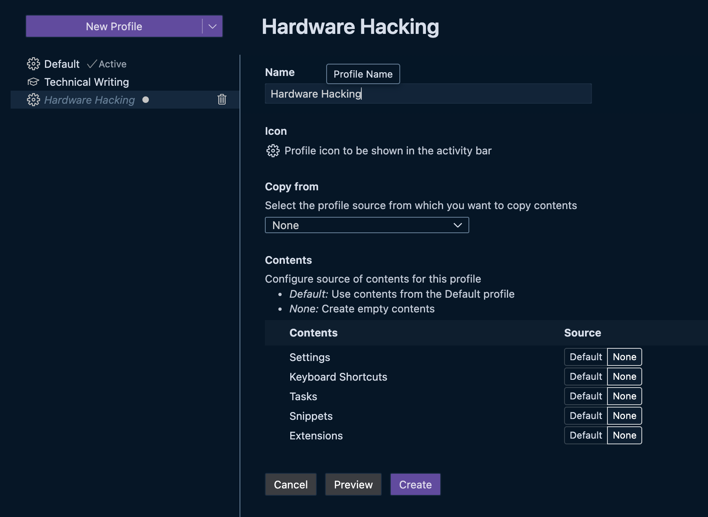

Settings Profiles allow you to create and manage distinct Visual Studio Code configurations for different projects, tasks, or programming languages. This is incredibly useful when you need to switch between drastically different development environments (e.g., web development vs. data science, personal projects vs. work projects).

## Creating Profiles

1. **Command Palette:** Open the Command Palette (`Ctrl+Shift+P` or `Cmd+Shift+P`) and run "Preferences: Create Settings Profile".
2. **Profile Type:** Choose a profile type:
   - **Empty Profile:** Starts with default settings.
   - **Based on Current Profile:** Copies settings from your current profile.
   - **Based on Template Profile:** Starts with settings from a predefined template (e.g., "Web Development", "Data Science").
3. **Profile Name:** Enter a name for your new profile.

## Switching Profiles

1. **Command Palette:** Open the Command Palette (`Ctrl+Shift+P` or `Cmd+Shift+P`) and run "Preferences: Switch Settings Profile".
2. **Select Profile:** Choose the profile you want to activate from the list.

## Managing Profiles

1. **Command Palette:** Open the Command Palette (`Ctrl+Shift+P` or `Cmd+Shift+P`) and run "Preferences: Manage Settings Profiles".
2. **Profile Actions:** In the Settings Profiles view, you can:
   - **Edit:** Modify settings within a profile.
   - **Rename:** Change the name of a profile.
   - **Export:** Export a profile to a JSON file.
   - **Import:** Import a profile from a JSON file.
   - **Delete:** Delete a profile.

> [!NOTE] Profile Scope
> Settings profiles primarily manage User settings. Workspace and Folder settings remain workspace/folder-specific and are not directly managed by profiles. However, you can create profiles tailored for specific types of projects, and then apply those profiles when working on projects of that type.

## Example Use Cases

- **Web Development Profile:** Enable web development-specific extensions, configure code formatters for HTML, CSS, and JavaScript, set up linters for web technologies, and customize themes for front-end work.
- **Data Science Profile:** Install data science extensions (Python, Jupyter, R), configure Python environments, adjust editor settings for data analysis notebooks, and use a theme suitable for data visualization.
- **Work vs. Personal Profile:** Separate work-related settings (company themes, code style guidelines, specific extensions) from personal project settings.
- **Language-Specific Profiles:** Create profiles for different programming languages (e.g., Python profile, JavaScript profile) with language-specific settings and extensions.
