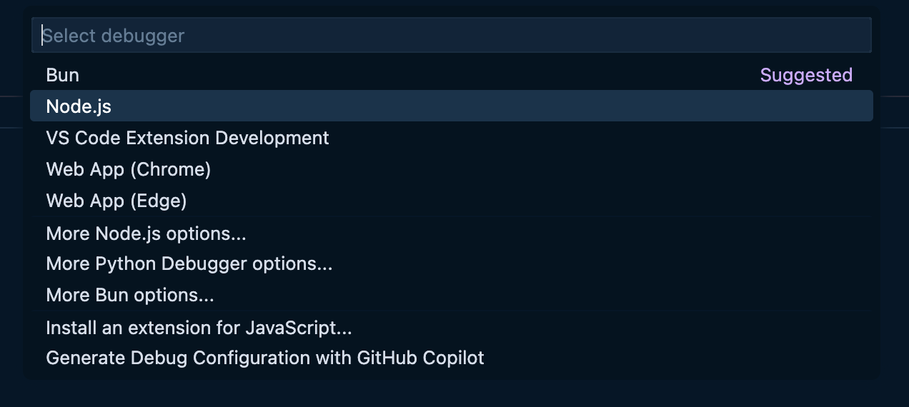

> [!NOTE] Example Repository
> We're going to be playing around with some of the examples in [this repository](https://github.com/stevekinney/vscode-examples).

Visual Studio Code offers a few ways for debugging your code.

- You can set **breakpoints** on lines of code where you want execution to pause.
- While paused, you can inspect **variables**, **call stacks**, and **evaluate expressions** to see what's going on.
- You can **step through code** line by line (**Step Over**, **Step Into** functions, **Step Out**) to follow the logic flow.
- You can even change variables on the fly to test different scenarios.

There are a bunch of templates that Visual Studio Code provides to get up and running quickly.



## Together

We're going to walk through the `maths` example in [this repository].

## Exercise: Debugging an Express Application

Set up a `launch.json`. Here is a example of a _super simple_ `launch.json`.

```json
{
	"version": "0.2.0",
	"configurations": [
		{
			"type": "node",
			"request": "launch",
			"name": "Launch Program",
			"skipFiles": ["<node_internals>/**"],
			"args": ["${workspaceFolder}/index.js"]
		}
	]
}
```
