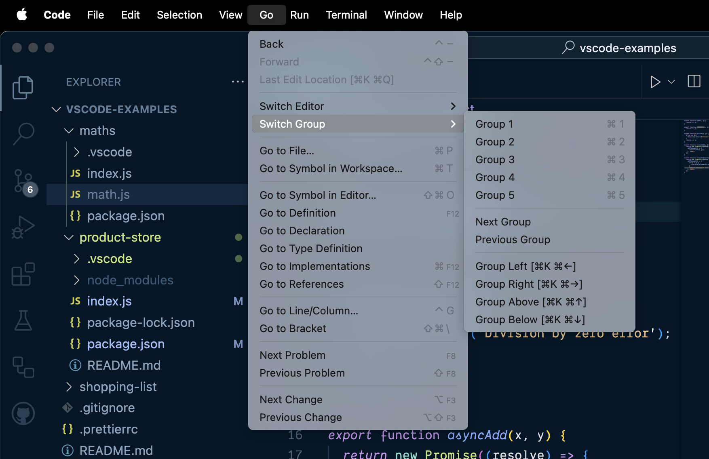
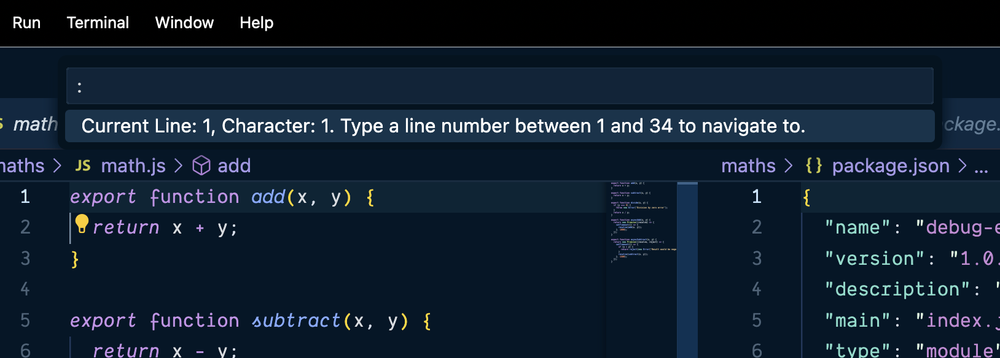
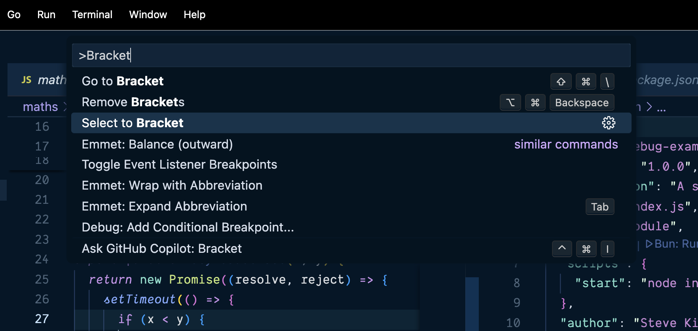

The most reasonable place to start is getting comfortable with the editor itself. If we can take the little tedious stuff that we need to do and make it _faster_, then we have more mental bandwidth for all of the Big Brain™ stuff that is arguably what we get paid for—as opposed to mousing around looking for that important file.

Visual Studio Code allows you to rearrange views and panels so that the information you need is always front and center. You can drag and drop panels (such as `Explorer`, `Debug`, or `Terminal`) to different areas of the screen to match your preference. Under the `View` menu, you'll find `Appearance`, where you can toggle side bars, activity bars, and the panel location.

If you like a cleaner setup, consider hiding the panel entirely. When you need it back, you can easily restore it through `View -> Appearance -> Show Panel`. This back-and-forth adjustment helps keep your editor free of clutter whenever deep focus is required.

> [!TIP] When in doubt, use the Command Palette
> If you ever lose track of a panel or side bar, use the Command Palette (`Ctrl+Shift+P` or `Cmd+Shift+P` on macOS) to search for a command like `View: Toggle Sidebar Visibility` and bring it right back.

## Open Editors

The `Open Editors` section in the Explorer panel shows all files currently open in the editor. This feature acts as a quick reference to see everything you're working on at a glance. If you have too many files listed there, close tabs you're no longer using to keep the list lean and easier to scan.

A lesser-known perk of the `Open Editors` area is that it allows you to reorder open tabs by simply dragging filenames up or down in the list. It mirrors the order of your tabs in the top editor region, letting you manage your open files from either location without missing a beat.

## Splitting

Splitting the editor enables side-by-side comparisons or editing in multiple places at once. You can split vertically or horizontally. For instance, if you're reviewing a React component's TypeScript file while editing its related CSS, splitting your editor lets you see both files at the same time.

To split your editor quickly, right-click the tab of the file you're viewing and select `Split Editor`. Alternatively, you can use the `View -> Editor Layout` menu or the split icons on the top right corner of your editor. Closing one panel is just a matter of clicking the `x` in the tab or dragging it back to its original position.

> [!TIP] Switching layouts
> Want to quickly switch between split layouts? Search for `View: Toggle Editor Group Layout` in the Command Palette to flip between horizontal and vertical splits. It's like rotating your desk without having to move anything heavy.

## Multiple Windows

I'm coming from a editor that didn't have split panes—I'm looking at you, TextMate. So, this _used_ to be how I lived my life. But, these days—I tend to stick with a single window with multiple editor groups. That said, I also don't use multiple monitors.

Sometimes, splitting isn't enough. Multiple windows might be the solution if you're juggling many files or separate projects. You can open another instance of Visual Studio Code from the `File -> New Window` menu, or by using the Command Palette command `New Window`. Each window can then focus on a distinct set of files or a different project folder.

If you're working on a large feature and also monitoring logs or a server file in another folder, multiple windows prevent you from losing context. Arrange these windows on multiple monitors or snap them side-by-side for a command-center vibe.

## Zen Mode

Zen Mode is the ultimate solution for code meditation. When activated, Zen Mode removes all bars, panels, and distractions, leaving you with a full-screen editor to focus on coding or reading code. To activate Zen Mode, toggle it under `View -> Appearance -> Zen Mode`, or search for `View: Toggle Zen Mode` in the Command Palette.

Once in Zen Mode, you can still hover near the edges of the screen to reveal hidden bars or use your favorite shortcuts as usual. Exit Zen Mode just as you entered it—through the same menu or by pressing `Escape` twice.

> [!TIP] Adding keybindings for Zen Mode
> If you frequently use Zen Mode, assign a custom keyboard shortcut to it in your keybindings (`File -> Preferences -> Keyboard Shortcuts` or `Code -> Preferences -> Keyboard Shortcuts` on macOS). You'll be a single keystroke away from that tranquil, minimalistic bliss.

## Splitting the Editor

Use `Cmd+\` or `Ctrl+\` to split the editor into a new pane.


## Move Across Tabs

Use `Cmd-Option-⃗➡️` and `Cmd-Option-⬅️` to move from tab to tab. On Windows, you can use `Ctrl-Alt-➡️` and `Ctrl-Alt-⬅️`.


## Jump Between Editor Groups

You've got two options here.

1. You can jump to a _particular_ group.
2. You can move around between the groups using the arrow keys.



## Jump to a Line

Use `Ctrl-G` to jump to a particular line.



## Go to Bracket

The **Go to Bracket** command jumps from the opening to the closing bracket. There is also ability to **Select to Bracket**, but it doesn't have a keybinding—by default. We'll look at how to add one later.



## Open the Integrated Terminal

You can use `Ctrl-Backtick` to open the integrated terminal.


## Customizing Your Panels

VS Code allows you to not only rearrange panels but also resize them for optimal focus. Adjust the borders between panels to allocate more space to your most-used views, such as the Explorer or Terminal. Once you have your ideal layout, save your workspace configuration to preserve these settings between sessions. For example, you can save your layout using:

```json
// In your workspace configuration file
{
  "folders": [
    {
      "path": "."
    }
  ],
  "settings": {
    "workbench.panel.defaultLocation": "bottom",
    "workbench.editor.enablePreview": false
  }
}
```

> [!TIP] Save Your Layout
> Use `File → Save Workspace As…` to keep your customized panel sizes and positions intact.

## Managing Open Editors

The Open Editors section is more than a simple list—it can be optimized for enhanced productivity. Pin frequently used files to keep them visible, even when multiple tabs are open. You can also reorder the list to group related files together, which mirrors the order in the top editor area and helps maintain a neat workflow.

> [!TIP] Keep It Organized
> Regularly close files you no longer need and pin those you access frequently for a cleaner Open Editors view.

## Troubleshooting & Additional Tips

Even with a perfectly set up environment, you may encounter occasional glitches. If a panel or view suddenly disappears, use the Command Palette (`Ctrl+Shift+P` or `Cmd+Shift+P`) and run commands such as `View: Reset View Locations` or `Toggle Sidebar Visibility`. For performance issues in larger projects, consider closing unused files or temporarily disabling non-essential extensions to keep VS Code running smoothly.

> [!TIP] Stay Productive
> Regularly update your workspace settings and extensions to avoid common pitfalls and maintain an efficient coding environment.
