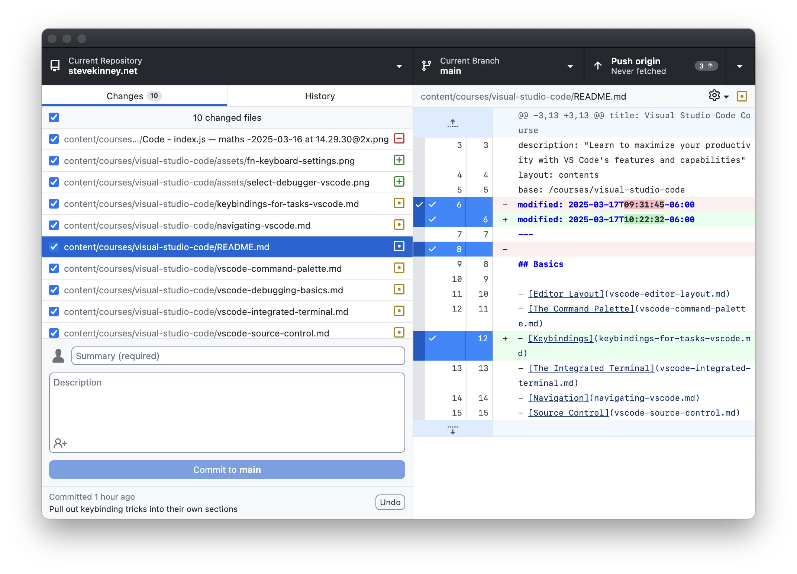

Git is baked right into Visual Studio Code, making version control feel like second nature. From staging and committing changes to handling merges and pushing to remote repositories, the built-in UI provides a smooth, visual workflow. Let's explore how to leverage these features—plus a few extras like Git blame, GitHub integration, and interactive rebase—to keep your code pristine and your team happy.

## Basic Git Operations

At the heart of Visual Studio Code's source control is the Source Control panel (the icon that looks like a branch fork on the Activity Bar). Once opened, you'll see the changes in your working tree, including any staged and un-staged files. Here's the lowdown on each operation:

- **Staging:** Click the plus icon next to changed files, or use the `Stage Changes` button for everything at once.
- **Committing:** Enter a commit message in the text box at the top of the Source Control panel, then hit the checkmark to commit.
- **Pushing & Pulling:** Once you've committed, push your changes to the remote repository by clicking the triple-dot menu (`…`) and selecting `Push`, or use the Command Palette (`Ctrl+Shift+P` / `Cmd+Shift+P`) and type `Git: Push`. Pulling follows a similar workflow (`Git: Pull`).
- **Branching:** Use the branch indicator in the bottom status bar. Clicking it displays your current branch and offers options like `Create Branch`, `Checkout Branch`, and `Delete Branch`.
- **Merging:** Switch to the branch you want to merge into, then from the Source Control menu or Command Palette, select `Git: Merge Branch` to bring in changes from another branch.

> [!TIP] The Terminal is Always an Option
> If you prefer the terminal, everything is still at your fingertips (`git add`, `git commit`, etc.). Visual Studio Code's integrated terminal can provide a nice blend of command-line control and visual feedback in the Source Control panel.

## Diff View

Comparing code changes is a breeze with Visual Studio Code's diff viewer. When you click on a modified file in the Source Control panel, you'll see a split view showing the **old** content on one side and **new** changes on the other. Additions appear in green, deletions in red. This helps you quickly review edits before committing, ensuring you don't accidentally introduce that half-finished debugging hack.

> [!TIP] Diffing Made Easy™
> You can diff any two files (even if they aren't in the same repository) by right-clicking a file in the Explorer and choosing `Select for Compare`, then right-clicking another file and selecting `Compare with Selected`.

## Merge Conflict Resolution

Git merges can get hairy, but Visual Studio Code's merge conflict resolution tool is there to save the day. Whenever a merge conflict arises, conflicting sections in files are highlighted in the editor with clear options:

- **Accept Current Change** keeps your local modifications.
- **Accept Incoming Change** takes changes from the branch you're merging in.
- **Accept Both Changes** merges them together. (Use with caution if they're truly conflicting!)
- **Compare Changes** opens a diff to help you decide what to keep.

Once you resolve each conflict, save the file, and stage the changes. Visual Studio Code will mark the conflict as resolved, letting you wrap up the merge gracefully.

## Git History

To browse commit history, use extensions like `Git History` or built-in commands. Even without an extension, you can right-click a file and select `Timeline` to see recent commits. Additionally, you can open the Command Palette and type `Git: View File History` (if you've installed an extension providing that feature). Each commit in the history shows details like commit message, author, and date, and you can drill down to view diffs for that commit.

## Git Blame

Ever wonder who wrote that questionable piece of code? Git blame has you covered. In Visual Studio Code, you can hover your cursor over a line or install an extension like [GitLens](https://marketplace.visualstudio.com/items?itemName=eamodio.gitlens) to see inline blame annotations. It'll tell you which commit last touched that line, who authored it, and when. It's an efficient way to track accountability—just don't use it for shaming your past self too hard.

## GitHub Integration

Visual Studio Code provides native support for GitHub, GitLab, and Bitbucket workflows. For example, you can:

- **Clone a repository** by clicking the Source Control icon, then the triple-dot menu (`…`), and selecting `Clone Repository`. Paste in the remote URL, pick a local folder, and you're off.
- **Create pull requests** using the GitHub Pull Requests extension (or a similar extension for GitLab or Bitbucket). This gives you a specialized view in Visual Studio Code to manage pull requests, add comments, and review code without leaving your editor.
- **Push to private or public repos** by using the same `Push` or `Publish Branch` features in the Source Control menu.

> [!TIP] Even More Github Integration
> If you want to integrate more deeply, the official GitHub extension suite lets you sign in to GitHub and manage issues, pull requests, and more, all from within Visual Studio Code.

## Another Option

Alternatively, I also really like [Github Desktop](https://github.com/desktop).

