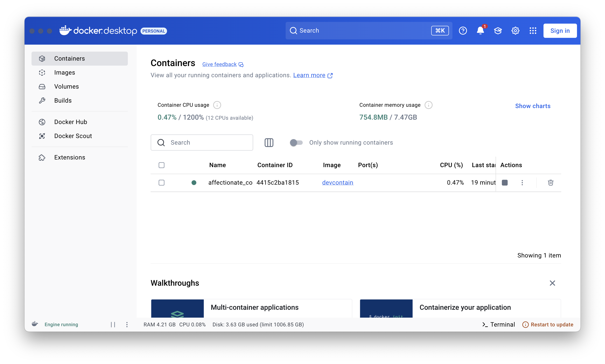

Once you have a `.devcontainer` folder in your project, Visual Studio Code will recognize it and offer you options to work within the Dev Container.

> [!NOTE] Docker Installation
> If Docker is not installed, Visual Studio Code will attempt to install it.

**What Happens When You "Reopen in Container"?**

- **Container Build—If Needed:** If the specified container image (or Dockerfile) needs to be built, Visual Studio Code will trigger a Docker build process. You'll see build logs in the Output panel (select "Dev Containers" from the dropdown). Subsequent "Reopen in Container" operations will be faster if the image is already built (Docker caching).
- **Container Start:** Docker starts the container based on the configuration.
- **Visual Studio Code Connection:** Visual Studio Code establishes a connection to the running container.
- **Workspace Mount:** Your project folder from your host machine is **bind-mounted** into the container at the `workspaceFolder` path (default `/workspace`). This means changes you make to files inside the container are reflected in your host project folder, and vice versa. This allows seamless file editing between host and container.
- **Extension Installation (Inside Container):** Visual Studio Code automatically installs the extensions listed in the `extensions` property of `devcontainer.json` _inside_ the container. These are separate from your host machine extensions.
- **Settings Application (Inside Container):** Visual Studio Code applies the settings defined in the `settings` property of `devcontainer.json` _inside_ the container environment.

Once the container is up and running, you'll be able to see it in **Docker Desktop**.

## Building, Rebuilding, and Updating

Sometimes you need to modify your Dev Container configuration – update dependencies in the Dockerfile, add new extensions, change settings, etc. In such cases, you need to rebuild the Dev Container.

### Option 1: Command Palette - "Dev Containers: Rebuild Container

1. Ensure you are connected to your Dev Container (Visual Studio Code window says "(Dev Container)" in the bottom-left).
2. Command Palette -> "Dev Containers: Rebuild Container".
3. This will rebuild the container image based on your updated `Dockerfile` or image specification, and then restart the container. Changes in `devcontainer.json` (like extensions or settings) are also applied during rebuild.

### Option 2: Command Palette - "Dev Containers: Rebuild and Reopen in Container"

1. Similar to "Rebuild Container", but after rebuilding, it automatically reopens your project in the newly rebuilt container. This is often more convenient.

### When to Rebuild

- **Changes to `Dockerfile`:** Whenever you modify your `Dockerfile` to add software, update dependencies, or change the base image.
- **Changes to `devcontainer.json` (image/dockerFile):** If you switch to a different base image or Dockerfile.
- **Software Updates in Container (Less Common):** If you manually installed software inside the container through the terminal and want to persist these changes, you might need to rebuild the container image (though it's generally better to define software installations in your Dockerfile).

## Accessing the Terminal

A key aspect of working with Dev Containers is accessing the integrated terminal within Visual Studio Code. This terminal runs _inside_ the Dev Container, providing you with a shell environment directly within your containerized environment.

1. Ensure you are connected to your Dev Container.
2. Open the Visual Studio Code integrated terminal (`Ctrl+Backtick` or `Command+Backtick`).
3. The terminal prompt will indicate that you are now inside the container environment. The shell (e.g., bash, zsh) will be the one configured within your container image or `devcontainer.json` settings.
