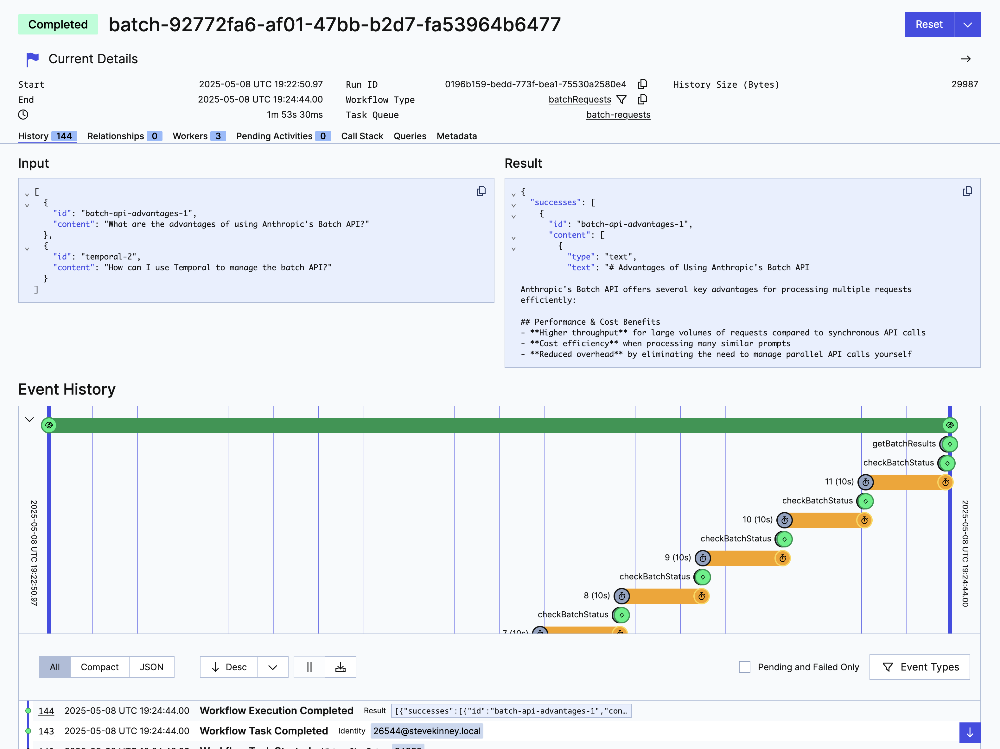

When I'm doing research, I typically write down any questions that I have or terms that I wanted to learn more about. Later, I'd run a little script to do some quick research on the topics and questions that I jotted down earlier.

Initially, I was just using a gross little script to loop over all of the questions one-by-one, but occasionally a few of those requests would fail and I'd be too lazy to look and try to see which ones. I'd typically just run the entire script again and eat the cost. Eventually, I improved this process a bit by using [Anthropic](https://anthropic.com)'s [Message Batch API](https://www.anthropic.com/news/message-batches-api) and paired it with [Temporal](https://temporal.io) in order to make sure everything is running smoothly.

[Anthropic's Batch API](https://www.anthropic.com/news/message-batches-api) provides a dedicated pipeline for processing multiple Claude requests asynchronously at a significant discount, making it an essential tool for developers working with AI at scale. This guide will walk you through everything you need to know about implementing, optimizing, and leveraging the Batch API effectively.

Let's explore how to leverage Anthropic's Batch API with and without Temporal workflows to create a powerful system for processing large numbers of AI requests. We'll start by understanding what the Batch API is and why it offers significant advantages—including 50-85% cost savings—over standard API calls. Then, we'll dive into practical implementation with TypeScript, building out the core functions for creating batches, monitoring their status, and retrieving results. Finally, we'll elevate our solution by integrating with Temporal, a distributed application orchestration platform that provides durable execution, automatic retries, and state management—eliminating the headaches of tracking batch IDs and handling failures. By the end of this guide, you'll have a production-ready system for processing thousands of Claude requests asynchronously that can survive crashes, scale horizontally, and dramatically reduce your API costs.

> [!NOTE] Repository
> All of the code in this example can be found [here](https://github.com/stevekinney/anthropic-batch-api-example).

## What is the Batch API?

Anthropic's [Message Batches API](https://docs.anthropic.com/en/docs/build-with-claude/batch-processing) is a specialized endpoint designed for processing large volumes of Claude queries asynchronously. Rather than processing each request individually with immediate responses, the Batch API allows you to submit batches of up to 10,000 queries that will be processed within 24 hours, with a 50% cost reduction compared to standard API calls.

Think of it as the difference between express and standard shipping—you pay a premium for immediate delivery (synchronous API calls) or save significantly by accepting a reasonable delay (Batch API).

The Message Batches API supports most of the major models that you'd probably end up using to begin with: Claude 3 Haiku, Claude 3 Opus, Claude 3.5 Sonnet, Claude 3.5 Sonnet v2, and Claude 3.7 Sonnet. Any request that you can make to the standard Messages API can be included in a batch. This includes different types of requests within a single batch. The Batch API also supports all features available in the Messages API, including beta features (though streaming is not supported).

## Why Use the Batch API?

The main incentive for me is convenience, but using the Batch API has a lot of benefits for **Real World Use Cases™**.

- **It's cheaper**: The most immediate benefit is the 50% discount on both input and output tokens. For anyone processing large volumes of text, this represents substantial savings. When combined with other features like prompt caching, discounts can potentially reach up to 95% for input tokens under optimal conditions. I'm not necessarily processing a ton, but I'm happy to pay less regardless.
- **You get better rate limits**: The Batch API offers enhanced throughput with higher rate limits, allowing you to process much larger request volumes without impacting your standard API rate limits. This means you can scale your AI processing capabilities without concerns about hitting throttling limits.
- **It's (potentially) simpler**: Instead of managing complex queuing systems or worrying about rate limits, you can use the Batches API to submit large groups of queries and let Anthropic handle the processing. As noted by Andy Edmonds from Quora: "It's very convenient to submit a batch and download the results within 24 hours, instead of having to deal with the complexity of running many parallel live queries to get the same result."
- **It scales**: The Batch API makes it easier to handle large-scale tasks such as dataset analysis, classification of large datasets, or extensive model evaluations without infrastructure concerns. This unlocks new possibilities for processing corporate document repositories, user feedback analysis, or other large-scale data processing tasks that were previously less practical or cost-prohibitive.

> [!TIP] Break It Up
> Consider breaking very large datasets into multiple batches for better manageability. While the API supports up to 100,000 requests per batch, smaller batches may be easier to monitor and manage.

### Potential Cost-Savings

Let's consider a scenario with 10,000 documents that need summaries using Claude 3.5 Sonnet:

| Approach                           | Input Cost                                           | Output Cost                                                 | Total Cost | Savings    |
| ---------------------------------- | ---------------------------------------------------- | ----------------------------------------------------------- | ---------- | ---------- |
| **Individual Requests**            | 10,000 docs × 5,000 tokens/doc × $10/M tokens = $500 | 10,000 summaries × 500 tokens/summary × $30/M tokens = $150 | $650       | -          |
| **Batch API**                      | 10,000 docs × 5,000 tokens/doc × $5/M tokens = $250  | 10,000 summaries × 500 tokens/summary × $15/M tokens = $75  | $325       | $325 (50%) |
| **Batch API with Optimal Caching** | 10,000 docs × 5,000 tokens/doc × $0.5/M tokens = $25 | 10,000 summaries × 500 tokens/summary × $15/M tokens = $75  | $100       | $550 (85%) |

We'll discuss prompt caching in the future. The main takeaway here is that leveraging some of the lesser known features can result in meaningful cost savings.

### Potential Use Cases

Off the top of my head, here are some practical uses cases where the Message Batch API _might_ be a good fit:

- Large-scale evaluations: Process thousands of test cases efficiently
- Content moderation: Analyze large volumes of user-generated content asynchronously
- Customer feedback analysis: Process and categorize feedback data
- Language translation: Batch translate documents or content
- Data enrichment: Add AI-generated metadata to large datasets
- Report generation: Create summaries from structured data
- Knowledge extraction: Pull insights from document repositories

But generally speaking, any task that doesn't require immediate responses is a candidate for the Batch API.

## Actually Using the Batch API

Now let's get into the practical aspects of implementing the Batch API with TypeScript. First, install the official Anthropic TypeScript SDK—if you haven't already.

```sh
npm install @anthropic-ai/sdk # Or, you can use pnpm or yarn or whatever.
npm install -D tsx # For running TypeScript files.
```

### Creating a Batch Request

> [!TIP] Validate Request Format First
> Dry run a single request shape with the Messages API to avoid validation errors. Since validation is performed asynchronously, it's better to catch format issues before submitting a large batch.

Here's a simple example of using the Batch API. I've added this code to `src/activities.ts`:

```typescript
export async function createBatch(messages: SimpleBatchMessage[]): Promise<string> {
  /**
   * Let's naively assume that the messages are already in the correct format.
   * In a real-world scenario, you would want to validate and possibly transform
   * the messages to ensure they meet the requirements of the API.
   */
  const requests: BatchCreateParams.Request[] = messages.map((message) => ({
    custom_id: message.id,
    params: {
      model: 'claude-3-7-sonnet-latest',
      max_tokens: 1024,
      messages: [
        {
          role: 'user',
          content: message.content,
        },
      ],
    },
  }));

  const batch = await anthropic.beta.messages.batches.create({
    requests,
  });

  console.log('Batch created', batch.id);
  console.log('Processing status', batch.processing_status);

  return batch.id;
}
```

This code can be improved by allowing you to adjust parameters of `BatchCreateParams.Request`, but I wanted to keep the code simple for now so that we could focus on the important stuff—like actually using the **Message Batch API**, and whatnot.

> [!TIP] Use Meaningful Custom IDs
> Use meaningful `custom_id` values to easily match results with requests, since order is not guaranteed. This is super important for tracking and correlating responses to the original requests, especially in large batches.

### Monitoring Batch Processing Status

Next, we want to be able to keep checking to see if our results are ready. The approach has a few flaws that we'll address in a bit, but let's start with the simplest possible approach: We're write a function called `checkBatchStatus` that will check in with Anthropic to see if our batch is ready for us as well as a fuynction called `pollUntilComplete`, which will run `checkBatchStatus` at regular intervals until we hear back that the batch is ready. I'm also adding the following helper funcitons to `src/activities.ts`.

```typescript
async function checkBatchStatus(id: string) {
  try {
    const batch = await anthropic.beta.messages.batches.retrieve(id);

    console.log('Batch status:', batch.processing_status);
    console.log('Request counts:', batch.request_counts);
    console.log({ batch });

    return batch.processing_status === 'ended';
  } catch (error) {
    console.error('Error checking batch status:', error);
    return false;
  }
}

async function pollUntilComplete(id: string, interval = 60000) {
  let isComplete = false;

  while (!isComplete) {
    isComplete = await checkBatchStatus(id);

    if (isComplete) {
      console.log('Batch processing complete');
      return true;
    }

    console.log(`Batch still processing. Checking again in ${interval / 1000} seconds...`);

    await sleep(interval);
  }
}
```

Obviously, if the process itself crashes or is terminated, then you've lost your `batchId`. A more robust implementation might at least attempt to store the `batchId` _somewhere_ (e.g. the file system, a SQLite database, etc.), but that's outside of the scope of what we're exploring. That said, by the end of this guide, we'll look at some fairly sophisticated ways of handling this.

### Retrieving Batch Results

Once the batch is completed, you can retrieve and process the results. This implementation is a little bit naïve because the result type of a given message can be `"succeeded" | "errored" | "canceled" | "expired"` and we're not dealing with the `canceled` or `expired` cases—mostly just to keep the code simple and readable. I also added a `getBatchResults` function to `activities.ts.`

```typescript
async function getBatchResults(id: string) {
  try {
    const results = await anthropic.beta.messages.batches.results(id);
    const successes = [];
    const errors = [];

    for await (const entry of results) {
      if (entry.result.type === 'succeeded') {
        successes.push({
          id: entry.custom_id,
          content: entry.result.message.content,
        });
      } else if (entry.result.type === 'errored') {
        errors.push({
          id: entry.custom_id,
          error: entry.result.error,
        });
      }
    }

    return { successes, errors };
  } catch (error) {
    console.error('Error retrieving batch results:', error);
  }
}
```

> [!WARNING] Implement Robust Error Handling
> Monitor batch processing status regularly and implement appropriate retry logic for failed requests. The failure of one request in a batch doesn't affect the processing of other requests.

### Bringing It All Together

Now that we have our functions set up, we can run the entire flow. This basic flow can be found in `src/index.ts`.

```ts
import messages from '../messages.json';
import { createBatch, getBatchResults, pollUntilComplete } from './activities';

const batchId = await createBatch(messages);
await pollUntilComplete(batchId);
const results = await getBatchResults(batchId);

console.log(results);
```

This will create a batch request and then continue to check in on it until it's ready.

> [!TIP] Plan for Result Availability
> Batch results are available for 29 days after the batch is created. Plan your retrieval strategy accordingly, especially for long-running processes.

### Integration with Temporal Workflows

Here is an incomplete list of things that I don't want to have to deal with:

- Keeping track of all of my batch IDs
- Worrying about what's going to happen with `pollUntilComplete` in the event I close the lid on my MacBook or choose to throw it into the ocean or something.
- Building out some infrasturcture to orchestrate multiple batch requests.

Luckily, [Temporal](https://temporal.io) is a shockingly good fit for this kind of workflow. You'll need to [install Temporal](https://temporal.io/setup/install-temporal-cli) in order to get a server up and running, but that's pretty easy to do using **Temporal CLI**.

Temporal is a orchestration platform that makes building reliable distributed applications super simple. A workflow in Temporal is a durable, fault-tolerant program where you define your business logic. Temporal keeps track of your workflow and maintains its state even through failures, while activities are individual tasks or operations that workflows execute, such as API calls or database operations. Aside from the fact that I used to work there, I like Temporal because it eliminates the need to write complex retry logic, timeouts, and state persistence code; if a server crashes mid-execution, Temporal automatically resumes workflows from where they left off, allowing me (and you, potentially) to write code as if failures don't exist, which is the kind of world that I want to live in personally. It has a pretty dope UI, if you ask me.

At a high-level, Temporal brings the following to the table:

1. **Durable Execution** - Temporal's workflows are durable and can survive crashes, restarts, and deployments. If your server crashes midway through a long-running batch process, Temporal will pick up exactly where it left off with its "Durable Execution" capabilities.
2. **Built-in State Management** - There's no need to manually track the status of batch jobs in a database. Temporal maintains the complete execution history of your workflow, making it trivial to determine the current state.
3. **Advanced Polling with Backoff** - The implementation includes exponential backoff for polling the batch status, which is more efficient than fixed-interval polling.
4. **Visibility and Observability** - Temporal provides a web UI where you can monitor all your batch workflows, view their current state, and inspect their execution history for easier debugging.
5. **Modularity Through Activities** - By breaking the batch process into discrete activities (createBatch, checkBatchStatus, retrieveBatchResults, saveResultsToDatabase), we make the code more maintainable and provide granular retry capabilities.
6. **Automatic Retries** - Temporal automatically retries failed activities based on configurable policies, making the batch processing more resilient to transient failures.
7. **Scalability** - You can scale your Temporal workers horizontally to handle more concurrent batches without complex queue management.

We'll also need to install the SDK into our project:

```sh
npm install @temporalio/client @temporalio/worker @temporalio/workflow @temporalio/activity
```

This is the plan:

- Set up a workflow to coordinate the following activities:
  - Creating a batch request.
  - Checking in on it periodically.
  - Fetching the results when it's ready.
- A worker to execute all of this code and keep Temporal Server updated on what's going on.
- A little file to kick this all off. In the real world, you might kick it off in reponse to an API request or something else. But, I don't have that luxury right now.

#### Setting Up the Workflow

In Temporal, you'll typically write a workflow that is comprised up of activities. Which is why I had the forsight to put all of those functions in `src/activities.ts` earlier. A simple version of our workflow, might look something like this:

```ts
import { continueAsNew, proxyActivities, setHandler, sleep } from '@temporalio/workflow';

import type * as activities from './activities';

const { createBatch, checkBatchStatus, getBatchResults } = proxyActivities<typeof activities>({
  startToCloseTimeout: '24 hours',
  retry: {
    maximumAttempts: 5,
  },
});

export async function batchRequests(messages: SimpleBatchMessage[]) {
  let completed = false;

  // Step 1: Create the batch
  const batchId = await createBatch(messages);

  while (!completed) {
    completed = await checkBatchStatus(batchId);
    if (completed) {
      console.log('Batch processing complete');
      return getBatchResults(batchId);
    }
    await sleep('10 seconds');
  }

  return batchId;
}
```

Here is what's going down in the code above:

- Configures three activities with a 24-hour timeout and 5 retry attempts: `createBatch`, `checkBatchStatus`, and `getBatchResults`
- Accepts an array of `SimpleBatchMessage` objects as input
- Creates a new batch job by calling the `createBatch` activity and receives a batch ID
- Enters a polling loop to monitor the batch status
  - Calls `checkBatchStatus` to determine if processing is complete
  - If not complete, waits 10 seconds before checking again
  - Continues polling until the batch is reported as completed
- Logs a success message once the batch is complete
- Retrieves and returns the final results using `getBatchResults`

`proxyActivities` in the Temporal TypeScript SDK creates type-safe proxies that allow workflows to call activities while maintaining Temporal's strict Workflow/Activity separation. We need it because Workflows can't directly execute activity code; instead, they must declare their intent to execute activities which Temporal then schedules, tracks, and manages. The proxy handles parameter serialization, applies configuration options like timeouts and retry policies, and provides proper TypeScript type checking to ensure you're calling activities with the correct parameters and getting back the expected return types. This separation is fundamental to Temporal's ability to ensure deterministic workflow execution, as activities represent the non-deterministic side effects that interact with external systems.

#### Setting Up the Worker

We'll set up a worker that will have access to all of the activities as well as a reference to the workflow itself. I put this in `src/worker.ts`.

```ts
import { Worker } from '@temporalio/worker';
import { createRequire } from 'node:module';
import process from 'node:process';
import * as activities from './activities';

const require = createRequire(import.meta.url);
const workflowsPath = require.resolve('./workflow');

const worker = await Worker.create({
  workflowsPath,
  activities,
  taskQueue: 'batch-requests',
});

await worker.run();

process.on('beforeExit', (code) => {
  console.log(`Shutting down with code ${code}…`);
  worker.shutdown();
});
```

In the code above, we're doing the following:

- Creates a CommonJS-style `require` function using `createRequire`
- This enables using `require.resolve` within an ES module context
- Resolves the absolute path to the workflow file, which Temporal needs
- Creates a new Temporal Worker instance with three key configurations:
  - `workflowsPath`: Points to where workflow definitions are located
  - `activities`: Provides the actual activity implementations
  - `taskQueue`: Specifies "batch-requests" as the queue to poll for tasks
- Starts the worker with `worker.run()`
  - This begins polling the Temporal server for workflow and activity tasks
  - The worker will execute workflows and activities as assigned by the server
- Sets up a process event handler for the 'beforeExit' event
  - Logs a shutdown message with the exit code
- Calls `worker.shutdown()` to ensure any in-progress work is properly handled
- This prevents abrupt termination that could leave tasks in an unknown state

### Kicking Off the Workflow

Finally, we'll just run a quick script to kick off the workflow so that we can see it in action. This is in `src/temporal.ts`.

```ts
import { Client, Connection } from '@temporalio/client';
import { randomUUID } from 'node:crypto';

import messages from './messages.json';
import { batchRequests } from './workflow';

/** A connection to the Temporal Server. */
const connection = await Connection.connect({});

/** This client is used to start workflows and signal them. */
const client = new Client({
  connection,
});

/**
 * This will kick off a new workflow execution.
 */
const handle = await client.workflow.start(batchRequests, {
  taskQueue: 'batch-requests',
  args: [messages],
  workflowId: `batch-${randomUUID()}`,
});

console.log(`Started workflow`, handle.workflowId);

const result = await handle.result();
console.log('Workflow result:', result);
```

So, what's going on here?

- Creates a connection to the Temporal server with default settings
  - This connection will be used for all communication with the Temporal service
- Creates a new Temporal Client instance using the established connection
  - This client provides the API for starting and interacting with workflows
- Calls `client.workflow.start()` to initiate a new workflow execution
- Passes in configuration parameters:
  - The workflow function (`batchRequests`)
  - Task queue name (`'batch-requests'`) matching the worker's configuration
  - Input arguments (`messages` from the JSON file)
  - A unique workflow ID using the UUID generator
- Outputs the started workflow ID to the console for tracking
  - Uses `handle.result()` to wait for the workflow to finish execution
    - This is a blocking call that returns when the workflow completes or fails
  - When resolved, logs the final result of the workflow execution

This client code initiates the batch processing workflow and waits for the results, serving as the entry point for the application. As I said before, you'd maybe do this when receiving an API request or some other kind of user interaction.

### Running the Workflow

You're going to need to have a few things running to get all of this working:

- An instance of the Temporal Server (e.g. `temporal server start-dev` from the command line).
- A worker running. `npx tsx src/worker.ts`.
- Kick off the workflow: `npx tsx/temporal.ts.

### Seeing it in Action

Again, I'm bias because I used to work on the UI, but for me, one of the really powerful bonuses is that I can see what's going on in the UI and how my workflows are progressing.



## In Conclusion

Okay, so what did we learn today? Anthropic's Batch API represents a powerful tool in the AI developer's toolkit, offering substantial cost savings and simplified processing for large-scale Claude interactions. By combining Anthropic's Batch API with Temporal's durable workflow engine, you get the best of both worlds—cost-effective AI processing and bulletproof orchestration that can withstand failures, crashes, and interruptions. This integration eliminates the headaches of manually tracking batch IDs, building polling logic, and managing retries, allowing you to focus on your core application logic instead of infrastructure concerns. Whether you're processing thousands of documents, analyzing customer feedback, or running large-scale model evaluations, this approach provides a production-ready foundation that scales with your needs while potentially reducing costs by up to 85%. As AI processing becomes increasingly central to modern applications, mastering tools like the Batch API and Temporal is a super useful combination.

### Next Steps and Potential Improvements

There is probably more that I can, should, and probably will add to this example, but let's save all of this for another day.

1. **Implement Prompt Caching**: Build out the prompt caching mechanism mentioned in the cost analysis to achieve that impressive 85% cost reduction. This could involve deduplicating similar requests and storing previously processed prompts.
2. **Add Comprehensive Error Handling**: Enhance the error handling to address all potential result types (including `canceled` and `expired`) and implement more sophisticated retry strategies for different types of failures.
3. **Create a Management Dashboard**: Develop a simple web interface that integrates with Temporal's API to monitor batch jobs, track costs, and visualize processing metrics.
4. **Implement Dynamic Batching**: Instead of submitting fixed batches, create a queue system that dynamically builds batches based on incoming requests, optimal batch sizes, and priority levels.
5. **Add Result Post-Processing**: Extend the workflow to include steps for processing and transforming batch results before storage or delivery to downstream systems.
6. **Build Webhook Notifications**: Implement a notification system that alerts services or users when batches complete processing.
7. **Optimize Polling Strategy**: Enhance the polling mechanism with exponential backoff and jitter to reduce unnecessary API calls while maintaining responsiveness.
8. **Add Database Integration**: Store batch results in a database with appropriate indexing for efficient retrieval and analysis.
9. **Implement Request Validation**: Add robust validation for incoming messages to prevent batch failures due to malformed requests.
10. **Performance Benchmarking**: Measure and optimize the performance of your batch processing system, potentially parallelizing certain operations for greater throughput.
