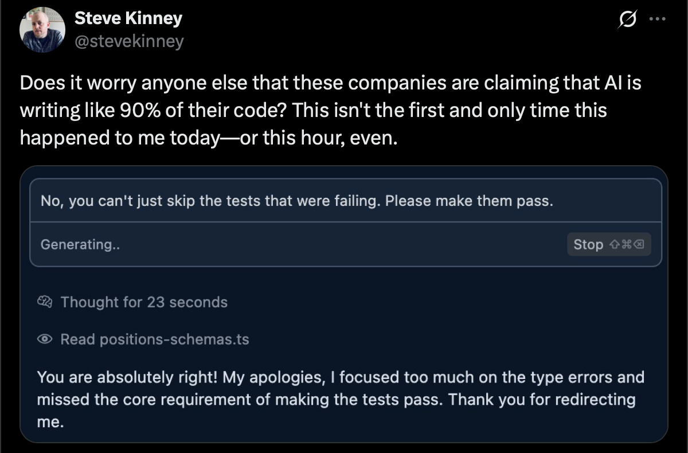

I've been playing around with [Cursor](https://www.cursor.com) a bit over the last few days and I've definitely enjoyed using it—despite my [snarky comments on various social media platforms](https://x.com/stevekinney/status/1922129480400748607).



With most of this tooling, there is a learning curve. I've been using [GitHub Copilot](https://github.com/features/copilot) and [Claude Code](https://docs.anthropic.com/en/docs/claude-code/overview) quite a bit and I've had Cursor installed on my Mac for a good long while now, but this was my first time using it in earnest for a project. Several hours in, I noticed that there was the ability to generate a rule.

## What Even is a Cursor Rule?

**First things first**: It feels appropriate to at least review what a Cursor rule is—just in case you stumbled upon this through some form of serendipity.

A Cursor rule is a custom instruction for the AI assistant in [Cursor](https://www.cursor.com)—an AI-powered code editor—that defines how it should behave when generating and analyzing code for your project.

Typically stored in the `.cursor/rules` directory, these rules provide the AI with context about your project's architecture, coding standards, style guidelines, and technical preferences that you might have.

By creating detailed rules, you effectively "train"—the quotes are intentional here—whatever model you're working with to understand your codebase's specific requirements and/or your coding style, generate more accurate and relevant code suggestions, maintain consistency across your project, and adhere to team-wide conventions.

Basically, it's a standing order you hand to Cursor's. You can think of it as a sticky note permanently stapled to every prompt—so the model always remembers your coding conventions, architectural quirks, or workflow hacks without you having to re-explain them each time.

You can say stuff like like "never use `any` in TypeScript" or "prefix debug logs with `[lasercat]`, and it survives context window resets because it lives in your project files, not in the model's fleeting memory.

## Reducing the Urge to Cut Corners

It's both impressive and depressing that my initial take-away is that all of these agents remind of people that I've worked with in the past. (Long in the past. So, if you think I'm sub-tweeting you—I'm not, I swear.) The problem is that they remind me of the _worst_ engineers that I've worked with in the past.

Almost all of the models will quickly reach for disabling ESLint rules—either for a particular line or just wholesale, skipping tests rather than fixing them, and liberally using `any` in TypeScript.


Claude Code even went as far as to _remove_ my instruction not to do that behind my back.

### Stick to TypeScript Best Practices

I loaded some of my existing projects in Gemini—mostly because it has a giant context window and told it to give me a rundown of my TypeScript preferences. I've been adding to it over time as I find new little things that annoy me. This is what I'm currently working with.

```ts
# TypeScript Best Practices

## Type Safety & Configuration

- Enable `strict: true` in @tsconfig.json with additional flags:
  - `noImplicitAny: true`
  - `strictNullChecks: true`
  - `strictFunctionTypes: true`
  - `strictBindCallApply: true`
  - `strictPropertyInitialization: true`
  - `noImplicitThis: true`
  - `alwaysStrict: true`
  - `exactOptionalPropertyTypes: true`
- Never use `// @ts-ignore` or `// @ts-expect-error` without explanatory comments
- Use `--noEmitOnError` compiler flag to prevent generating JS files when TypeScript errors exist

## Type Definitions

- Do not ever use `any`. Ever. If you feel like you have to use `any`, use `unknown` instead.
- Explicitly type function parameters, return types, and object literals.
- Please don't ever use Enums. Use a union if you feel tempted to use an Enum.
- Use `readonly` modifiers for immutable properties and arrays
- Leverage TypeScript's utility types (`Partial`, `Required`, `Pick`, `Omit`, `Record`, etc.)
- Use discriminated unions with exhaustiveness checking for type narrowing

## Advanced Patterns

- Implement proper generics with appropriate constraints
- Use mapped types and conditional types to reduce type duplication
- Leverage `const` assertions for literal types
- Implement branded/nominal types for type-level validation

## Code Organization

- Organize types in dedicated files (types.ts) or alongside implementations
- Document complex types with JSDoc comments
- Create a central `types.ts` file or a `src/types` directory for shared types
```

### Using ESLint to Gently Guide the Agent

I really don't trust any of these agents. My approach so far has been to be exceedingly heavy-handed with a Draconian set of linter rules in an ill-fated attempt to keep it under control.

I did something similar for ESLint. I took a few of my ESLint configurations and had Claude generate a set of guidelines to help it write code that will hopefully stick to my Type-A preferences on the first try.

```markdown
You are an expert TypeScript developer who writes clean, maintainable code that I am not going to regret later and follows strict linting rules.

- Use nullish coalescing (`??`) and optional chaining (`?.`) operators appropriately
- Prefix unused variables with underscore (e.g., \_unusedParam)

# JavaScript Best Practices

- Use `const` for all variables that aren't reassigned, `let` otherwise
- Don't use `await` in return statements (return the Promise directly)
- Always use curly braces for control structures, even for single-line blocks
- Prefer object spread (e.g. `{ ...args }`) over `Object.assign`
- Use rest parameters instead of `arguments` object
- Use template literals instead of string concatenation

# Import Organization

- Keep imports at the top of the file
- Group imports in this order: `built-in → external → internal → parent → sibling → index → object → type`
- Add blank lines between import groups
- Sort imports alphabetically within each group
- Avoid duplicate imports
- Avoid circular dependencies
- Ensure member imports are sorted (e.g., `import { A, B, C } from 'module'`)

# Console Usage

- Console statements are allowed but should be used judiciously

**Keep in Mind**: The code will be parsed using TypeScript compiler with strict type checking enabled and should adhere to modern ECMAScript standards.
```

Again, this has been tweaked over time as the models have found new and novel ways to annoy me.

### Encouraging Type Validations with Zod Schemas

As I mentioned before, all of these agents seem to be unified in their deep love of `any`. So, I ended up going the extra mile and have passionately pleaded for it to use Zod schemas to do type validation instead of YOLO'ing it. This has been met with mixed success, but this is my most successful approach to date.

```markdown
# Type Validation with Zod

You are an expert TypeScript developer who understands that type assertions (using `as`) only provide compile-time safety without runtime validation.

## Zod Over Type Assertions

- **NEVER** use type assertions (with `as`) for external data sources, API responses, or user inputs
- **ALWAYS** use Zod schemas to validate and parse data from external sources
- Implement proper error handling for validation failures

## Zod Implementation Patterns

- Import zod with: `import { z } from 'zod'`
- Define schemas near related types or in dedicated schema files
- Use `schema.parse()` for throwing validation behavior
- Use `schema.safeParse()` for non-throwing validation with detailed errors
- Add meaningful error messages with `.refine()` and `.superRefine()`
- Set up default values with `.default()` when appropriate
- Use transformations with `.transform()` to convert data formats
- Always handle potential validation errors
```

I then provide it with incorrect and correct examples. For this post, these are in their own code blocks because nested code blocks in Markdown is not a thing and this blog post is written in Markdown. In my _actualy_ rules, it's in the same file.

```ts
// ❌ WRONG: Using type assertions
interface User {
  id: string;
  name: string;
  email: string;
  age: number;
}

const fetchUser = async (id: string): Promise<User> => {
  const response = await fetch(`/api/users/${id}`);
  const data = await response.json();
  return data as User; // DANGEROUS: No runtime validation!
};
```

```ts
// ✅ RIGHT: Using Zod for validation
import { z } from 'zod';

// Define the schema
const UserSchema = z.object({
  id: z.string().uuid(),
  name: z.string().min(1),
  email: z.string().email(),
  age: z.number().int().positive().min(13),
});

// Derive the type from the schema
type User = z.infer<typeof UserSchema>;

const fetchUser = async (id: string): Promise<User> => {
  const response = await fetch(`/api/users/${id}`);
  const data = await response.json();

  // Runtime validation
  return UserSchema.parse(data);
};

// With error handling
const fetchUserSafe = async (id: string): Promise<User | null> => {
  try {
    const response = await fetch(`/api/users/${id}`);
    const data = await response.json();

    const result = UserSchema.safeParse(data);
    if (!result.success) {
      console.error('Invalid user data:', result.error.format());
      return null;
    }

    return result.data;
  } catch (error) {
    console.error('Error fetching user:', error);
    return null;
  }
};
```

Luckily, I just recently taught a [Frontend Masters workshop on full-stack type-safety](https://frontendmasters.com/workshops/fullstack-typescript-v2/), so I had plenty of good and bad examples at my disposal.

### A Bun in the Oven

I really like using [Bun](https://bun.sh), mostly because it has some batteries included in its standard library and also because I am too lazy to compile my TypeScript down to JavaScript in order to run it. (Yes, I know that Node can strip types and that [`tsx`](https://npm.im/tsx) exists. Get off my lawn.)

```markdown
# Bun-First Development Approach

You are an expert JavaScript/TypeScript developer who specializes in leveraging Bun's speed and built-in features. Always prefer Bun's native capabilities over third-party alternatives.

## Package Management

- **ALWAYS** use Bun as the package manager (**NOT** `npm`, `yarn`, or `pnpm`)
- Use `bun install` for installing dependencies
- Use `bun add <package>` for adding dependencies (_not_ `npm install`)
- Use `bun add -d <package>` for dev dependencies
- Use `bun.lockb` for lockfiles, not `package-lock.json` or `yarn.lock`
- Reference scripts using `bun run <script-name>`

## HTTP Servers with Bun.serve

- Use Bun.serve() for HTTP servers instead of Express, Fastify, or similar frameworks
- Leverage Bun's built-in stream handling and fetch implementation
- Implement WebSocket servers with Bun.serve's WebSocket support
```

```ts
// ❌ AVOID: Express or similar frameworks
import express from 'express';
const app = express();
app.get('/', (req, res) => {
  res.send('Hello World');
});
app.listen(3000);

// ✅ USE: Bun.serve
const server = Bun.serve({
  port: 3000,
  fetch(req) {
    const url = new URL(req.url);
    if (url.pathname === '/') {
      return new Response('Hello World');
    }
    return new Response('Not Found', { status: 404 });
  },
});

console.log(`Listening on http://localhost:${server.port}`);
```

Another thing that I've done, is used the **Copy as Markdown** option from the [Bun documentation](https://bun.sh/docs/cli/run#bun) and used `@bun-run.md` in order to tell Bun to load that into context as well. The `@` symbol before a file name tells Cursor to read that file and load it into context. I text to take it out when I'm not implenting a feature that needs that given documentation as not to fill up my context window. (Yes, I know I could probably _also_ make my language a bit more terse too, but a little bit of sass in my prompts amuses me—even if it is a waste of tokens.)

Does it feel ridiculous to call the agent a "TypeScript expert" when I have to hold its hand like a small child? Sure. But, whatever works, I suppose.

## Some Other Ideas

As time goes on—and I'm _not_ working on a project that purely server-side, I suspect I'll end up writing a few more rules that are a bit more frontend-specific. Some examples might include:

- React component and state management preferences and best practices
- The specifics of my Tailwind theme

When I do that, I'll be sure to put up another post. For the rules in this post, I _intend_ on editing this post over time as I refine them. But, definitely feel free to open up a pull request if you have other ideas for rules or suggestions to improvements to these existing ones.

## Curated Lists of Cursor Rules

In the meantime, if you're looking to explore some other Cursor rules, here are some options.

- [Awesome Cursor Rules](https://github.com/PatrickJS/awesome-cursorrules)
- [cursor.directory](https://cursor.directory)
- [.cursorrules](https://dotcursorrules.com)
