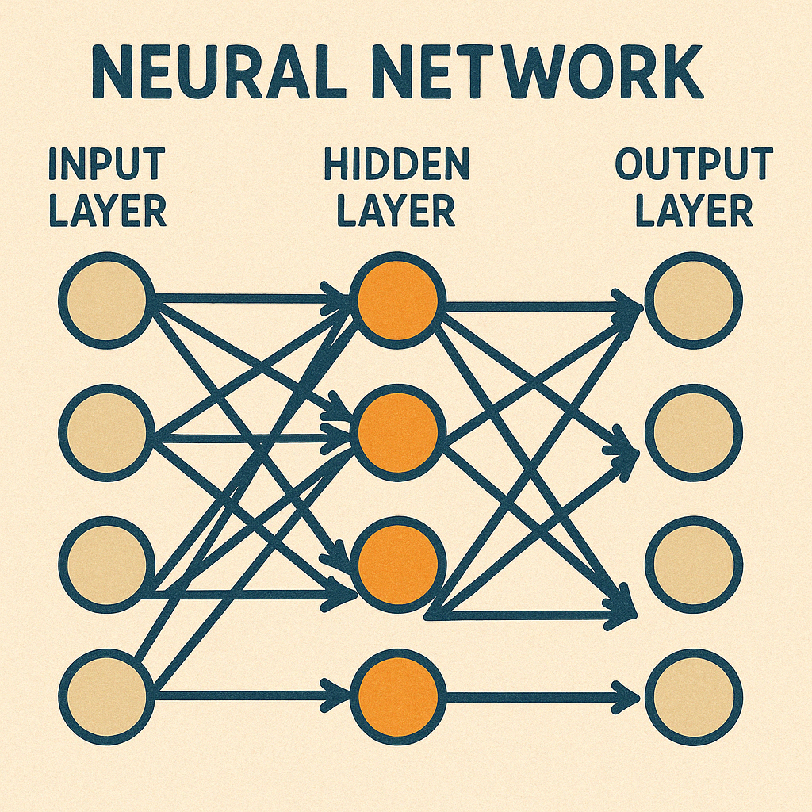

At its core, a [**neural network**](https://en.wikipedia.org/wiki/Neural_network_%28machine_learning%29) is like a very complex function or a pipeline you might build in your programming language of choice. You can think of it as a series of processing steps chained together—like a `pipe` function. You feed data in one end (function arguments or parameters), it goes through various transformations, and you get an output (like a return value).

These individual processing steps are often called [**neurons**](https://www.baeldung.com/cs/neural-networks-neurons), but let's not get _too_ hung up on the biological analogy. Think of them as little computational units. They take some input numbers, do a small calculation, and pass the result along. These neurons are organized into [**layers**](https://www.geeksforgeeks.org/layers-in-artificial-neural-networks-ann/), much like you might organize your code into modules or stages in a data processing pipeline.

The thing that makes neural networks useful for learning is that the mathematical functions they represent are _differentiable_. Basically, this means we can calculate how a small change in any internal setting affects the final output. Why does that matter? Because it allows the network to figure out _how_ to get better. If the network's output is wrong, differentiability tells us which internal knobs to tweak, and in which direction, to make the output slightly _less wrong_ next time. It's like getting automated hints on how to adjust parameters to improve performance.

Imagine you're mixing colors to paint the perfect green. You start with some blue and some yellow paint. If the green you mix is too bluish, you know exactly what to do next time: use a bit less blue or a bit more yellow.

That's what “differentiable” means for neural networks. When the network makes a mistake, we know exactly how to tweak each little part inside to get closer to the right answer next time. It helps the network learn by showing exactly how each small change affects the final result.

## Layers, Weights, and Biases

Let's quickly translate the main components into familiar—to a software engineer, at least—terms:

- **Input Layer:** This is where the raw data goes in—think of it as the parameters to your main function. It could be pixel values from an image, numerical representations of words, or raw audio samples.
- **Hidden Layers:** These are the intermediate processing stages, like the internal helper functions or private methods in your classes. They take the input (or the output from previous layers) and transform it, gradually extracting more complex features or patterns. A network can have many hidden layers, allowing it to model very complex relationships.
- **Output Layer:** This is the final step that produces the result—the `return` statement of your big function. Depending on the task, it might output a probability (e.g., 90% chance this image is a cat), a number, or, in generative AI, the next piece of data (like a word or pixel).

How do these layers actually _do_ anything? The connections between neurons have associated [**weights**](https://www.geeksforgeeks.org/the-role-of-weights-and-bias-in-neural-networks/), which are essentially numbers that determine the strength or importance of a connection. Think of them as configuration values or coefficients you can tune. Each neuron also typically has a [**bias**](https://www.geeksforgeeks.org/the-role-of-weights-and-bias-in-neural-networks/), which is like a default offset, allowing the neuron to activate more or less easily. These weights and biases are the aforementioned knobs the network learns to adjust during training. They start random (or with sensible defaults) and get refined over time.

## How Neural Networks Learn: The Training Loop

So how does the network learn the right values for all those weights and biases? Through a process called [**training**](https://developers.google.com/machine-learning/crash-course/neural-networks), which you can think of as a highly iterative testing and refinement cycle, perhaps the world's noisiest Continuous Integration loop.

First, you run data through the network with its current weights and biases—this is the **Forward Pass**, like executing your code. Then, you compare the network's output to the known correct answer using a [**Loss Function**](https://builtin.com/machine-learning/loss-functions). This function calculates how "wrong" the network was—think of it as running your unit tests and seeing how many failed, or how far off the results were.

Next comes the clever part, which is typically called [**backpropagation**](https://developers.google.com/machine-learning/crash-course/neural-networks/backpropagation). Because the network is differentiable, it can efficiently calculate how much each individual weight and bias contributed to the final error. It essentially works backward from the error, figuring out the "gradient"—a direction indicating how to adjust each knob (weight/bias) to reduce the error slightly. It's like tracing an error back through your call stack to find the source, but with mathematical precision guiding the fix.

Finally, an [**Optimizer**](https://www.analyticsvidhya.com/blog/2021/10/a-comprehensive-guide-on-deep-learning-optimizers/) (like "gradient descent") takes these calculated adjustments and updates the weights and biases by a tiny amount. You commit these small changes and repeat the whole process—forward pass, calculate error, backpropagate adjustments, update weights—millions or even billions of times with lots of different data examples. Gradually, the network's parameters get tuned, and it starts producing more accurate outputs, effectively learning patterns from the data.

## Enter Generative AI

Traditional neural networks are often used for classification ("Is this a cat or a dog?") or prediction ("What will sales be next quarter?"). Generative AI takes a leap forward. Instead of just identifying existing patterns, it learns the underlying patterns so well that it can _create_ new data that follows those patterns. Instead of saying "This is a cat," it says, "Here's a brand new picture of a cat that didn't exist before."

The key concept behind many recent advances, especially in text and image generation, is the [**Transformer architecture**](https://en.wikipedia.org/wiki/Transformer_%28deep_learning_architecture%29). You can loosely think of it as a highly sophisticated autocompletion engine. One of its core components is [**attention**](https://en.wikipedia.org/wiki/Attention_%28machine_learning%29), a mechanism that allows the model, while generating the next piece of output (like a word), to look back and focus on the most relevant parts of the input or previously generated content. It's like how you might refer back to specific requirements or earlier paragraphs while writing a document or code.

For text generation, models often work token by token (a token is roughly a word or part of a word), predicting the most likely next token based on the preceding ones. For images, popular techniques like [**diffusion models**](https://www.assemblyai.com/blog/diffusion-models-for-machine-learning-introduction/) start with random noise and iteratively refine it, step-by-step, guided by your text prompt, until a coherent image emerges.

Neural networks might sound intimidating at first, but at their core, they're just clever, stackable math functions that learn from data. By understanding how inputs flow through layers, how training fine-tunes weights via backpropagation, and how architectures like Transformers or diffusion models push generative AI forward, you unlock the ability to reason about these systems—not just use them.
