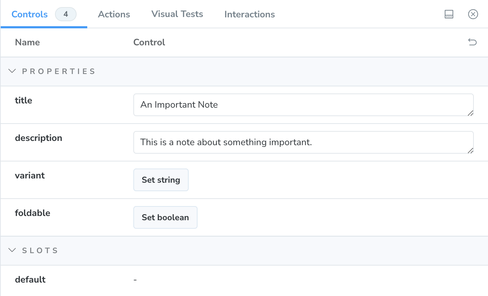

I use [Obsidian](https://obsidian.md) for a lot of my writing and note gathering when I'm working on a course. I wouldn't mind using [Obsidian Publish](https://obsidian.md/publish) for hosting my notes and—as of this writing—I do have a paid account, but given that I want a high-level of customization and the ability to include code along with my content, I need a bit more control over how the content is hosted than Obsidian Publish is willing to give me.

> [!Abstract] We're Doing This Live
> I'm in the middle of working on a course on building out a component library in Storybook, so I figured, this was a good excuse to document my thinking around building out a component. I'm coming into this relatively cold and this piece documents my thinking as I went about implementing the component that you're reading _right now_.

I want to be able to use Obsidian's [Callout](https://help.obsidian.md/Editing+and+formatting/Callouts) components, but they're not a standard feature of Markdown. So, I need to build out my own `Callout` component to render them properly.

This is what they look like right now as I embark on this journey.


Looking at the documentation, it looks like we have a few variations. There are a number of different types of callouts (e.g. `note`, `tip`, `warning`, `question`, etc.), callouts can have an optional title, callouts can have an optional body, and they can be foldable like an accordion component.

As far as variations are concerned, Obsidian supports the following:

| Variation | Aliases            | Color  |
| --------- | ------------------ | ------ |
| abstract  | summary, tldr      | green  |
| bug       |                    | red    |
| danger    | error              | red    |
| example   |                    | purple |
| failure   | fail, missing      | red    |
| info      |                    | blue   |
| note      |                    | blue   |
| question  | faq, help          | orange |
| quote     | cite               | grey   |
| success   | check, done        | green  |
| tip       | hint, important    | green  |
| todo      |                    | blue   |
| warning   | caution, attention | orange |

With all of that in mind, Here is some pseudo-code of what I'd like the interface for my component to look like.

```tsx
<Callout variant="note" title="An Important Note" foldable>
	This is the body of a very important note.
</Callout>
```

That could just as easily be Svelte or React—and that's one of the cool things about building out a design system, a shocking amount of is framework agnostic.

## Creating a Type for Callout Variations

First up we want to take that table of all of the variation and make a type that comprises of the union of all of them.

```ts
type CalloutVariation =
	| 'abstract'
	| 'attention'
	| 'bug'
	| 'caution'
	| 'check'
	| 'cite'
	| 'danger'
	| 'done'
	| 'error'
	| 'example'
	| 'fail'
	| 'failure'
	| 'faq'
	| 'help'
	| 'hint'
	| 'important'
	| 'info'
	| 'missing'
	| 'note'
	| 'question'
	| 'quote'
	| 'success'
	| 'summary'
	| 'tip'
	| 'tldr'
	| 'todo'
	| 'warning';
```

## Determining the Component Properites

Then when it comes to our component, we can assume that the body of the callout will be the `<slot />` of the Svelte component. This is similar to `children` if you're more familiar with React.

One caveat here is that Storybook doesn't have great support for `<slot />`. In React, we can get around this by using the `children` prop, but that's not something that exists in Svelte.

I'm basically left with two and a half options:

1. Don't use a `<slot />` and opt for a `description` or `body` prop instead. This will let me use Storybook's [Component Story Format](https://storybook.js.org/docs/api/csf/) with not additional work.
2. Use the `render` property and pass in a function that renders my component instead of using the object notation.
3. Support both. If not slot is present, use the `description` property.

Normally, I wouldn't feel super great about letting Storybook determine the API for my component, but since this component is most likely to be used in the process of compiling Markdown, I don't really mind passing a long string to `description`. That said, I think I'm going for the third option.

My initial component structure is going to look something like this:

```svelte
<script lang="ts">
	import { Pencil } from 'lucide-svelte';
	import type { CalloutVariation } from './variations';

	export let variant: CalloutVariation = 'note';
	export let title: string = '';
	export let description: string = '';
	export let foldable: boolean = false;
</script>

<div class="rounded-md border border-current bg-blue-50 p-4 text-blue-700 shadow-sm">
	<div class="mb-2 flex items-center gap-1 leading-tight">
		<Pencil class="w-4" />
		<span class="font-bold">{title}</span>
	</div>
	<div class="prose">
		<slot><p>{description}</p></slot>
	</div>
</div>
```

Obsidian uses Lucide for icons and that was already what I was using on this site. I took a look at the default callout and saw that it was using the [Pencil icon](https://lucide.dev/icons/pencil). One of the things that I'm immediately thinking about is the fact that I'm not sure that I want to have to load every single icon if the component is only used once or only in a few variations. I _could_ choose to load them dynamically, but I'm not totally sure if I want to do that just yet.

Here is a picture of what it looks like at this point.


Now, this is obviously incomplete. It doesn't support any of the variations listed above, the colors and icon are hard-coded, and it's not foldable.

I'm using the `prose` class from [`@tailwindcss/typography`](https://github.com/tailwindlabs/tailwindcss-typography) because callout can support nested markdown, but I'm not totally sure how I feel about that just yet. And, I reserve the right to change my mind.

## Writing the First Story

Since this callout is going to have lots of different variations, I want to create stories for each of the given permutations. Let's start with a story that captures out default state.

```ts
import type { Meta, StoryObj } from '@storybook/svelte';
import Callout from './callout.svelte';

const meta = {
	title: 'Components/Callout',
	component: Callout,
} satisfies Meta<Callout>;

export default meta;
type Story = StoryObj<typeof meta>;

export const Default: Story = {
	args: {
		title: 'An Important Note',
		description: 'This is a note about something important.',
	},
};
```

One of the first things that jumps out at me is that right now, I'd have to type the name of the variant in by hand if I wanted to change it in a given story. I'd love to make it a list that I could select from, but right now, I only have access to that list as a type.



A trick that I commonly use here is to create a constant value and then derive the type from that. Let me show you what that looks like.

```ts
export const variations = [
	'abstract',
	'attention',
	'bug',
	'caution',
	'check',
	'cite',
	'danger',
	'done',
	'error',
	'example',
	'fail',
	'failure',
	'faq',
	'help',
	'hint',
	'important',
	'info',
	'missing',
	'note',
	'question',
	'quote',
	'success',
	'summary',
	'tip',
	'tldr',
	'todo',
	'warning',
] as const;

export type CalloutVariation = (typeof variations)[number];
```

Using `as const` tells TypeScript that this array is never going to change. Without the `as const`, the `variations` array would have a type of `string[]`, but as a constant, TypeScript knows exactly what values to expect in there. As a result, `ColorVaration` has the exact same union type as it did before.

I can now update my story as follows:

```ts
import type { Meta, StoryObj } from '@storybook/svelte';
import Callout from './callout.svelte';
import { variations } from './variations';

const meta = {
	title: 'Components/Callout',
	component: Callout,
	argTypes: {
		variant: {
			control: 'select',
			options: variations,
		},
	},
} satisfies Meta<Callout>;

// …the rest of the story…
```

You'll notice that I am now able to access the callout variations as an array and still use it as a type in the component. As a result, we now have the option to switch between all of the different variations of the callout.


That said, it doesn't do anything yet.

## Supporting Callout Variations

Our next task is to be able to set the correct color and icon for each callout type. Before endeavoring on this adventure, I already took the time to look up the color associated with each variation, but I'll need to decide which I icon I want to use for each. Given that Obsidian and I are both using Lucide for our icons, I think I'll just follow their lead.

| Variation | Icon                                                |
| --------- | --------------------------------------------------- |
| abstract  | [clipboard-list](https://lucide.dev/clipboard-list) |
| bug       | [bug](https://lucide.dev/bug)                       |
| danger    | [zap](https://lucide.dev/zap)                       |
| example   | [list](https://lucide.dev/list)                     |
| failure   | [x](https://lucide.dev/x)                           |
| info      | [info](https://lucide.dev/info)                     |
| note      | [pencil](https://lucide.dev/pencil)                 |
| question  | [help-circle](https://lucide.dev/help-circle)       |
| quote     | [quote](https://lucide.dev/quote)                   |
| success   | [check](https://lucide.dev/check)                   |
| tip       | [flame](https://lucide.dev/flame)                   |
| todo      | [check-circle-2](https://lucide.dev/check-circle-2) |
| warning   | [alert-triangle](https://lucide.dev/alert-triangle) |

Earlier, I opined on how I wasn't sure I wanted to have to import all of these. But, I am going to start by doing that and then refactor later. But, first let's worry about the colors.

## Adjusting the Color Based on the Callout Variation

Not only do I have over a dozen variations, but some of those variations have aliases, which adds an additional level of complexity. My first thought it to create some kind of object that will give me the correct color.

### Resolving Aliases

First of all, I don't ever want to think about these aliases again. So, I'm going to write a little function to quickly resolve them whatever variation they alias to.

```ts
const aliases = {
	summary: 'abstract',
	tldr: 'abstract',
	error: 'danger',
	fail: 'failure',
	missing: 'failure',
	faq: 'question',
	help: 'question',
	cite: 'quote',
	check: 'success',
	done: 'success',
	hint: 'tip',
	important: 'tip',
	attention: 'warning',
	caution: 'warning',
} as const;

const isAlias = (variant: CalloutVariation): variant is keyof typeof aliases => {
	return variant in aliases;
};

type Alias = keyof typeof aliases;
type ResolvedVariation = Exclude<CalloutVariation, Alias>;

export const getVariation = (variant: CalloutVariation): ResolvedVariation => {
	if (isAlias(variant) && variant in aliases) {
		return aliases[variant];
	}
	return variant as ResolvedVariation;
};
```

With that solved, I can do something similar with the core variations and the colors. I chose to write this all in `variations.ts` because I don't want to junk up my component definition with all of this business logic _and_ I want to leave my self the option to be able to easily grab these functions and pull them into some unit tests without needing to worry about the rest of the component. You can make an arguement that this should be in it's own file and I don't know that you'll get a lot of pushback from me.

```ts
const variationColors: Record<ResolvedVariation, string> = {
	abstract: 'bg-green-50 text-green-700',
	bug: 'bg-red-50 text-red-700',
	danger: 'bg-red-50 text-red-700',
	example: 'bg-purple-50 text-purple-700',
	failure: 'bg-red-50 text-red-700',
	info: 'bg-blue-50 text-blue-700',
	note: 'bg-blue-50 text-blue-700',
	question: 'bg-orange-50 text-orange-700',
	quote: 'bg-slate-50 text-slate-700',
	success: 'bg-green-50 text-green-700',
	tip: 'bg-green-50 text-green-700',
	todo: 'bg-blue-50 text-blue-700',
	warning: 'bg-orange-50 text-orange-700',
};

export const getVariationColor = (variation: CalloutVariation): string => {
	const v = getVariation(variation);
	return variationColors[v];
};
```

Now, let's wire all of this into our component in. I _could_ use something like `tailwind-merge` to combine my classes, but right now I know that there won't be any conflicts with the existing classes since I'm only using this for colors.

```svelte
<script lang="ts">
	import { Pencil } from 'lucide-svelte';
	import { getVariationColor, type CalloutVariation } from './variations';

	export let variant: CalloutVariation = 'note';
	export let title: string = '';
	export let description: string = '';
	export let foldable: boolean = false;
</script>

<div class="rounded-md border border-current p-4 shadow-sm {getVariationColor(variant)}">
	<div class="mb-2 flex items-center gap-1 leading-tight">
		<Pencil class="w-4" />
		<span class="font-bold">{title}</span>
	</div>
	<div class="prose">
		<slot><p>{description}</p></slot>
	</div>
</div>
```

Immediately, I'm able to head over to my Storybook and toggle between the variants. But, I think I want to make a set of stories so that I can run visual tests against them. Let's update our story as follows:

```ts
import type { Meta, StoryObj } from '@storybook/svelte';
import Callout from './callout.svelte';
import { variations } from './variations';

const meta = {
	title: 'Components/Callout',
	component: Callout,
	args: {
		title: 'This is a Callout',
		description: 'This is a description of the callout.',
		foldable: false,
	},
	argTypes: {
		variant: {
			control: 'select',
			options: variations,
		},
	},
} satisfies Meta<Callout>;

export default meta;
type Story = StoryObj<typeof meta>;

export const Default: Story = {};

export const Abstract: Story = {
	args: {
		variant: 'abstract',
	},
};

export const Bug: Story = {
	args: {
		variant: 'bug',
	},
};

export const Danger: Story = {
	args: {
		variant: 'danger',
	},
};

export const Example: Story = {
	args: {
		variant: 'example',
	},
};

export const Failure: Story = {
	args: {
		variant: 'failure',
	},
};

export const Note: Story = {
	args: {
		variant: 'note',
	},
};

export const Info: Story = {
	args: {
		variant: 'info',
	},
};

export const Question: Story = {
	args: {
		variant: 'question',
	},
};

export const Quote: Story = {
	args: {
		variant: 'quote',
	},
};

export const Success: Story = {
	args: {
		variant: 'success',
	},
};

export const Tip: Story = {
	args: {
		variant: 'tip',
	},
};

export const Todo: Story = {
	args: {
		variant: 'todo',
	},
};

export const Warning: Story = {
	args: {
		variant: 'warning',
	},
};
```

In addition to make a whole bunch of stories, I went ahead and move some of the default arguments to the `meta` for the component. Now we need to get to the icons.

## Getting the Icon for the Callout Variation

My first thought is to do something similar to what we did the the colors. Although, this time I'll need to pull in a whole bunch of components.

Let's import all of our icons and some types to help us work with them.

```ts
import type { ComponentType } from 'svelte';
import {
	type Icon,
	AlertTriangle,
	Bug,
	Check,
	CheckCircle2,
	ClipboardList,
	Flame,
	HelpCircle,
	Info,
	List,
	Pencil,
	Quote,
	X,
	Zap,
} from 'lucide-svelte';
```

Next, we'll define a list a dictionary that associates our variations to our icons.

```ts
const variationIcons: Record<ResolvedVariation, ComponentType<Icon>> = {
	abstract: ClipboardList,
	bug: Bug,
	danger: Zap,
	example: List,
	failure: X,
	info: Info,
	note: Pencil,
	question: HelpCircle,
	quote: Quote,
	success: Check,
	tip: Flame,
	todo: CheckCircle2,
	warning: AlertTriangle,
};

export const getIcon = (variation: CalloutVariation) => {
	const v = getVariation(variation);
	return variationIcons[v];
};
```

Finally, we'll pull that logic into our component. I'm using `svelte:component` to dynamically render the correct icon component.

```svelte
<script lang="ts">
	import { getVariationColor, getIcon, type CalloutVariation } from './variations';

	export let variant: CalloutVariation = 'note';
	export let title: string = '';
	export let description: string = '';
	export let foldable: boolean = false;
</script>

<div class="rounded-md border border-current p-4 shadow-sm {getVariationColor(variant)}">
	<div class="mb-2 flex items-center gap-1 leading-tight">
		<svelte:component this={getIcon(variant)} class="w-4" />
		<span class="font-bold">{title}</span>
	</div>
	<div class="prose">
		<slot><p>{description}</p></slot>
	</div>
</div>
```

## Supporting a Default Title

Obsidian's callouts will let you omit a title and use the name of the variation as the title. All of the variations are one word; so really, we just need a simple function to capitalize the variation name. I haven't explicitly dealt with the fact that Obsidian's variations are case-insensitive and my current implementation is _very_ case sensitive. But, I'm going to at least prepare for that in my `capitalize` function.

```ts
export const capitalize = (str: string): string => {
	return str.charAt(0).toUpperCase() + str.slice(1).toLowerCase();
};
```

And now, we can set a default value for our title based on the variant.

```svelte
<script lang="ts">
	import { capitalize } from '$lib/capitalize';
	import { getVariationColor, getIcon, type CalloutVariation } from './variations';

	export let variant: CalloutVariation = 'note';
	export let title: string = capitalize(variant);
	export let description: string = '';
	export let foldable: boolean = false;
</script>
```

And now, I think I'll remove the title as a default argument in the stories.

```ts
const meta = {
	title: 'Components/Callout',
	component: Callout,
	args: {
		// title: 'This is a Callout', ❌ Remove this!
		description: 'This is a description of the callout.',
		foldable: false,
	},
	argTypes: {
		variant: {
			control: 'select',
			options: variations,
		},
	},
} satisfies Meta<Callout>;
```

We'll also add an additional story that _does_ set the title.

```ts
export const WithTitle: Story = {
	args: {
		title: 'An Important Callout',
	},
};
```

## Supporting the Optional Description

If we just don't pass in a `description` slot, then it doesn't look too bad, but there is some additional space. Let's set up a story and then update our component so that it doesn't have the little bit of extra space.

```ts
export const WithoutDescription: Story = {
	args: {
		title: 'An Important Callout',
		description: undefined,
	},
};
```


We'll only render that additional `div` with the description if there is either a `description` _or_ some content in the `<slot />`.

```svelte
<script lang="ts">
	import { capitalize } from '$lib/capitalize';
	import { getVariationColor, getIcon, type CalloutVariation } from './variations';

	export let variant: CalloutVariation = 'note';
	export let title: string = capitalize(variant);
	export let description: string = '';
	export let foldable: boolean = false;
</script>

<div class="space-y-2 rounded-md border border-current p-4 shadow-sm {getVariationColor(variant)}">
	<div class="flex items-center gap-1 leading-tight">
		<svelte:component this={getIcon(variant)} class="w-4" />
		<span class="font-bold">{title}</span>
	</div>
	{#if $$slots.default || description}
		<div class="prose">
			<slot><p>{description}</p></slot>
		</div>
	{/if}
</div>
```

Now, it looks like we want it to—with no additional space at the bottom.

## Making the Callout Foldable

Do I _really_ care about foldable callouts? I don't, but as long as I've gotten this far, I might as well add support for foldable components.

Looking at Obsidian's implementation, they're just taking Lucide's `chevron-down` component and rotating it -90 degrees when the callout is collapsed. I don't need to reinvent the wheel here. Let's start with a simple story so that we have something to look at.

```ts
export const Foldable: Story = {
	args: {
		foldable: true,
	},
};
```

If I look at Obsidian's implementation, anywhere on the title will open or close the foldable callout, but clicking on the body does not fold the callout back up. My first tempotation was to try to get clever with a hidden checkbox and then show or hide the content with CSS based on the state of the checkbox, but I think I'll leverage Svelte instead. (I reserve the right to revisit this decision in the future.)

I'm going to use a number of techniques.

1. I'm going to use a hidden checkbox and Tailwind's `peer` utility to style the chevron and get it pointing in the right direction.
2. I'm going to make the entire clickable region the label in order to trigger the checkbox.
3. I'm going to bind that checkbox and add it to the logic where I show or hide the description section.

This is what I wrote for my first draft.

```svelte
<script lang="ts">
	import { ChevronDown } from 'lucide-svelte';
	import { capitalize } from '$lib/capitalize';
	import { getVariationColor, getIcon, type CalloutVariation } from './variations';

	export let variant: CalloutVariation = 'note';
	export let title: string = capitalize(variant);
	export let description: string = '';
	export let foldable: boolean = false;

	let open = !foldable;
</script>

<div class="space-y-2 rounded-md border border-current p-4 shadow-sm {getVariationColor(variant)}">
	<!-- Use a label element to make the entire region clickable -->
	<label class="flex items-center gap-1 leading-tight text-current">
		<input type="checkbox" bind:checked={open} class="peer hidden" />
		<!-- Hidden checkbox -->
		<svelte:component this={getIcon(variant)} class="w-4" />
		<span class="font-bold">{title}</span>
		{#if foldable}
			<!-- Use Tailwind's `peer` variant to control the rotation of the checkbox -->
			<ChevronDown class="ml-auto w-4 -rotate-90 transition-transform peer-checked:rotate-0 " />
		{/if}
	</label>
	{#if $$slots.default || description}
		<!-- Hide the description unless the callout is in an open state -->
		<div class="prose" class:hidden={!open}>
			<slot><p>{description}</p></slot>
		</div>
	{/if}
</div>
```

I think that this is mostly accessible, but I'll set up some accessibility audits in a future piece and we'll find out together. I also want to test to make sure that I don't break the mechanics of folding the callout. But, that's also a future endeavor. For right now, I have a component that I'm pretty happy with.
