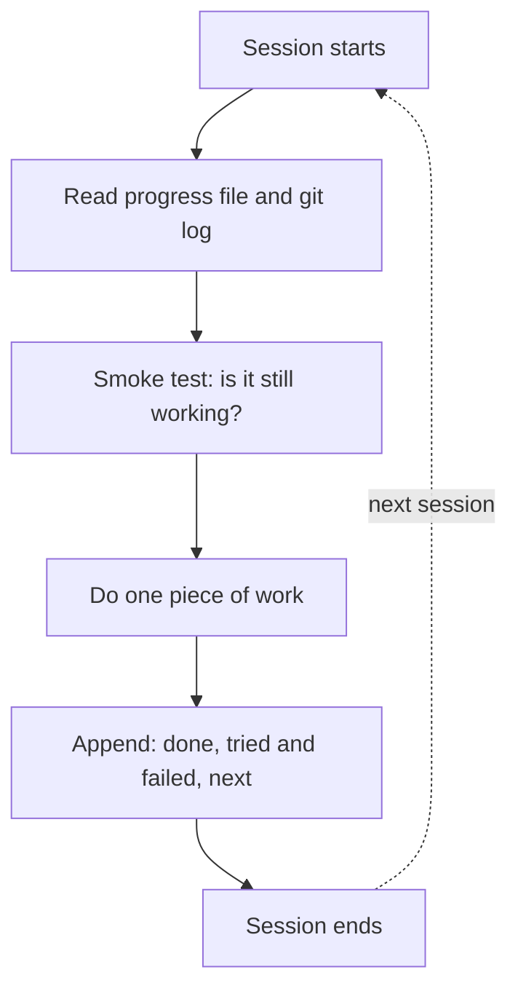
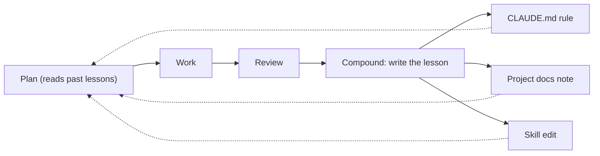

Every session starts from nothing. Whatever the agent learned yesterday—how the build works, which approach already failed, the convention you corrected it on twice—is gone unless something put it where today's session will find it. These three patterns decide what gets written down, where it lives, and how the setup gets smarter instead of starting over.

They work at different timescales. The testing contract holds the handful of facts every session needs. The progress file carries one long task across sessions. Compound engineering carries lessons across tasks.

## Instructions as a testing contract

**What it is:** Put the exact build and test commands, in order, with what passing looks like, into the instructions file the agent reads at the start of every session.

**How it works:** This has the strongest evidence I've found for any of the fifteen patterns, with caveats I'll get to. Stephen Toub's report on [ten months of running GitHub's coding agent against `dotnet/runtime`](https://devblogs.microsoft.com/dotnet/ten-months-with-cca-in-dotnet-runtime/) measured pull request success at 38.1% before their setup changes and 69% after. The main change wasn't a better model. It was writing down which commands to run, in what order, and what to expect. The engineers had assumed the agent would figure out the build. It didn't. It guessed, and each wrong guess cost a full failed CI run.

That's why these commands outrank everything else you might put in `CLAUDE.md` or `AGENTS.md`. A missed style preference costs you a review comment. A wrong build command costs a failed run, plus a recovery attempt that may guess wrong again.

**When to use it:** On any repository whose build isn't one obvious command, which is most real ones, and especially monorepos or anything whose fast inner-loop build differs from the full one. Start the moment you see the agent run the wrong thing twice. That repetition doesn't fix itself.

**When not to use it:** To document the whole build system. Instruction files have a budget, and a long one gets skimmed. Never write a command you haven't verified: a wrong command is worse than none, because the agent trusts it and stops thinking. Keep fast-changing details out, since a stale command fails confidently. And if the commands belong in a script or task runner, put them there and point to it.

Two caveats on the number. The team made two changes at once—the instructions file and network access to package feeds—and it's one repository with an unusually complicated build. Even so, that's a big effect from a cheap change. [User and Project Instructions](user-and-project-instructions.md#write-operational-facts) covers what else belongs in the file. The [project initializer skill](exemplar-skills.md#project-initializer) writes these commands in the first place, while you watch.

## Progress file

**What it is:** One append-only file that records what was done, what was tried and failed, and what comes next. Each session reads it first and updates it last.

**How it works:** Anthropic's [long-running agent harness](https://www.anthropic.com/engineering/effective-harnesses-for-long-running-agents) tells every session to start by reading the progress notes and the git log and running a basic test before touching anything. At the end, the session appends what it did.

The failures are the most valuable part. A file that only lists completed work is a worse changelog than the one git already keeps. The useful version records the dead ends with the reason: "tried moving the query into the parent component; it broke the suspense boundary, reverted." Without that, every fresh session rediscovers the same dead end, which is the most common way long runs waste money. Keep the file append-only, too. An agent allowed to rewrite it will eventually summarize the failures away, because keeping the successes is what a summary does.

**When to use it:** Whenever work outgrows one session's context window: overnight runs, multi-day features, any [Ralph loop](the-ralph-loop.md) where each pass starts blind. Also when several sessions or agents touch the same work, so there's one story instead of a pile of transcripts.

**When not to use it:** For a task that fits in one session, where it's overhead that goes stale the moment you stop maintaining it. Don't use it in place of commits; git already records what changed. Keep it separate from the plan, since a file that mixes intent with history leaves you guessing which lines are still true. And rotate it before it grows so large that reading it eats the context it was supposed to save.

[Where State Lives](where-state-lives.md) covers which kind of state belongs in which file, and the [session handoff skill](exemplar-skills.md#session-handoff) writes the entry for you.

## Compound engineering

**What it is:** End every task by writing down what it taught you, in a place the next task will read. Plan, work, review, then _compound_.

**How it works:** The first three steps are ordinary. The fourth is the point. After review, look at what made the change hard: the framework quirk, the convention you had to correct, the approach that failed. Write it up as a rule in `CLAUDE.md`, a note in the project docs, or an edit to a skill. The next task's planning step reads those, so it starts out knowing what the last one had to learn. [Every](https://every.to/guides/compound-engineering), the team that named it, puts it as "each unit of engineering work should make subsequent units easier—not harder."

A good lesson is specific and findable. "Be careful with dates" helps nobody. "Our API returns timestamps in UTC without a `Z` suffix; parse with `parseUtc()` in `lib/time.ts`" saves the next session an hour.

**When to use it:** On a long-lived codebase with the same small team, where the same kinds of mistake keep coming back. A written lesson pays off every time the mistake doesn't recur, and it's the most direct way to turn your repeated corrections into something durable.

**When not to use it:** On throwaway projects, where there's nothing to compound. On very large codebases with many teams, lessons pile up faster than anyone prunes them, and an always-loaded `CLAUDE.md` full of them costs the context it was meant to save. There, put lessons where they load on demand—a skill, a docs folder the agent searches. And don't let the agent decide on its own what gets written. Review lessons like code.

The [self-improvement junkie](exemplar-subagents.md#self-improvement-junkie) drafts the lesson from the task's evidence, and you decide what goes in. The last step of [Using a skill to codify your workflow](subagents.md#using-a-skill-to-codify-your-workflow) is this pattern applied to a skill. When a lesson is big enough to be a whole procedure, the [skill builder](exemplar-skills.md#skill-builder) helps you write it as a skill and check that it actually helps.

The agent's memory is whatever you wrote down. Write down less than you think, keep it accurate, and put it where the next session will actually look.
