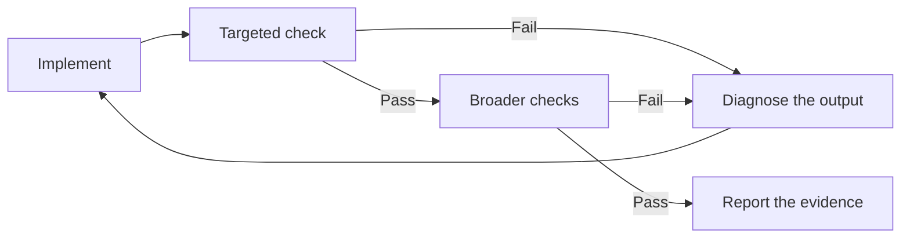
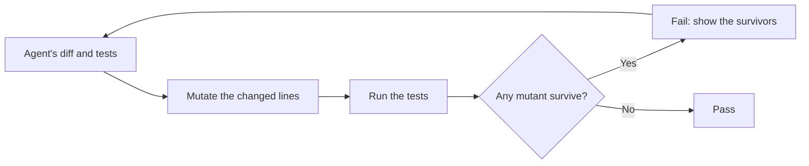

The most common way agent work goes wrong isn't bad code. It's an agent _saying_ the work is done when it isn't. A [study of 20,574 real coding-agent sessions](https://arxiv.org/abs/2605.29442) found that inaccurate self-reporting, where the agent turns a partial or unverified state into a completion claim, made up 22.58% of the episodes where something went wrong, and that share grew even as problems overall declined.

These five patterns move the decision about "done" out of the agent's head and into something you can check. They stack: each one closes a gap the one before it leaves open.

## Verification loop

**What it is:** Implement, run a check that produces pass or fail evidence, diagnose any failure, and go around again. The check decides when you're done, not the model.

**How it works:** Order the checks from cheap and narrow to expensive and broad. Type checking and linting catch structural problems in seconds. Unit tests check local behavior. Integration and end-to-end checks ask whether the feature works the way a person would use it. A failure at any layer goes back to diagnosis, not straight to another edit.

The last step matters more than it looks. "Done" should come with the command that ran, its exit code, and the relevant output, so you can check the claim after the session is over. Anthropic's [long-running agent harness](https://www.anthropic.com/engineering/effective-harnesses-for-long-running-agents) found that agents happily passed unit tests and `curl` checks while the feature was broken end to end. They got better when they were told to test in a real browser.

**When to use it:** Any time you can express "correct" as a command. That covers debugging a failing test, upgrading a dependency the suite covers, or hitting a benchmark target. Every unattended run needs one. Without it, the agent's sense that the work "looks done" is your only stop signal.

**When not to use it:** When there's no mechanical oracle (the thing that decides pass or fail). "Make the dashboard look better" has no exit code, and a loop with no real signal either spins forever or declares victory on its own say-so. Don't make a weak, agent-written suite the only gate. And for a one-line change, skip the ladder and run the one test that matters.

[Verification and Evidence](verification-and-evidence.md) covers matching each claim to the evidence that supports it. The [verification gate skill](exemplar-skills.md#verification-gate) packages it up. When the final check needs judgment rather than an exit code, hand the evidence to a [referee](exemplar-subagents.md#referee), so the agent doing the work never gets to decide it's finished.

## Test-driven agent loop

**What it is:** Write a test for the behavior you want, watch it fail, and only then let the agent implement. The test stays frozen while the agent makes it pass.

**How it works:** This is classic red-green-refactor (write a failing test, make it pass, then clean up) with one rule added: the agent has to _see_ the new test fail before it's allowed to write the implementation. A test that passes before any code exists isn't testing the new behavior. Once it's red, the test is frozen. The agent changes production code until it goes green, then refactors while keeping it green. [Kent Beck's experiments with agents](https://newsletter.kentbeck.com/p/augmented-coding-beyond-the-vibes) work the same way: a short list of behaviors, one test at a time.

The payoff is that "done" now means something specific. Every behavior on the list was seen failing and now passes, and the test files still match what they were at the red step. A [hook](hooks.md) can enforce the frozen part by denying edits to test files during the green phase.

**When to use it:** When you can write the behavior down as inputs and expected outputs before you know how to implement it: parsers, validators, API contracts, algorithms. It's also the best way to fix a bug: reproduce it in a failing test, fix it, and the test doubles as the regression guard.

**When not to use it:** When the tests already exist and the agent's job is to make them pass. A [study of agents on SWE-bench Verified](https://arxiv.org/abs/2602.07900), a benchmark built from real GitHub issues, found that pushing them to write more of their own tests didn't change outcomes and cost tokens. It's also a poor fit when the spec is too vague to encode (UI polish, exploratory prototypes), and when the agent can't stand up the integration harness, because it'll quietly swap in mocks so the tests pass.

The [test-first loop skill](exemplar-skills.md#test-first-loop) is one way to codify this, and the [test designer](exemplar-subagents.md#test-designer) subagent writes the tests without seeing the implementation.

## Test ratchet

**What it is:** Quality measures move in one direction only. Tests can be added, never removed or weakened. Coverage can go up, never down.

**How it works:** Anthropic's harness states the rule flatly: it's "unacceptable to remove or edit tests." It backs that up with a feature list where each entry has a `passes` field, and the agent can change that field and nothing else. The definition of done is fixed. Only the claim that it's been met is writable. Claude Code won't enforce that by itself, though, and the sources I have don't say what backs the rule beyond the prompt. To make it hold, add a [hook](hooks.md) that rejects edits touching anything but `passes`, a script that validates the diff, or a script that's the only thing allowed to flip `passes`.

The same idea extends to anything with a direction: coverage, lint rules, and suppression counts, each compared against the base branch rather than a fixed threshold. [Protecting the Oracle](verification-and-evidence.md#protecting-the-oracle) lists which measures to ratchet.

**When to use it:** On every project where an agent can edit the files that judge it, which is nearly all of them. Especially on unattended runs, where nobody notices a weakened check for days, and anywhere "the suite is green" is the signal to stop.

**When not to use it:** When a test is genuinely wrong. That's the real cost: a ratchet turns fixing a bad test into a separate, human-approved change instead of something the agent does mid-task. Don't ratchet a measure with no meaningful direction: a ratchet on test count just rewards trivial tests. And don't rely on an instruction alone. Block edits to `tests/`, and the agent's next move is to lower a threshold in a config file.

[The Enforcement Ladder](the-enforcement-ladder.md) covers where to enforce each defense. To find the holes before an implementing agent does, point a [saboteur](exemplar-subagents.md#saboteur) at your checks and tell it to cheat.

## Mutation gate

**What it is:** Grade the agent's tests, not just its code. Deliberately break the lines a change touched, and require the test suite to notice.

**How it works:** A mutation testing tool makes small, deliberate defects one at a time: `>` becomes `>=`, a `return x` becomes `return 0`, a function call disappears. Each broken version is a _mutant_. For each one, it runs the tests. If a test fails, the mutant is "killed," and the tests have proved they can see that kind of breakage. If everything still passes, the mutant "survived," and you have a concrete fact: this line can be wrong and nothing will tell you.

This matters because agent-written tests are often weak. A [study of 86,156 test files from agent-authored pull requests](https://arxiv.org/abs/2606.18168) found that 80.2% had weak or no explicit assertions. They ran the code without checking much about what it did. [Salesforce Engineering lists this gate](https://engineering.salesforce.com/maintaining-code-quality-at-agent-speed-7-patterns-for-agentic-engineering/) among its patterns for keeping quality up at agent speed.

Two things make it practical. Scope it to the diff, because mutating forty changed lines takes seconds while mutating a whole codebase takes hours. And report the survivors, not a score. "Changing `>=` to `>` on line 48 survived" tells the agent exactly which assertion is missing. Tools like [Stryker](https://stryker-mutator.io/), [PIT](https://pitest.org/), [mutmut](https://github.com/boxed/mutmut), and [cargo-mutants](https://mutants.rs/) do the mutating.

**When to use it:** When an agent writes its own tests, and when a green suite is a loop's stop signal, since a weak suite makes every loop stop early. It pays off most on logic-heavy code (pricing, permissions, parsing) where a surviving mutant is a bug waiting to happen.

**When not to use it:** Across the whole repository on every change. It's too slow, and it'll be switched off within a week. Skip code with nothing meaningful to assert, like logging or generated code. And don't chase a score. Some mutants don't change behavior at all, so no test can kill them, and an agent told to hit 100% will write absurd tests trying.

## Fresh-context reviewer

**What it is:** Hand the finished change to a reviewer that never saw the conversation that produced it.

**How it works:** The reviewer gets the requirements, the diff, the test results, and read access to the code, but never the implementer's reasoning, and it has to come back with findings it can demonstrate. [Agent reviewers](verification-and-evidence.md#agent-reviewers) covers why, and what a usable finding looks like.

**When to use it:** As a bounded extra check on changes that matter, especially when the implementation conversation was long or the tests leave important behavior unexamined. Give it a narrow question. "Does logout invalidate an in-flight token refresh?" gets you a better answer than "find anything wrong."

**When not to use it:** As a replacement for executable checks. I treat a reviewer's verdict as an opinion. The tests are evidence. Set a round limit before you start, because an agent asked for suggestions will always find another one. Trivial changes don't need a second session at all.

The [antagonist](exemplar-subagents.md#antagonist) is a ready-made brief for it. For a clause-by-clause check against the requirements, use the [stickler](exemplar-subagents.md#stickler). To find out whether the change makes sense without its author around, use the [archaeologist](exemplar-subagents.md#archaeologist). When the findings come back, the [taking review feedback skill](exemplar-skills.md#taking-review-feedback) keeps the main agent from accepting all of them on reflex.

If you only adopt one of these, make it the loop. The other four are what you add after the first time a green check lies to you.
