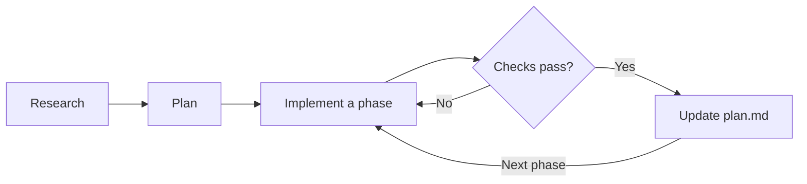

Agents are _terrible_ at noticing that a task is underspecified. They'll happily pick an interpretation and sprint. The cheapest time to resolve ambiguity is before anyone, human or model, has written a line of code.

That doesn't mean every task needs a spec. Most don't. The skill is knowing how much planning a given task deserves.

## How much planning does this need?

Work down this list and stop at the first match. It runs from the highest stakes and most uncertainty to the least, so the expensive cases get caught first.

| The task looks like…                                                         | Do this                                                                                                                                               |
| ---------------------------------------------------------------------------- | ----------------------------------------------------------------------------------------------------------------------------------------------------- |
| Requirements are known and getting it wrong is expensive                     | Spec, then tests derived from the spec, then code. The implementing session can't edit either. If the code is unfamiliar, add a research phase first. |
| You have no idea how to build it                                             | Prototype first. No spec.                                                                                                                             |
| You're not sure what you want yet                                            | Have the agent interview you, then write a spec                                                                                                       |
| Cross-cutting change in code you _don't_ know                                | Research, then plan, then implement, each phase in a fresh context                                                                                    |
| Small or medium change in code you understand, more than a one-sentence diff | Plan. Iterate on the plan, then implement.                                                                                                            |
| You could describe the diff in one sentence                                  | Nothing. Just ask.                                                                                                                                    |

A _context_ is everything the model can see when it decides its next step: your messages, its instructions, and every file or command output so far. A _fresh_ context starts with none of that history.

Three terms need pinning down, because people use them interchangeably:

- A **task contract** is the minimum: the outcome you want, how far the agent may go, and what would prove it worked. ([Towards Systems Thinking](why-systems.md) has an example.)
- A **plan** is a task contract plus the exact files, the order of the changes, and a check for each step.
- A **spec** is a bigger, more self-contained plan for work that's ambiguous or expensive to get wrong. It adds the interfaces involved and an explicit out-of-scope list.

Each one contains the one before it, and you write the smallest one the task deserves. Even "Nothing. Just ask." works better when your sentence names the outcome and how you'll check it.

The rule of thumb: if the spec is longer than the diff it describes, you used the wrong tool. You won't have the diff yet, so compare against the change you expect. [One careful hands-on comparison](https://martinfowler.com/articles/exploring-gen-ai/sdd-3-tools.html) watched a small bug fix balloon into 16 acceptance criteria across four user stories. The author called it "a sledgehammer to crack a nut."

## Research, plan, implement

For anything cross-cutting, split the work into three phases. Each one ends in an artifact you actually read. [HumanLayer's write-up](https://github.com/humanlayer/advanced-context-engineering-for-coding-agents/blob/main/ace-fca.md) makes the case for this: a small misunderstanding in research turns into a large error in the code.

- **Research**: Read-only. What exists, where it lives, how it connects, which tests already cover it, and what assumptions the agent made along the way. No opinions. No proposals.
- **Plan**: Split into phases, each naming the exact files it touches, in order, and the command that proves the phase worked.
- **Implement**: One phase at a time. If a phase's checks fail, implement that phase again. Fold the verified status back into `plan.md` only once they pass.

The payoff is where your review goes. You read the research and the plan, which are short, instead of the diff, which is long. And because the plan records what's done, it doubles as the resume point when a session runs out of room.

Start each phase with a fresh context and the previous phase's artifact. The artifact is the handoff, not the conversation. Within the implement phase, you can keep one session going across phases, and clear it when it gets long. [Managing a Long Session](managing-a-long-session.md) covers that.

Be suspicious of the research phase in particular. A fluent summary of a codebase is not evidence. This is where I argue with the agent's findings, and where my experience as an engineer matters most. It's where taste comes in: I'll read the research and notice that something feels off, or that I don't agree with the trade-offs.

So make the claims checkable. Ask for them as a numbered list with a file and line number for each one. Open the citations. Delete the ones that don't hold up. ([Verification and Evidence](verification-and-evidence.md) applies the same instinct to finished work.)

### A word on prompt engineering

At the end of a research session, once I have a good sense of what's going on and what I want to do, I'll have the model restate the plan. Then I ask, "Turn this into a prompt that I can use," and use that prompt to start the next phase in a fresh session.

It's shockingly effective. The model writes the prompt from everything we just worked out, so I rarely hand-tune the wording. That's why I'm not spending any of our time on the finer points of prompt engineering.

## Let the agent interview you

In the research phase, the agent writes and I read. Just as often, I work the other way: I write out my plan or a feature specification first, then use the model as a [rubber duck](https://en.wikipedia.org/wiki/Rubber_duck_debugging). I ask questions like:

- What haven't I considered in this plan?
- What assumptions have I made that aren't true?
- In what ways is my thinking _not_ clear to someone reading this for the first time?

Later in the course, [Exemplar Subagents](exemplar-subagents.md) shows how I use subagents (helper agents with their own context) to make this part of my process repeatable.

When you haven't written anything yet because you don't know what you want, flip it around once more. Have the agent ask _you_ questions. The prompt I use comes from [Anthropic's best practices guide](https://code.claude.com/docs/en/best-practices): describe the feature briefly, then ask the agent to interview you in detail. Two instructions in it do the heavy lifting. "Don't ask obvious questions" keeps it from turning into a form. "Keep interviewing until we've covered everything" stops it from asking three questions and wandering off to write code.

The output is a single, self-contained `SPEC.md` with the files and interfaces involved, an explicit out-of-scope list, and an end-to-end verification step. Then implement it in a fresh session. The interview transcript is long and full of ideas you rejected. The spec is the thing worth keeping.

There are a few ways I like to do this:

- It's one of the few times I'll use voice mode, where I talk to the agent instead of typing. I'll pace around my kitchen with the list of questions and dictate my answers.
- I'll push the agent to use the `AskUserQuestion` tool, which presents each question as a set of options you pick from. (Codex calls this the `request_user_input` tool.)

> [!WARNING] Don't answer "you decide" to every question
> It launders the agent's guesses into a document that looks like your decisions. If you have no opinion on a particular question, say so and move on.

Plan as much as the task deserves. Past that point, you're just writing a longer version of the diff.
