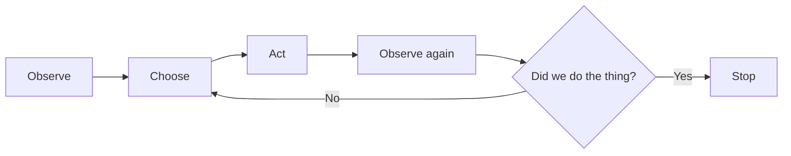

If you've used a coding agent for more than a week, you've already run this experiment—even if you didn't mean to. Ask it to "fix the lint errors and get the lint check passing," and it probably nails it. Ask it to "build an inventory management system, make no mistakes," and you get something that _looks_ finished and isn't.

Part of that is size, sure. But, the bigger difference is that the first request comes with a way to check the work. The agent can run the linter, see whether it passes, and keep going until it does. The second request gives it nothing to check against.

## The model and the harness

It helps to separate two things that usually get lumped together:

- **The model** proposes the next step: "read this file," "edit that function," "run the tests." Think Claude Opus, OpenAI's GPT-6.1 Sol, or DeepSeek.
- **The harness** is the program wrapped around the model that actually carries those steps out. It supplies the **tools** (the actions the agent can take, like reading a file or running a shell command), the **context** (everything the model can see when it decides its next step: your messages, its instructions, and every file or command output so far), the permissions, and the hooks (scripts that run automatically at set points). Think [Claude Code](https://code.claude.com/docs/en/overview), [Codex](https://developers.openai.com/codex), or [Cursor](https://cursor.com).

You don't get to edit Claude Code's source. (Mods, near the end of the course, let you change its behavior from the inside, but that's an advanced move.) What you _can_ do is configure nearly everything around it: the instructions it reads, what it's allowed to do, the checks it runs, and where it keeps notes. When I say **the system**, I mean all of that together—the harness, its configuration, and the checks and state around it. That's why I care more about the system than about any particular model.

I'm not dogmatic about which harness you use. My daily drivers are Claude Code, Codex, and [OpenClaw](https://openclaw.ai) (an open-source AI assistant), with [GitHub Copilot](https://github.com/features/copilot) and Cursor when I need them. Claude Code is the default in this course, and I'll point out where Codex differs. The ideas are converging anyway: [skills](skills.md) (packaged instructions the agent loads on demand) follow an [open standard](https://agentskills.io), Codex's hooks were modeled on Claude Code's and share the same basic contract, and the two tools' subagents (helper agents the main agent hands work to) are close cousins.

## A good system

Out of the box, the model and harness give you something very capable. They also come with generic defaults that know nothing about your project. You have to add the following yourself.

- **Durable state**: What survives after this session—one conversation with the agent—ends, and where it lives.
- **Bounded tools**: What the agent can _actually_ do in _this_ project, and what it can't. The harness ships with general-purpose permissions. You tighten them to fit your code.
- **Verification**: The check itself—a test, a linter, a command with an exit code—that decides whether the thing got done.
- **An acceptance path**: Who gets to act on that check's result and call the work finished. That might be an automated gate, a reviewer, or you.

Most of this course is about adding those four, in one form or another.

## The minimum closed loop

Here's the smallest loop that can check its own work:

The agent looks at the current state—the code, the test output—picks a move, makes it, then looks again to see what changed. If it's not done, it picks a new move based on what it just saw.

That diamond at the end is the whole game. If you can turn "did we do the thing?" into something deterministic—a test, a lint check, a command with an exit code—the agent can go around the loop on its own until the answer is yes. If you can't, the answer comes from the agent's opinion of its own work, which is a much weaker signal.

## A request is not a task contract

"Make checkout better" is a _request_. It leaves three things undefined: what outcome you want, how far the agent is allowed to go, and what would prove it worked.

A **task contract** pins all three down. Compare:

> Reduce duplicate-submit failures without changing payment semantics. Reproduce the bug with the `duplicate-submit` test.

Now there's a behavior to change, a boundary not to cross, and a check: that test fails before the fix and should pass after it. Not every task needs this much ceremony. [Planning and Task Contracts](planning-and-task-contracts.md) covers how much planning a given task actually deserves.

## Don't be a meat proxy

There's a failure mode I see constantly. The agent writes some code. You run the tests, notice they fail, and paste the error back. It tries again. You run the tests again. You've become a **[meat proxy](https://dontbeameatproxy.com/)**—a human whose only job is carrying messages between the agent and a test runner it could have run itself, if anyone had set it up to.

Your time is worth more than that. The high-value work has _always_ been systems thinking: deciding how the software should behave, which trade-offs to make, and how to keep it easy to change direction later. Who typed the syntax was never the interesting part. (So, yes: all those books on designing software systems that nobody had time to read are relevant again.)

## Your job: taste and judgment

Building the loop doesn't take you out of it. It moves you to the parts that need taste and judgment—the ones that stay yours no matter how good the model gets:

- Selecting and framing the task.
- Deciding what the agent may touch and how much risk you'll accept.
- Inspecting the evidence—test results, diffs, screenshots—behind any claim that matters.
- Resolving ambiguity, and cleaning up when the agent breaks something.
- Improving the system after something fails.

## When something goes wrong

The response is _not_ to log into Reddit and declare that the model is garbage now. Get curious about _why_ it failed instead. Two causes come up a lot:

- **The wrong task contract**: The agent did what you asked, and you asked for the wrong thing—or asked too vaguely.
- **Stale or misplaced state**: The agent was working from information that was out of date or sitting somewhere it never looked.

Sometimes the cause is simpler: there was no check, so nothing caught the mistake. Whatever it was, fix the system rather than the single result. Sharpen the task contract, move the information somewhere the agent will find it, or add the check that would have caught the mistake. That's the whole job of the systems thinker.
