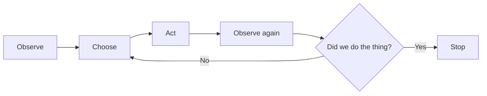

If you've used a coding agent for more than a week, you've already run this experiment—even if you didn't mean to. Ask it to "fix the lint errors and get the lint check passing," and it probably nails it. Ask it to "build an inventory management system, make no mistakes," and you get something that _looks_ finished and isn't.

Part of that is size, sure. But, the bigger difference is that the first request comes with a way to check the work. The agent can run the linter and keep going until it passes. The second request gives it nothing to check against.

## The model and the harness

Two things usually get lumped together:

- **The model** proposes the next step: "read this file," "edit that function," "run the tests." Think Claude Opus, OpenAI's GPT-6.1 Sol, or DeepSeek.
- **The harness** is the program around the model that carries those steps out. Think [Claude Code](https://code.claude.com/docs/en/overview), [Codex](https://developers.openai.com/codex), or [Cursor](https://cursor.com). It supplies the **tools** (actions like reading a file or running a shell command), the **context** (everything the model can see when it picks its next step: your messages, its instructions, and every file or command output so far), the permissions, and the hooks (scripts that run automatically at set points).

You don't get to edit Claude Code's source. (Mods, near the end of the course, change its behavior from the inside, but that's an advanced move.) You _can_ configure nearly everything around it: the instructions it reads, what it's allowed to do, the checks it runs, and where it keeps notes. When I say **the system**, I mean all of that together—the harness, its configuration, and the checks and state around it. I care more about the system than about any particular model.

I'm not dogmatic about harnesses. My daily drivers are Claude Code, Codex, and [OpenClaw](https://openclaw.ai) (an open-source AI assistant), with [GitHub Copilot](https://github.com/features/copilot) and Cursor when I need them. Claude Code is the default here, and I'll point out where Codex differs. The ideas are converging anyway: [skills](skills.md) (packaged instructions the agent loads on demand) follow an [open standard](https://agentskills.io), Codex's hooks were modeled on Claude Code's and share the same basic contract, and the two tools' subagents (helper agents the main agent hands work to) are close cousins.

## The minimum closed loop

Here's the smallest loop that can check its own work:

The agent looks at the current state—the code, the test output—makes a move, then looks again. If it's not done, it picks a new move based on what it just saw.

That diamond at the end is the whole game. If you can turn "did we do the thing?" into something deterministic—a test, a lint check, a command with an exit code—the agent can go around the loop on its own until the answer is yes. If you can't, the answer comes from the agent's opinion of its own work, which is a much weaker signal.

## A request is not a task contract

"Make checkout better" is a _request_. It leaves three things undefined: what outcome you want, how far the agent may go, and what would prove it worked.

A **task contract** pins all three down. Compare:

> Reduce duplicate-submit failures without changing payment semantics. Reproduce the bug with the `duplicate-submit` test.

Now there's a behavior to change, a boundary not to cross, and a check: that test fails before the fix and should pass after it. Not every task needs this much ceremony; [Planning and Task Contracts](planning-and-task-contracts.md) covers how much a given task deserves.

## Don't be a meat proxy

There's a failure mode I see constantly. The agent writes some code. You run the tests, see them fail, and paste the error back. It tries again. You run the tests again. You've become a **[meat proxy](https://dontbeameatproxy.com/)**—a human whose only job is carrying messages between the agent and a test runner it could have run itself, if anyone had set it up to.

Your time is worth more than that. The high-value work has _always_ been systems thinking: deciding how the software should behave, which trade-offs to make, and how to keep it easy to change direction later. Who typed the syntax was never the interesting part. (So, yes: all those books on designing software systems that nobody had time to read are relevant again.)

Building the loop doesn't take you out of it. It moves you to the parts that need taste and judgment—the ones that stay yours no matter how good the model gets:

- Selecting and framing the task.
- Deciding what the agent may touch and how much risk you'll accept.
- Inspecting the evidence—test results, diffs, screenshots—behind any claim that matters.
- Resolving ambiguity, and cleaning up when the agent breaks something.
- Improving the system after something fails.

## Five concerns

Out of the box, the model and harness are very capable, with generic defaults that know nothing about your project. A working system has to answer five questions, and most of this course is about answering them:

- **Context**: What goes in front of the model? What does it know about the codebase, the deployment pipeline, and your team's conventions?
- **Capability**: What can it do? Which tools and command-line programs can it run, and how does it use them?
- **Control**: What's allowed to happen, and when? The harness ships with general-purpose permissions. You tighten them to fit your code.
- **State**: What survives this _session_—one conversation with the agent—and where does it live?
- **Evidence**: What proves we did the thing? That's the check—a test, a linter, a command with an exit code—plus whoever acts on its result and calls the work finished: an automated gate, a reviewer, or you.

Nearly any agent problem is one of these going missing. The convention was never put in front of the agent: context. It had no way to run the tests: capability. It was told not to push to that branch and did anyway: control. It figured something out yesterday and it's gone today: state. It said it was done and wasn't: evidence.

## Where each concern lives

Each concern has one or more natural homes in the system, each with its own lesson:

- **Standing rules** go in the instruction file: `CLAUDE.md` for Claude Code, `AGENTS.md` in Codex. It carries the context that's true for the whole project. In Claude Code, working-directory and ancestor instructions load at launch; descendant `CLAUDE.md` files load only when Claude reads files in that subtree. Put rules needed for initial planning in a launch-loaded file, and explicitly read subtree instructions before planning there. See [User and Project Instructions](user-and-project-instructions.md).
- **A reusable procedure** goes in a [skill](skills.md): a folder of instructions the agent loads only when the task calls for it.
- **An independent, bounded task** goes to a [subagent](subagents.md): a helper agent with its own working context that reports back when it's finished.
- **A deterministic gate** is a [hook](hooks.md) or plain old code. This is where control lives when "usually" isn't good enough.
- **A durable objective** is a goal, a queue, or a tracker: state that outlives any one conversation. See [Goals and Loops](goals-and-loops.md) and [Where State Lives](where-state-lives.md).
- **A repeatable trigger** is a schedule or an event, so the work starts without you. That's control over _when_ work happens. See [Routines and Schedules](routines-and-schedules.md).
- **A reviewable output** is a file, a diff, a report, or an artifact: something a person or a script can inspect without replaying the session. See [Verification and Evidence](verification-and-evidence.md).

That's seven places for five concerns, and they don't line up one-to-one. A skill mostly supplies context: how to do a task, including how to use a capability the agent already has. A hook is a control. A tracker is state. A reviewable output is evidence.

## Start with a blank canvas

Knowing where things go is half of it. The other half is not putting too much there. Most people build their agent setup by installing things. A plugin (a bundle of skills, hooks, and other pieces installed in one go) here, a pile of rules there, a skill someone posted last week. Six months later, nobody can say which piece does what, and the agent is following three instructions that contradict each other.

Boris Cherny, the creator of Claude Code, put the alternative bluntly in a talk at [Y Combinator Startup School in 2026](https://www.ycombinator.com/library/UN-boris-cherny-building-claude-code):

> For people who aren't building agentic products but are using Claude Code, every six months, delete your `CLAUDE.md` file, delete your skills, and delete your hooks. Then see what the model does. It might surprise you.
>
> For Opus 5, we strongly recommend trying to delete all of these things because the model may no longer need the extensive instructions that were necessary for previous models.

That's the crux of this course. The tools keep changing (and, occasionally, regressing), while the principles have held steady for a hot minute now. So instead of memorizing one tool's settings, build your own light saber: a small system you assembled yourself and understand completely, which you can carry to the next tool or through an upgrade of this one.

The approach is _very_ simple:

- **Start empty**: No plugins, no borrowed rules. Just the harness and your project.
- **Notice what you repeat**: The instructions you type over and over are your candidates. Standing rules go in the instruction file. Repeatable procedures go in a skill.

A small system you understand and know how to tweak will almost always beat seven plugins full of conflicting skills and instructions and a hopeful shrug.

## Fix the floor first

Before this course, I had agents audit nearly 13,000 of my own sessions. A surprising amount of the failure had _nothing_ to do with the model. It was the environment the agent was standing on:

- A broken `asdf` Python shim (a small launcher script that picks which Python version runs) broke 252 sessions until I pinned a version. Then it broke zero.
- Bun's TypeScript type definitions (`@types/bun`) weren't being found, which broke type checking in 131 sessions. It vanished the moment I fixed the TypeScript configuration.
- Agents kept guessing at `gh --json` fields that the installed GitHub command-line tool rejects.
- macOS doesn't ship a `timeout` command, non-interactive zsh didn't have my `PATH`, and zsh's `nomatch` option aborted any command containing a SvelteKit route like `[slug]`.

None of those get better with a smarter model. They get better when you fix the shell. How many of these have you been blaming on the model?

## Measuring whether it works

Here's the uncomfortable part: you're not a reliable instrument for judging whether your setup helps. In [METR's randomized trial](https://metr.org/blog/2025-07-10-early-2025-ai-experienced-os-dev-study/), experienced maintainers were 19% _slower_ with AI tools and still believed afterward that they'd been 20% faster. The tooling has improved since, and METR has [revised its numbers](https://metr.org/blog/2026-02-24-uplift-update/), but the lesson holds: doing the task is not a measurement of the task.

Measure **time to an accepted result** (not to a first draft), **rework** (how often a human has to touch the work afterward), **review minutes**, and **cost per accepted result** (not per run). Ignore lines of code, suggestion acceptance rates (they go _up_ when you stop reading), and raw token counts. Pick one and record a baseline before you change anything. "We didn't measure it" is a legitimate verdict. "I feel faster" isn't.

The audit above came from my session logs—the transcripts Claude Code and Codex save to disk—and I had agents do the reading. What made it trustworthy:

- **Scripts parse, and models read digests**: Deterministic code extracts, redacts, and compresses the logs before a model sees them.
- **Every quoted piece of evidence must appear verbatim in the log**: About 16% of them didn't.
- **Count in code**: When models merged overlapping findings, they double-counted sessions. One count came back as 436 when the real number was 95.
- **Keep a control row**: Include a problem you already fixed. It should stay at zero.

Almost everything I found was one mistake in different outfits: treating writing something down as the same as doing it. If it matters, make it executable, then check the logs to see whether it actually stopped.

## Three things that help

I've recently added these to my own workflow, and each makes the starting state of a session less of a guess. They're examples of the method, not a starter kit. Add one only when you keep fixing the same start-of-session problem by hand.

- **A `SessionStart` bootstrapper**: A `SessionStart` [hook](hooks.md) runs when a session begins and injects the branch, worktree (an extra checkout of the same Git repository, in its own directory), ticket, and which local services (a dev server, a database) are running, so the agent doesn't have to go looking. [Writing Good Hooks](writing-good-hooks.md) has a table of example hooks, including a context bootstrapper like this one.
- **A smoke test on entry**: Before touching anything, the agent runs the app and the test suite to establish a baseline. If the baseline is already red, that's the first finding, not something you discover after your change.
- **An initializer session for long-running work**: Session zero writes _no_ feature code. It sets up the start script, a feature list where every item starts out failing, a progress file, and a baseline commit, so every later session starts from facts instead of guesses. The [project initializer skill](exemplar-skills.md#project-initializer) does this, and the [test ratchet](patterns-for-proving-it-works.md#test-ratchet) covers keeping that feature list honest.

That last one makes more sense once you've seen how state survives between sessions in [Where State Lives](where-state-lives.md).

## When something goes wrong

The response is _not_ to log into Reddit and declare that the model is garbage now. It's usually not to write another instruction, either—that one tends to get quietly ignored three sessions later. Get curious about _why_ it failed, and ask which concern went missing before you reach for a fix.

Three of them look alike from the outside:

- **Context**: The information was never in front of the agent, or the task contract asked for the wrong thing or asked too vaguely. Put it there: a sharper task contract, an instruction file, or a skill.
- **Control**: The information _was_ there, and the agent ignored it or lost track of it. A louder sentence won't help. You need a gate that doesn't depend on the agent remembering.
- **State**: The agent learned something once and lost it, often because the session ended or the conversation was compacted (replaced with a summary to free up context). Or it worked from information that was stale or sitting somewhere it never looked. Write it somewhere that survives, and that the agent will actually read.

If you keep re-reading the transcript to find out whether it worked, the missing concern is evidence. Sometimes there was simply no check, so nothing caught the mistake.

The most common mistake is writing a rule when what you needed was a check. The [enforcement ladder](the-enforcement-ladder.md), which ranks ways of keeping a rule from a request the agent can ignore up to a refusal it can't, is how you tell the difference.

Whatever it was, fix the system rather than the single result, and put the fix in the place built for that concern. Build small. Delete often. And before you ask for a smarter model, fix the floor.
