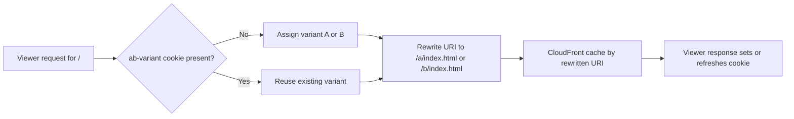

A/B testing on the frontend usually involves a client-side library like LaunchDarkly or Optimizely that swaps content after the page loads. The problem: there's a flash of content, a layout shift, or a delay while the library initializes and decides which variant to show. Your Lighthouse score takes the hit.

Edge functions eliminate this problem entirely. The routing decision happens **before** the response reaches the browser. The user gets one version of the page—no flicker, no client-side SDK, no additional JavaScript bundle. From the user's perspective, there's no A/B test happening at all.

## How It Works

The mechanism has three parts:

1. **Assign new visitors to a variant.** When a user makes their first request and has no experiment cookie, the edge function randomly assigns them to variant A or B and sets a cookie.
2. **Route returning visitors by cookie.** On subsequent requests, the edge function reads the cookie and routes to the same variant—the user gets a consistent experience.
3. **Modify the request based on variant.** The function either rewrites the URI (serving different static files) or sets a header that your origin uses to return different content.



This approach works with both CloudFront Functions and Lambda@Edge. The example below uses a CloudFront Function because A/B testing at the viewer request level is typically simple enough to fit within its constraints. If your routing logic requires network calls or complex computations, use Lambda@Edge instead.

## The Complete CloudFront Function

Here's a full implementation that splits traffic 50/50 between two variants:

```javascript
function handler(event) {
  var request = event.request;
  var cookies = request.cookies;
  var variant;

  // Check if the user already has a variant assignment
  if (cookies['ab-variant']) {
    variant = cookies['ab-variant'].value;
  } else {
    // Assign a new variant randomly
    variant = Math.random() < 0.5 ? 'a' : 'b';
  }

  // Normalize invalid cookie values
  if (variant !== 'a' && variant !== 'b') {
    variant = 'a';
  }
  // [!note Guard against tampered cookies by falling back to a known variant.]

  // Rewrite the URI to serve the variant-specific page
  if (request.uri === '/' || request.uri === '/index.html') {
    request.uri = '/' + variant + '/index.html';
  }

  // Set the cookie on the response (via request header that CloudFront forwards)
  request.headers['x-ab-variant'] = { value: variant };

  return request;
}
```

This function does three things:

1. Reads the `ab-variant` cookie from the request. If present, the user keeps their current assignment.
2. If no cookie exists, assigns the user to variant `a` or `b` with equal probability.
3. Rewrites the URI so `/` serves either `/a/index.html` or `/b/index.html`.

### Setting the Cookie on the Response

The viewer request function above sets a custom header (`x-ab-variant`) but doesn't set the cookie—viewer request functions can't modify the response. You need a companion **viewer response** function to set the cookie:

```javascript
function handler(event) {
  var response = event.response;
  var request = event.request;
  var variant = request.headers['x-ab-variant'] ? request.headers['x-ab-variant'].value : 'a';

  response.cookies['ab-variant'] = {
    value: variant,
    attributes: 'Path=/; Max-Age=2592000; SameSite=Lax',
  };
  // [!note `Max-Age=2592000` is 30 days. The user stays in the same variant for a month.]

  return response;
}
```

> [!WARNING]
> You need **two** CloudFront Functions for this pattern—one on `viewer-request` to route the request, and one on `viewer-response` to set the cookie. A single CloudFront Function can only handle one event type per behavior, but a behavior can have both a viewer request and a viewer response function attached.

## Setting Up the S3 Structure

For this to work, your S3 bucket needs variant-specific content. The simplest approach: create parallel directory structures.

```
my-frontend-app-assets/
├── a/
│   └── index.html     ← Variant A homepage
├── b/
│   └── index.html     ← Variant B homepage
├── style.css           ← Shared assets (not A/B tested)
└── script.js           ← Shared assets
```

Upload the variant content to your S3 bucket:

```bash
aws s3 cp ./build/variant-a/index.html \
  s3://my-frontend-app-assets/a/index.html \
  --region us-east-1 \
  --output json

aws s3 cp ./build/variant-b/index.html \
  s3://my-frontend-app-assets/b/index.html \
  --region us-east-1 \
  --output json
```

Shared assets (CSS, JS, images) don't need to be duplicated. Only the pages that differ between variants need separate versions.

## Lambda@Edge Alternative

If your A/B test needs to route to **different origins** (for example, two different S3 buckets or two different API endpoints), you need Lambda@Edge with an **origin request** trigger. CloudFront Functions can't change the origin.

```typescript
import type { CloudFrontRequestHandler } from 'aws-lambda';

export const handler: CloudFrontRequestHandler = async (event) => {
  const request = event.Records[0].cf.request;
  const cookies = request.headers.cookie || [];

  let variant = 'a';
  for (const cookie of cookies) {
    const match = cookie.value.match(/ab-variant=([ab])/);
    if (match) {
      variant = match[1];
      break;
    }
  }

  // Route to different S3 paths based on variant
  if (variant === 'b') {
    request.origin = {
      s3: {
        domainName: 'my-frontend-app-assets.s3.amazonaws.com',
        path: '/variant-b',
        region: 'us-east-1',
        authMethod: 'origin-access-identity',
      },
    };
    request.headers.host = [
      {
        key: 'Host',
        value: 'my-frontend-app-assets.s3.amazonaws.com',
      },
    ];
  }

  return request;
};
```

This function modifies the **origin path** instead of the URI, which means you can organize your variants differently in S3 or even point to entirely separate buckets.

## Weighted Splits

50/50 is the simplest split, but you'll often want to roll out changes to a smaller percentage of users first. Adjust the random assignment:

```javascript
// 90/10 split: 90% variant A, 10% variant B
variant = Math.random() < 0.9 ? 'a' : 'b';
```

For more than two variants:

```javascript
var rand = Math.random();
if (rand < 0.33) {
  variant = 'a';
} else if (rand < 0.66) {
  variant = 'b';
} else {
  variant = 'c';
}
```

## Caching Considerations

This is the part that trips people up. (It definitely tripped me up the first time.) If CloudFront caches the response for `/` and serves it to everyone, your A/B test breaks—every user gets whatever variant was cached first.

You need to tell CloudFront to **cache separately by variant**. There are two approaches:

**Approach 1: Cache by cookie.** Configure your cache behavior to include the `ab-variant` cookie in the cache key. Requests with `ab-variant=a` and `ab-variant=b` are cached separately. You set this up in the cache policy attached to the behavior (recall [Cache Behaviors and Invalidations](cache-behaviors-and-invalidations.md)).

**Approach 2: Cache by rewritten URI.** If your viewer request function rewrites `/` to `/a/index.html` or `/b/index.html`, CloudFront naturally caches them as separate objects because the URI is different. This approach avoids cache policy changes.

The URI rewrite approach (Approach 2) is simpler and is what the CloudFront Function example above uses. The cache just works because `/a/index.html` and `/b/index.html` are different cache keys.

> [!TIP]
> If you use the cookie-based cache key approach, be aware that it increases your cache miss rate. Every unique cookie combination creates a separate cached object. For A/B testing with two variants, this doubles your cache misses at most—which is acceptable. For experiments with many variants, the rewritten URI approach scales better.

## Ending the Experiment

When you have a winner, remove the edge functions and serve the winning variant directly. Update your deployment to copy the winning variant's content to the root path, remove the `/a/` and `/b/` directories, and disassociate the CloudFront Functions from the behavior.

Don't forget to handle users who still have the old cookie—it'll expire on its own (Max-Age handles this), but if you want to clean it up immediately, a temporary viewer response function can clear it:

```javascript
function handler(event) {
  var response = event.response;
  response.cookies['ab-variant'] = {
    value: '',
    attributes: 'Path=/; Max-Age=0',
  };
  return response;
}
```

Setting `Max-Age=0` tells the browser to delete the cookie.
