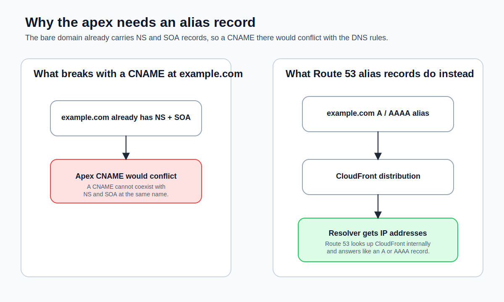

If you've managed DNS before, you've probably created CNAME records. They're the standard way to make one domain name point to another. But the moment you try to point the bare domain at CloudFront, CNAME starts falling apart. This is where Route 53's alias records come in. They solve a specific problem that standard DNS does not solve cleanly, and understanding that difference will save you from one of the most common custom-domain mistakes.

If you want AWS's side-by-side version of this decision, the [Route 53 guide to alias versus non-alias records](https://docs.aws.amazon.com/Route53/latest/DeveloperGuide/resource-record-sets-choosing-alias-non-alias.html) is the official reference.



## The Zone Apex Problem

Here's the core issue: **CNAME records can't be used at the zone apex**.

The zone apex is your bare domain—`example.com` without any prefix. Every DNS zone requires NS and SOA records at the apex (you saw these created automatically in [Hosted Zones and Record Types](hosted-zones-and-record-types.md)). The DNS specification (RFC 1034) says that if a CNAME record exists for a name, no other record types can exist for that same name. Since NS and SOA records must exist at the apex, a CNAME record there would violate the spec.

This means you can't do this:

```
example.com.    300    IN    CNAME    d111111abcdef8.cloudfront.net.
```

Some DNS providers let you enter it anyway and handle the conflict behind the scenes (Cloudflare calls this "CNAME flattening"), but it's technically non-compliant. Other providers reject it outright.

For subdomains, CNAME records are fine:

```
www.example.com.    300    IN    CNAME    d111111abcdef8.cloudfront.net.
```

This works because `www.example.com` isn't the zone apex—there are no NS or SOA records there to conflict with.

But most frontend deployments need to work at the bare domain. Users type `example.com`, not `www.example.com`. You need a way to point `example.com` at your CloudFront distribution without using a CNAME. That's what alias records are for.

## What an Alias Record Is

An **alias record** is a Route 53-specific extension to DNS. From the outside—from the perspective of a DNS resolver querying your domain—an alias record looks exactly like a standard A or AAAA record. The resolver asks for the A record of `example.com` and gets back an IP address. It has no idea that behind the scenes, Route 53 looked up the current IP addresses of your CloudFront distribution and returned those. (This is one of those things that I think is genuinely clever about Route 53's design.)

The key difference is in how you configure it. Instead of specifying an IP address, you specify an AWS resource:

```json
{
  "Name": "example.com",
  "Type": "A",
  "AliasTarget": {
    "HostedZoneId": "Z2FDTNDATAQYW2",
    "DNSName": "d111111abcdef8.cloudfront.net",
    "EvaluateTargetHealth": false
  }
}
```

Compare this to a standard A record, where you specify the IP directly:

```json
{
  "Name": "example.com",
  "Type": "A",
  "TTL": 300,
  "ResourceRecords": [
    {
      "Value": "192.0.2.1"
    }
  ]
}
```

The alias record has no `TTL` field and no `ResourceRecords`. Instead, it has an `AliasTarget` that tells Route 53: "Resolve this by looking up the target resource and returning its current addresses."

## Why Alias Records Are Better for AWS Resources

Alias records have three concrete advantages over CNAME records when pointing to AWS services:

### They Work at the Zone Apex

This is the main reason alias records exist. You can create an alias A record for `example.com` pointing to your CloudFront distribution. You can't do this with a CNAME.

### They're Free

Route 53 doesn't charge for DNS queries that resolve to alias records pointing to AWS resources. Standard DNS queries cost $0.40 per million, but alias queries to CloudFront, S3, Elastic Load Balancing, and other supported AWS services are free. For a high-traffic site, this adds up.

With a CNAME, every query is billed. With an alias record, it's zero.

### They Resolve in One Step

A CNAME adds an extra DNS lookup. When a resolver encounters a CNAME, it has to make a second query to resolve the target domain name. An alias record resolves directly to IP addresses—Route 53 handles the lookup internally and returns the answer in a single response. One fewer round trip means marginally faster DNS resolution.

## When to Use Each

| Scenario                                                                | Use                                   |
| ----------------------------------------------------------------------- | ------------------------------------- |
| Point `example.com` (zone apex) to CloudFront                           | Alias A + AAAA                        |
| Point `www.example.com` to CloudFront                                   | Alias A + AAAA (preferred) or CNAME   |
| Point `api.example.com` to API Gateway                                  | Alias A + AAAA                        |
| Point `staging.example.com` to a non-AWS service (e.g., Heroku, Render) | CNAME                                 |
| ACM DNS validation record                                               | CNAME (ACM gives you the value)       |
| Google Workspace email verification                                     | TXT or CNAME (Google tells you which) |

The rule is straightforward: if the target is an AWS resource that supports alias records, use an alias record. If the target is outside AWS, use a CNAME (for subdomains) or set up a redirect (for the apex).

## Supported Alias Targets

Not every AWS service can be an alias target. Here are the ones you'll encounter in this course:

- **CloudFront distributions**: Use hosted zone ID `Z2FDTNDATAQYW2` for all distributions.
- **S3 website endpoints**: Use the S3 website endpoint's regional hosted zone ID (varies by region). This is the endpoint from [Static Website Hosting on S3](static-website-hosting-on-s3.md).
- **API Gateway custom domain names**: Alias targets are available when you configure a custom domain in API Gateway.
- **Another Route 53 record in the same hosted zone**: You can alias one record to another within the same zone.

Each target has its own hosted zone ID. CloudFront always uses `Z2FDTNDATAQYW2`. S3 varies by region. You don't need to memorize these—the AWS documentation lists them, and the Route 53 console auto-fills the value when you select a target.

## Health Checking Differences

Alias records support Route 53 health checks differently than standard records. For standard records, you can attach a health check directly. For alias records, the `EvaluateTargetHealth` flag determines whether Route 53 considers the target healthy before returning the record.

For CloudFront, `EvaluateTargetHealth` must be `false`. CloudFront is a globally distributed service with its own health management—Route 53 health checks don't apply to it in a meaningful way. For Elastic Load Balancers and other regional resources, you might set this to `true` to enable failover routing.

For frontend deployments behind CloudFront, you'll always set `EvaluateTargetHealth` to `false` and let CloudFront handle availability at the edge.

## A Common Mistake

A mistake that trips people up: creating a CNAME record for the apex domain and wondering why it doesn't work. If you try to create a CNAME for `example.com` in Route 53, the console will let you attempt it, but the DNS behavior will be unpredictable. Some resolvers will return errors, and others will ignore the record entirely.

If you inherited a DNS configuration from a previous provider and see a CNAME at the apex, replace it with an alias A record (and an alias AAAA record for IPv6). This is the correct configuration for any AWS resource.

> [!WARNING]
> If you're migrating from Cloudflare, you may have been using their "CNAME flattening" feature at the apex domain. This is Cloudflare's proprietary workaround for the zone apex problem. Route 53 doesn't support CNAME flattening—you must use alias records instead. The end result is the same (the apex resolves to an IP address), but the configuration looks different.

## The Mental Model

Think of it this way: a CNAME record says "go ask someone else." An alias record says "I already asked for you—here's the answer." The resolver never sees the indirection. From the outside, `example.com` looks like it has a plain A record with real IP addresses. The fact that those IP addresses came from a CloudFront distribution lookup is entirely Route 53's business.

For everything in this course—CloudFront distributions, S3 endpoints, API Gateway custom domains—alias records are the right choice. Use CNAME only when the target is outside AWS or when a service specifically requires it (like ACM validation records).

Next, you'll use that rule for the real thing: creating the alias records that point your domain at CloudFront.
