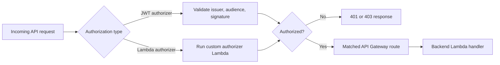

Your API is deployed, CORS is configured, and your frontend can call it. But right now, anyone with the URL can call any endpoint. There's nothing stopping a random script from hammering `POST /items` with garbage data. You need authentication—a way to verify that the person making the request is who they claim to be and that they're allowed to do what they're asking.

API Gateway supports two types of authorizers for HTTP APIs: **JWT authorizers** and **Lambda authorizers**. JWT authorizers handle the common case—validating tokens from Cognito, Auth0, or any OIDC provider. Lambda authorizers handle everything else.



## JWT Authorizers: The Fast Path

A **JWT authorizer** validates JSON Web Tokens on incoming requests. You tell API Gateway where to find the token (usually the `Authorization` header), who issued it (the OIDC provider's URL), and which audience to accept. API Gateway validates the token's signature, expiration, issuer, and audience before your Lambda function runs. If the token is invalid, the request gets a 401—your handler code never executes.

This is the same thing that happens when you use middleware like `next-auth` or a Vercel edge function to validate tokens, except API Gateway does it at the infrastructure layer.

### Creating a JWT Authorizer

Here's how to create a JWT authorizer that validates tokens from an Amazon Cognito user pool:

```bash
aws apigatewayv2 create-authorizer \
  --api-id abc123def4 \
  --authorizer-type JWT \
  --name cognito-authorizer \
  --identity-source '$request.header.Authorization' \
  --jwt-configuration \
    Issuer="https://cognito-idp.us-east-1.amazonaws.com/us-east-1_AbCdEfGhI",Audience="1a2b3c4d5e6f7g8h9i0j" \
  --region us-east-1 \
  --output json
```

```json
{
  "AuthorizerId": "auth123",
  "AuthorizerType": "JWT",
  "IdentitySource": "$request.header.Authorization",
  "JwtConfiguration": {
    "Audience": ["1a2b3c4d5e6f7g8h9i0j"],
    "Issuer": "https://cognito-idp.us-east-1.amazonaws.com/us-east-1_AbCdEfGhI"
  },
  "Name": "cognito-authorizer"
}
```

The key parameters:

- **`--authorizer-type JWT`**—tells API Gateway to validate the token as a JWT.
- **`--identity-source '$request.header.Authorization'`**—where to find the token. The standard location is the `Authorization` header with a `Bearer` prefix. API Gateway strips the `Bearer ` prefix automatically.
- **`--jwt-configuration Issuer`**—the issuer URL. For Cognito, this is `https://cognito-idp.{region}.amazonaws.com/{userPoolId}`. For Auth0, it's `https://{your-domain}.auth0.com/`. The issuer must match the `iss` claim in the JWT.
- **`--jwt-configuration Audience`**—the expected audience. For Cognito, this is the app client ID. For Auth0, this is the API identifier. The audience must match the `aud` claim in the JWT.

### Using Any OIDC Provider

JWT authorizers work with any provider that issues JWTs and exposes a JSON Web Key Set (JWKS) endpoint. This includes:

- **Amazon Cognito**—AWS's built-in identity service
- **Auth0**—popular third-party auth provider
- **Okta**—enterprise identity provider
- **Firebase Auth**—Google's authentication service
- **Any OIDC-compliant provider**—anything that publishes a `.well-known/openid-configuration` endpoint

API Gateway fetches the provider's JWKS (the public keys used to sign tokens) from the issuer's `/.well-known/openid-configuration` endpoint and uses them to verify token signatures. You don't need to manage keys yourself.

Here's the same command for an Auth0-issued token:

```bash
aws apigatewayv2 create-authorizer \
  --api-id abc123def4 \
  --authorizer-type JWT \
  --name auth0-authorizer \
  --identity-source '$request.header.Authorization' \
  --jwt-configuration \
    Issuer="https://my-app.us.auth0.com/",Audience="https://api.example.com" \
  --region us-east-1 \
  --output json
```

> [!TIP]
> The issuer URL for Auth0 must include the trailing slash. Cognito issuer URLs don't include a trailing slash. This is a common source of 401 errors—the issuer in the token must exactly match the issuer you configure on the authorizer.

### Attaching the Authorizer to a Route

Creating an authorizer doesn't protect any routes by itself. You need to attach it to specific routes using `update-route`:

```bash
aws apigatewayv2 update-route \
  --api-id abc123def4 \
  --route-id xyz789 \
  --authorization-type JWT \
  --authorizer-id auth123 \
  --authorization-scopes "items:read" "items:write" \
  --region us-east-1 \
  --output json
```

The `--authorization-scopes` parameter is optional. If specified, API Gateway checks that the token's `scope` claim contains at least one of the listed scopes. This lets you create fine-grained permissions: a `GET /items` route might require `items:read`, while `POST /items` requires `items:write`. I find this is one of those features you don't need until you _really_ need it.

You can find the route ID by listing routes:

```bash
aws apigatewayv2 get-routes \
  --api-id abc123def4 \
  --region us-east-1 \
  --output json
```

### What Your Handler Receives

When a JWT authorizer approves a request, the decoded token claims are available in your handler at `event.requestContext.authorizer.jwt.claims`:

```typescript
import type { APIGatewayProxyHandlerV2 } from 'aws-lambda';

export const handler: APIGatewayProxyHandlerV2 = async (event) => {
  const claims = event.requestContext.authorizer?.jwt?.claims;
  const userId = claims?.sub;
  // [!note The `sub` claim is the user's unique identifier in most OIDC providers.]

  if (!userId) {
    return {
      statusCode: 401,
      headers: { 'Content-Type': 'application/json' },
      body: JSON.stringify({ error: 'Unauthorized' }),
    };
  }

  return {
    statusCode: 200,
    headers: { 'Content-Type': 'application/json' },
    body: JSON.stringify({ message: `Hello, user ${userId}` }),
  };
};
```

The claims object includes everything in the JWT payload: `sub` (subject/user ID), `email`, `iss` (issuer), `exp` (expiration), custom claims, and anything else the identity provider includes.

## Lambda Authorizers: Custom Logic

**Lambda authorizers** run a Lambda function to decide whether a request is allowed. They're more flexible than JWT authorizers—you can validate tokens from non-standard providers, check custom headers, look up API keys in a database, or implement any authentication logic you need.

### Creating a Lambda Authorizer

First, write the authorizer function. This is a separate Lambda function from your API handler:

```typescript
import type { APIGatewayRequestSimpleAuthorizerHandlerV2 } from 'aws-lambda';

export const handler: APIGatewayRequestSimpleAuthorizerHandlerV2 = async (event) => {
  const token = event.headers?.authorization;

  if (!token) {
    return {
      isAuthorized: false,
    };
  }

  // Your custom validation logic here
  // Examples: decode a custom token, check a database, validate an API key
  const isValid = token === 'Bearer my-secret-api-key';

  return {
    isAuthorized: isValid,
    context: {
      userId: 'user-123',
      plan: 'premium',
    },
  };
};
```

The authorizer returns `isAuthorized: true` or `isAuthorized: false`. The optional `context` object passes data to your API handler—the values appear in `event.requestContext.authorizer.lambda`.

Deploy this function separately (using the same process from [Deploying and Testing a Lambda Function](deploying-and-testing-a-lambda-function.md)), then create the authorizer:

```bash
aws apigatewayv2 create-authorizer \
  --api-id abc123def4 \
  --authorizer-type REQUEST \
  --name custom-authorizer \
  --authorizer-uri arn:aws:apigateway:us-east-1:lambda:path/2015-03-31/functions/arn:aws:lambda:us-east-1:123456789012:function:my-frontend-app-authorizer/invocations \
  --authorizer-payload-format-version 2.0 \
  --identity-source '$request.header.Authorization' \
  --authorizer-result-ttl-in-seconds 300 \
  --region us-east-1 \
  --output json
```

And grant API Gateway permission to invoke the authorizer function:

```bash
aws lambda add-permission \
  --function-name my-frontend-app-authorizer \
  --statement-id apigateway-authorizer \
  --action lambda:InvokeFunction \
  --principal apigateway.amazonaws.com \
  --source-arn "arn:aws:execute-api:us-east-1:123456789012:abc123def4/authorizers/auth456" \
  --region us-east-1 \
  --output json
```

> [!WARNING]
> Lambda authorizer invocations count as additional Lambda invocations and incur their own costs. The `--authorizer-result-ttl-in-seconds` parameter caches the authorization result so the authorizer isn't called on every request. Set this to a reasonable value (300 seconds is five minutes) to reduce both latency and cost.

### Attaching to a Route

```bash
aws apigatewayv2 update-route \
  --api-id abc123def4 \
  --route-id xyz789 \
  --authorization-type CUSTOM \
  --authorizer-id auth456 \
  --region us-east-1 \
  --output json
```

## JWT vs. Lambda Authorizers

| Feature                 | JWT Authorizer                       | Lambda Authorizer                         |
| ----------------------- | ------------------------------------ | ----------------------------------------- |
| Token validation        | Built-in (signature, expiry, claims) | Your code                                 |
| Supported providers     | Any OIDC/JWT issuer                  | Anything                                  |
| Custom validation logic | No                                   | Yes                                       |
| Additional Lambda cost  | No                                   | Yes (extra invocation)                    |
| Latency                 | Lower (no Lambda cold start)         | Higher (Lambda invocation)                |
| Caching                 | Built-in                             | Configurable TTL                          |
| Use case                | Standard OAuth/OIDC flows            | API keys, custom tokens, database lookups |

Start with JWT authorizers. Move to Lambda authorizers when you need logic that JWT validation can't express—checking a database, validating a custom token format, or implementing multi-tenant authorization.

## Leaving Routes Unprotected

Not every route needs authentication. Public endpoints—health checks, public data feeds, landing page content—should remain accessible without a token. Only attach authorizers to routes that require authentication. Routes without an authorizer are open by default.

## Calling an Authenticated API from Your Frontend

From your React app, include the JWT in the `Authorization` header:

```typescript
const token = await getAccessToken(); // From your auth library

const response = await fetch('https://api.example.com/items', {
  headers: {
    'Content-Type': 'application/json',
    Authorization: `Bearer ${token}`,
  },
});
```

If the token is expired or invalid, the response is a 401. Your frontend should handle this by refreshing the token or redirecting to the login flow.

## Common Mistakes

**Using the wrong audience.** The `aud` claim in the JWT must match the audience configured on the authorizer. For Cognito, the audience is the app client ID—not the user pool ID. This is the most common cause of 401 errors with a valid-looking token.

**Forgetting to grant invoke permission on the Lambda authorizer function.** Just like your API handler, the authorizer function needs a resource-based policy allowing `apigateway.amazonaws.com` to invoke it. Without it, every request returns 500.

**Not handling 401 responses in the frontend.** When an authorizer rejects a request, the response is a bare `{"message":"Unauthorized"}`. Your frontend code should check for 401 status and trigger a token refresh or login redirect, not display a generic error.

You now have the complete API Gateway picture: HTTP APIs, routes, integrations, CORS, stages, custom domains, and authentication. In the exercise that follows, you'll put all of these pieces together and build a working API that your frontend can call.
