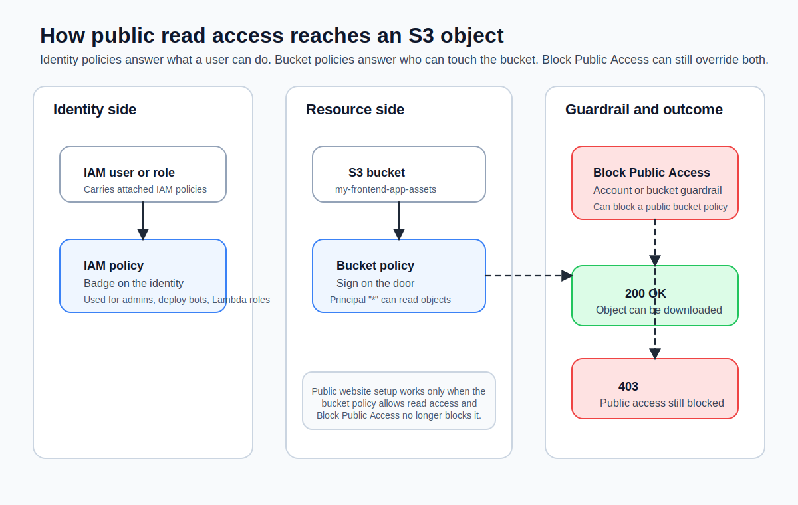
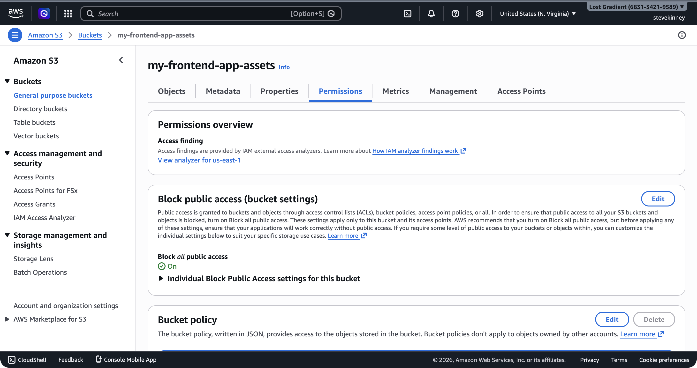
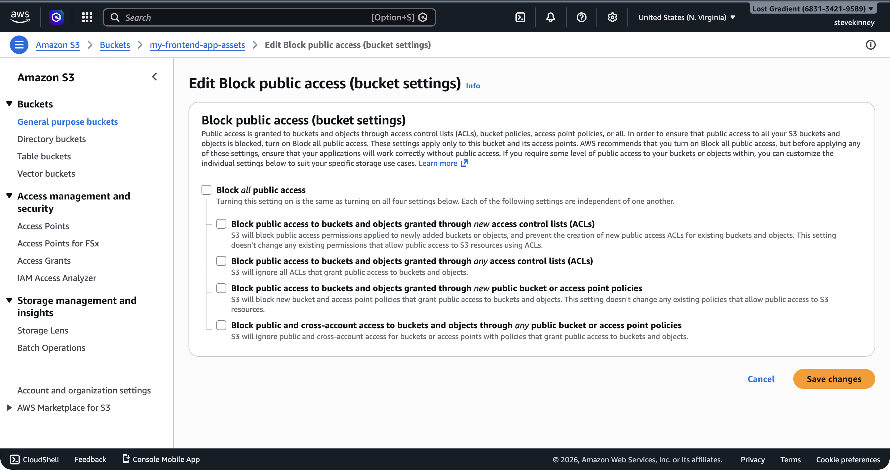
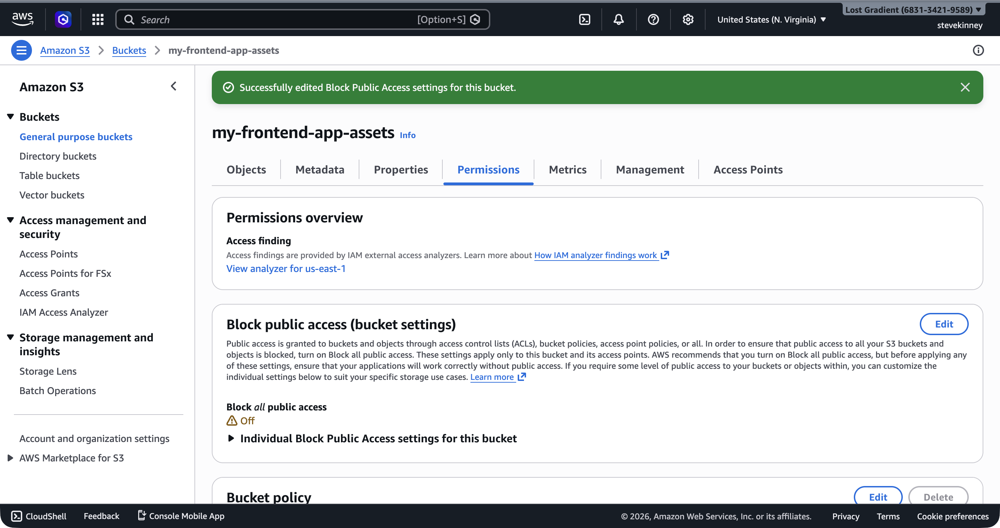
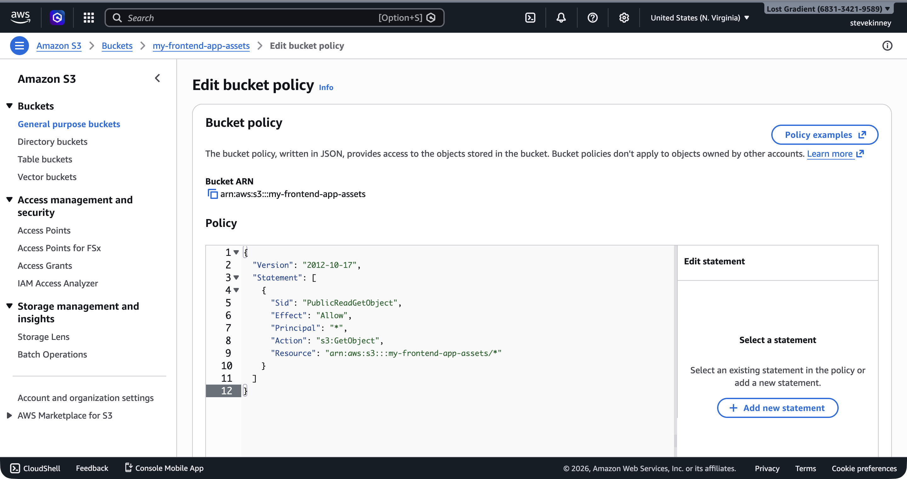
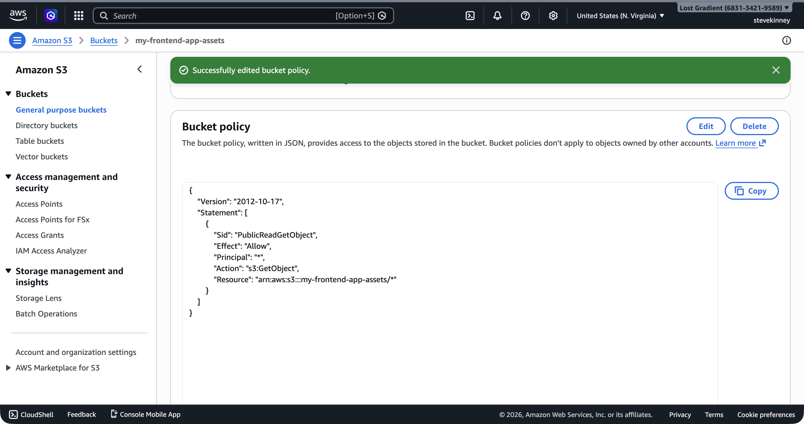

Your files are in the bucket, but nobody can access them. That's by design—S3's default posture is "deny everything unless explicitly allowed." To serve a static website, you need to tell S3 that the public is allowed to read your files. You do that with a **bucket policy**.

If you want AWS's version of the guardrails nearby, the [Amazon S3 User Guide](https://docs.aws.amazon.com/AmazonS3/latest/userguide/Welcome.html) and the [Block Public Access documentation](https://docs.aws.amazon.com/AmazonS3/latest/userguide/access-control-block-public-access.html) are the official references.

If you completed [Writing Your First IAM Policy](writing-your-first-iam-policy.md) in the IAM foundation section, the structure of a bucket policy will look familiar. The JSON shape is nearly identical. The difference is where the policy lives and who it applies to.



## IAM Policies vs. Bucket Policies

In the IAM foundation section, you attached IAM policies to users, groups, or roles. Those policies travel with the identity: "This user is allowed to do these things." A bucket policy is the reverse—it attaches to the resource and says: "These people are allowed to do things to me."

Both are JSON documents with `Version`, `Statement`, `Effect`, `Action`, and `Resource`. The key difference is the **Principal** field:

- **IAM policies** have an implicit principal—whoever the policy is attached to.
- **Bucket policies** have an explicit **Principal** field that specifies who the policy applies to. For public access, the principal is `"*"`, which means everyone.

I think of it this way: an IAM policy is a **badge** you wear. A bucket policy is a **sign on the door**.

> [!TIP]
> When both an IAM policy and a bucket policy apply to the same request, AWS evaluates them together. An explicit `Deny` in either policy wins. If there's no explicit `Deny`, then an `Allow` in either policy grants access. This is called **policy evaluation logic**, and understanding it saves hours of debugging "Access Denied" errors.

## Disabling Block Public Access

Before you can attach a public bucket policy, you need to disable the Block Public Access settings that AWS enables by default. On a fresh bucket, the **Permissions** tab shows all four settings turned on.

 Specifically, you need to turn off `BlockPublicPolicy` (so you can put a public policy on the bucket) and `RestrictPublicBuckets` (so the public policy actually takes effect).

For simplicity and because we're hosting a public static site, we'll disable all four Block Public Access settings:

```bash
aws s3api put-public-access-block \
  --bucket my-frontend-app-assets \
  --public-access-block-configuration \
    "BlockPublicAcls=false,IgnorePublicAcls=false,BlockPublicPolicy=false,RestrictPublicBuckets=false" \
  --region us-east-1
```

Verify the change:

```bash
aws s3api get-public-access-block \
  --bucket my-frontend-app-assets \
  --region us-east-1 \
  --output json
```

```json
{
  "PublicAccessBlockConfiguration": {
    "BlockPublicAcls": false,
    "IgnorePublicAcls": false,
    "BlockPublicPolicy": false,
    "RestrictPublicBuckets": false
  }
}
```

In the console, disabling all four settings on the **Edit Block Public Access** form looks like this—all checkboxes cleared.



After saving, the **Permissions** tab confirms that Block Public Access is now **Off** with a success banner.



> [!WARNING]
> Disabling Block Public Access is appropriate for a bucket that serves public static website files. It is not appropriate for buckets containing user data, logs, backups, or anything sensitive. In the CloudFront section, you'll switch to a different approach, Origin Access Control, that keeps the bucket private and lets only CloudFront read from it.

## Writing a Public Read Bucket Policy

Now you can attach a bucket policy. Here is a complete policy that allows anyone to read any object in the bucket:

```json
{
  "Version": "2012-10-17",
  "Statement": [
    {
      "Sid": "PublicReadGetObject",
      "Effect": "Allow",
      "Principal": "*",
      "Action": "s3:GetObject",
      "Resource": "arn:aws:s3:::my-frontend-app-assets/*"
    }
  ]
}
```

Let's break this down:

- **`Version`**: Always `"2012-10-17"`—this is the policy language version, not a date you change.
- **`Sid`**: A human-readable identifier for this statement. Optional but helpful for debugging.
- **`Effect`**: `"Allow"`—grant access rather than deny it.
- **`Principal`**: `"*"`—everyone, including unauthenticated users. This is what makes it public.
- **`Action`**: `"s3:GetObject"`—only allow reading objects. Not listing, not deleting, not uploading. Just reading.
- **`Resource`**: `"arn:aws:s3:::my-frontend-app-assets/*"`—applies to all objects inside the bucket. The `/*` is critical: without it, the policy applies to the bucket itself, not the objects inside it.

> [!WARNING]
> Notice the `Resource` ends with `/*`. The ARN `arn:aws:s3:::my-frontend-app-assets` (without `/*`) refers to the bucket. The ARN `arn:aws:s3:::my-frontend-app-assets/*` refers to the objects inside the bucket. The `s3:GetObject` action operates on objects, so you need the `/*`. Mixing these up is one of the most common bucket policy mistakes.

## Applying the Bucket Policy

Save the policy JSON to a file and apply it with the CLI:

```bash
aws s3api put-bucket-policy \
  --bucket my-frontend-app-assets \
  --policy file://bucket-policy.json \
  --region us-east-1
```

In the console, the same operation happens through the **Bucket Policy** editor on the **Permissions** tab. You paste the JSON directly into the editor.



You can verify the policy was applied:

```bash
aws s3api get-bucket-policy \
  --bucket my-frontend-app-assets \
  --region us-east-1 \
  --output json
```

The response wraps the policy in a `Policy` field as a JSON string. It's not the prettiest output, but it confirms the policy is in place.



## What This Policy Does (and Does Not Do)

This policy grants one specific permission: anyone can read (download) objects from the bucket. That's exactly what you need for a static website—browsers need to download your HTML, CSS, and JavaScript.

Here's what this policy does **not** allow:

- **Listing the bucket contents** (`s3:ListBucket`). A visitor can't browse your bucket and see all your files. They need to know the exact key.
- **Uploading files** (`s3:PutObject`). Only you (or whatever IAM user or role has upload permissions) can add files to the bucket.
- **Deleting files** (`s3:DeleteObject`). Same as above—only authorized users can delete.
- **Modifying the bucket policy** (`s3:PutBucketPolicy`). Only your IAM user or role can change the policy itself.

This is the **principle of least privilege** in action: grant the minimum permissions necessary for the task. The public needs to read your files. They don't need to do anything else.

## Testing Public Access

Once the policy is applied, you can test that objects are publicly accessible using a direct URL. The URL format for S3 objects is:

```
https://my-frontend-app-assets.s3.us-east-1.amazonaws.com/index.html
```

Try it with `curl`:

```bash
curl -I https://my-frontend-app-assets.s3.us-east-1.amazonaws.com/index.html
```

You should get a `200 OK` response with headers showing the content type and size. If you get `403 Forbidden`, double-check that Block Public Access is disabled and the bucket policy is applied correctly.

## A More Restrictive Policy

The policy above is the minimum for a public static site. But you might want to be more specific. Here is a policy that restricts public reads to only certain file types:

```json
{
  "Version": "2012-10-17",
  "Statement": [
    {
      "Sid": "PublicReadStaticAssets",
      "Effect": "Allow",
      "Principal": "*",
      "Action": "s3:GetObject",
      "Resource": [
        "arn:aws:s3:::my-frontend-app-assets/*.html",
        "arn:aws:s3:::my-frontend-app-assets/*.css",
        "arn:aws:s3:::my-frontend-app-assets/*.js",
        "arn:aws:s3:::my-frontend-app-assets/*.png",
        "arn:aws:s3:::my-frontend-app-assets/*.jpg",
        "arn:aws:s3:::my-frontend-app-assets/*.ico",
        "arn:aws:s3:::my-frontend-app-assets/*.woff2",
        "arn:aws:s3:::my-frontend-app-assets/*.webp",
        "arn:aws:s3:::my-frontend-app-assets/*.svg"
      ]
    }
  ]
}
```

This is more work to maintain but limits exposure. In practice, the `/*` wildcard is fine for a static site bucket that contains only build output. If you start putting non-public files in the same bucket (don't do this), a restrictive policy becomes necessary.

## Combining IAM and Bucket Policies

Your IAM user from the IAM foundation section can already access this bucket through IAM policies. The bucket policy adds public access on top of that. Both mechanisms work together:

- Your IAM user can upload, delete, and list objects (granted by the IAM policy attached to your user or group).
- The public can read objects (granted by the bucket policy).

If you ever need to debug access issues, remember that AWS evaluates both policies. An explicit `Deny` in either one overrides any `Allow`. The most common mistake is having a bucket policy that allows access but forgetting to disable Block Public Access—the Block Public Access settings act as an additional layer of denial that overrides bucket policies.

You have files in the bucket and a policy that lets the public read them. But navigating to an S3 object URL isn't the same as having a website. Next, you'll enable **S3 static website hosting**, which gives you an actual website endpoint with support for index documents (so `https://your-url/` serves `index.html`) and custom error pages.
