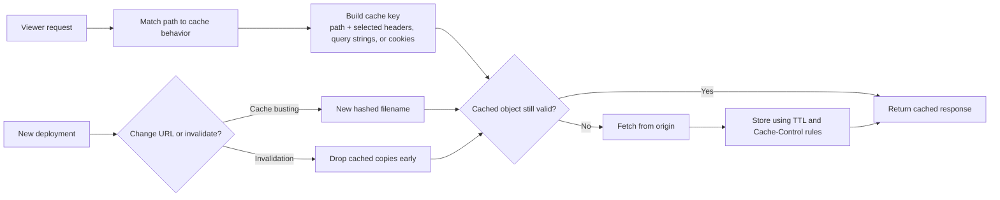
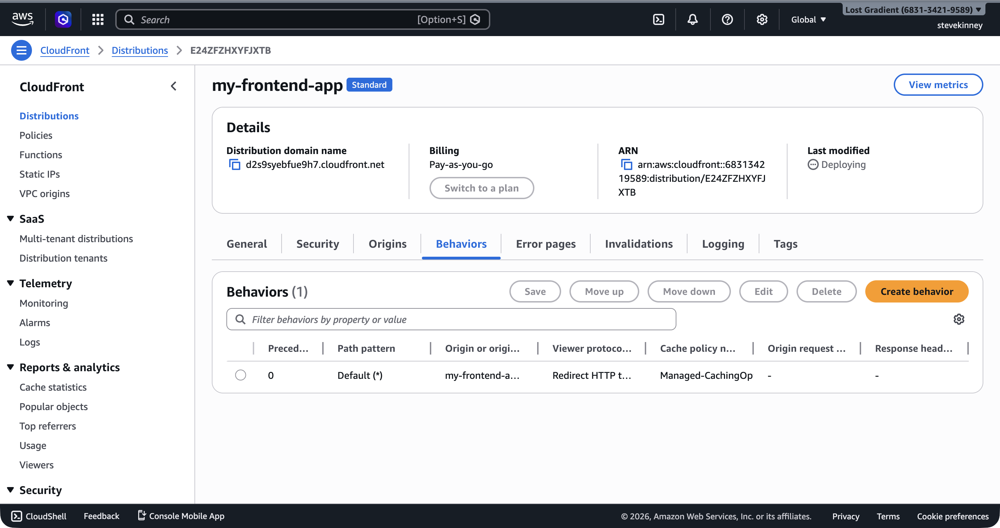
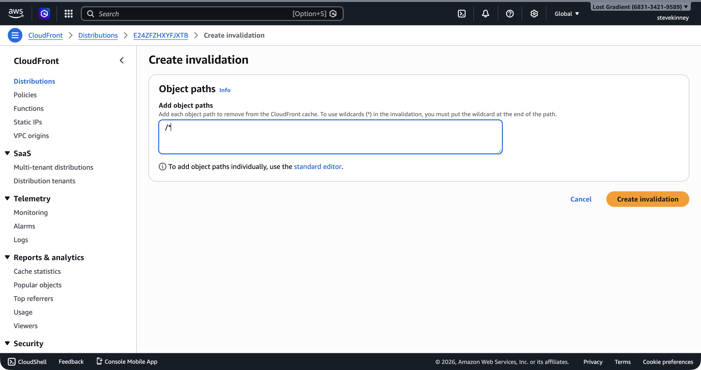
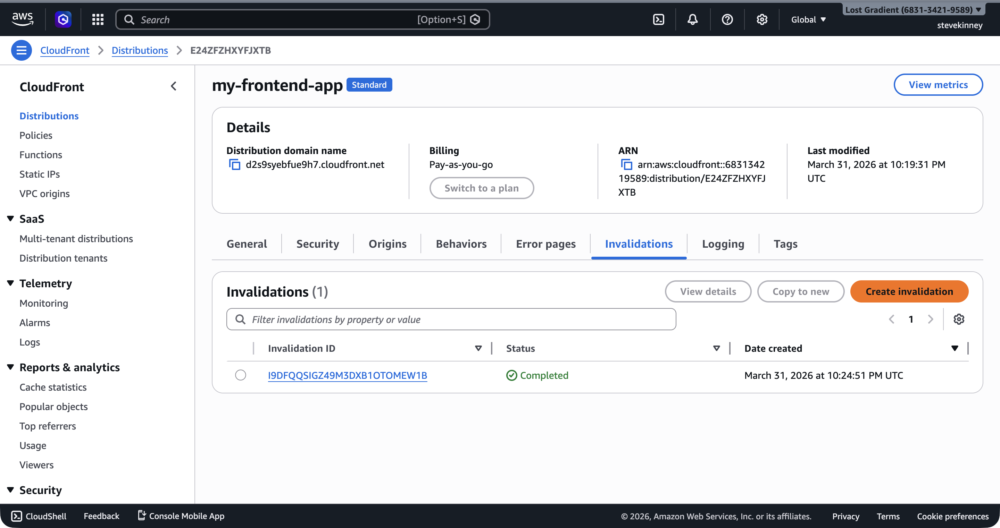

CloudFront's entire value proposition is caching: serve content from edge locations close to users instead of making round trips to your origin. But caching creates a problem you've probably already dealt with—stale content. You deploy a fix, but users still see the old version because the CDN hasn't picked up the change yet.

If you want AWS's exact version of the knobs you're turning here, keep the [cache behavior settings reference](https://docs.aws.amazon.com/AmazonCloudFront/latest/DeveloperGuide/DownloadDistValuesCacheBehavior.html), the [CloudFront invalidation guide](https://docs.aws.amazon.com/AmazonCloudFront/latest/DeveloperGuide/Invalidation.html), and the [`aws cloudfront create-invalidation` command reference](https://docs.aws.amazon.com/cli/latest/reference/cloudfront/create-invalidation.html) open.

On Vercel, the platform handles cache busting for you. On AWS, you manage it. That means understanding cache behaviors, TTLs, and invalidation strategies.



## How CloudFront Decides What to Cache

Every request to your CloudFront distribution is evaluated against a set of rules called **cache behaviors**. Each behavior defines:

- **Path pattern**: Which URLs this behavior applies to (e.g., `*.html`, `/api/*`, or `*` for everything).
- **Cache policy**: How long content is cached and what factors make a cached response unique.
- **Origin**: Which origin to fetch content from on a cache miss.
- **Viewer protocol policy**: Whether to allow HTTP, HTTPS, or redirect HTTP to HTTPS.

Every distribution has a **default cache behavior** (`*`) that applies to all requests not matched by a more specific behavior. For a static site, the default behavior is often all you need.

In the console, the **Behaviors** tab lists all cache behaviors for your distribution with their path patterns, origins, and attached policies.



## Cache Policies and TTLs

A **cache policy** controls three TTL values that determine how long CloudFront caches an object:

| Setting         | CachingOptimized Default      | What It Does                                                                                                     |
| --------------- | ----------------------------- | ---------------------------------------------------------------------------------------------------------------- |
| **Minimum TTL** | 1 second                      | The floor. CloudFront caches content for at least this long, even if the origin sends `Cache-Control: no-cache`. |
| **Default TTL** | 86,400 seconds (24 hours)     | Used when the origin doesn't send `Cache-Control` or `Expires` headers.                                          |
| **Maximum TTL** | 31,536,000 seconds (365 days) | The ceiling. Even if the origin sends `Cache-Control: max-age=999999999`, CloudFront caps caching at this value. |

The managed **CachingOptimized** policy (ID: `658327ea-f89d-4fab-a63d-7e88639e58f6`) that you attached in [Creating a CloudFront Distribution](creating-a-cloudfront-distribution.md) uses these defaults. For most static sites, these values are sensible—your content is cached for 24 hours unless your origin specifies otherwise.

### How TTLs Interact with Origin Headers

CloudFront doesn't blindly cache everything for the default TTL. It respects `Cache-Control` headers from your origin (S3), within the bounds of the min and max TTLs:

- Origin sends `Cache-Control: max-age=3600` (1 hour): CloudFront caches for 1 hour (between min and max, so it's honored).
- Origin sends `Cache-Control: max-age=0`: CloudFront caches for 1 second (the minimum TTL overrides).
- Origin sends no `Cache-Control` header: CloudFront caches for 24 hours (the default TTL).
- Origin sends `Cache-Control: max-age=63072000` (2 years): CloudFront caches for 365 days (the maximum TTL caps it).

> [!TIP]
> You can set `Cache-Control` headers on your S3 objects when uploading them. This gives you per-file control over caching: cache `index.html` for 60 seconds (so users get updates quickly), but cache hashed assets like `main.a1b2c3.js` for a year (they're immutable—the filename changes when the content changes).

```bash
# Short cache for HTML files
aws s3 cp ./build/index.html s3://my-frontend-app-assets/index.html \
  --cache-control "public, max-age=60" \
  --content-type "text/html" \
  --region us-east-1

# Long cache for hashed assets
aws s3 sync ./build/assets s3://my-frontend-app-assets/assets \
  --cache-control "public, max-age=31536000, immutable" \
  --region us-east-1
```

## Cache Keys

CloudFront uses a **cache key** to determine whether a cached response can serve a given request. By default, the cache key consists of the URL path and the `Host` header. Two requests to the same path produce the same cache key and get the same cached response.

You can expand the cache key to include:

- **Query strings**: `?v=2` and `?v=3` would be cached separately.
- **Request headers**: Different responses for `Accept-Encoding: gzip` vs. `Accept-Encoding: br`.
- **Cookies**: Different responses for authenticated vs. anonymous users.

For a static site, the default cache key (URL path only) is exactly right. You don't want query strings, headers, or cookies fragmenting your cache. Every request for `/index.html` should get the same cached response regardless of query parameters or cookies.

## Custom Cache Behaviors

Sometimes you need different caching rules for different paths. Common examples:

- **HTML files**: Cache briefly (60 seconds) so users get updates quickly.
- **Hashed JS/CSS files**: Cache aggressively (1 year) because the filename changes when the content changes.
- **API proxy**: Don't cache at all (if you're routing API requests through CloudFront).

You add custom behaviors by updating the distribution config. Each behavior has a path pattern and its own cache policy:

```json
{
  "CacheBehaviors": {
    "Quantity": 1,
    "Items": [
      {
        "PathPattern": "/assets/*",
        "TargetOriginId": "S3-my-frontend-app-assets",
        "ViewerProtocolPolicy": "redirect-to-https",
        "CachePolicyId": "658327ea-f89d-4fab-a63d-7e88639e58f6",
        "Compress": true,
        "AllowedMethods": {
          "Quantity": 2,
          "Items": ["GET", "HEAD"],
          "CachedMethods": {
            "Quantity": 2,
            "Items": ["GET", "HEAD"]
          }
        }
      }
    ]
  }
}
```

CloudFront evaluates behaviors in order, from most specific to least specific. The first behavior whose path pattern matches the request wins. The default behavior (`*`) is always evaluated last.

For most frontend deployments, you don't need custom cache behaviors. The combination of the CachingOptimized cache policy and per-file `Cache-Control` headers on your S3 objects gives you enough control. Custom behaviors become useful when you start routing different paths to different origins (e.g., `/api/*` goes to API Gateway while `/*` goes to S3).

## Cache Invalidations

When you deploy new content to S3, the old versions might still be cached at CloudFront edge locations. You have two options for getting the new content to users: **cache invalidation** and **cache busting**.

### Invalidation: Tell CloudFront to Drop Cached Copies

An invalidation tells CloudFront to remove specific objects from all edge caches before their TTL expires. The next request for those objects will be a cache miss, and CloudFront will fetch the latest version from S3.

```bash
aws cloudfront create-invalidation \
  --distribution-id E1A2B3C4D5E6F7 \
  --paths "/index.html" "/about/index.html" \
  --region us-east-1 \
  --output json
```

You can also invalidate everything:

```bash
aws cloudfront create-invalidation \
  --distribution-id E1A2B3C4D5E6F7 \
  --paths "/*" \
  --region us-east-1 \
  --output json
```

The response includes an invalidation ID you can use to check status:

```json
{
  "Invalidation": {
    "Id": "I1EXAMPLE",
    "Status": "InProgress",
    "CreateTime": "2026-03-18T12:00:00Z",
    "InvalidationBatch": {
      "Paths": {
        "Quantity": 1,
        "Items": ["/*"]
      },
      "CallerReference": "cli-1710763200"
    }
  }
}
```

Invalidations typically complete within a few minutes.

In the console, the **Invalidations** tab lets you create invalidations by entering object paths. The `/*` wildcard invalidates everything in one operation.



Once CloudFront finishes propagating the invalidation to all edge locations, the status changes to **Completed**.



### Invalidation Costs

The first 1,000 invalidation paths per month are free. After that, each path costs $0.005. A `/*` wildcard counts as one path. Individual file paths count as one path each.

> [!WARNING]
> Invalidating `/*` after every deployment is a common pattern, but it's a blunt instrument. It clears everything from the cache—including files that didn't change. If you have a high-traffic site, a full invalidation causes a burst of cache misses across all edge locations. For most frontend projects, this is fine. For sites handling millions of requests per minute, consider targeted invalidations.

### Cache Busting: Change the URL

The alternative to invalidation is **cache busting**—changing the filename so CloudFront treats it as a new object. If your build tool generates hashed filenames (e.g., `main.a1b2c3.js` becomes `main.d4e5f6.js` after a change), the new file has a different cache key. CloudFront fetches it fresh from S3, and the old version naturally expires from cache at the end of its TTL.

Modern frontend build tools (Vite, webpack, Next.js) generate hashed filenames by default for JavaScript and CSS bundles. This is why those files can be cached for a year—the hash changes when the content changes. The only file that doesn't get a hash is `index.html`, because its URL needs to stay stable.

### The Recommended Strategy

For most frontend deployments, the best approach is:

1. **Hashed filenames** for JS, CSS, and image assets. Cache these aggressively with `Cache-Control: max-age=31536000, immutable`.
2. **Short TTL or no-cache** for `index.html`. Either set `Cache-Control: max-age=60` on the S3 object, or rely on invalidations.
3. **Invalidate `/*`** after every deployment. This ensures `index.html` is refreshed immediately, and the hashed assets are fetched fresh if needed (though they would be new URLs anyway).

This is the same strategy Vercel and Netlify use behind the scenes. I've used this pattern on every production deployment I've ever set up on AWS, and it just works. Immutable assets get long-lived cache entries. The HTML entry point gets refreshed on every deploy.

## A Deploy Script

Here's a simple deployment script that ties everything together:

```bash
# Sync hashed assets with long cache
aws s3 sync ./build/assets s3://my-frontend-app-assets/assets \
  --cache-control "public, max-age=31536000, immutable" \
  --region us-east-1 \
  --delete \
  --output json

# Sync HTML files with short cache
aws s3 cp ./build/index.html s3://my-frontend-app-assets/index.html \
  --cache-control "public, max-age=60" \
  --content-type "text/html" \
  --region us-east-1

# Invalidate CloudFront cache
aws cloudfront create-invalidation \
  --distribution-id E1A2B3C4D5E6F7 \
  --paths "/*" \
  --region us-east-1 \
  --output json
```

> [!TIP]
> The `--delete` flag on `aws s3 sync` removes files from S3 that no longer exist in your local build directory. This cleans up old hashed assets. Without it, your bucket accumulates every version of every asset you've ever deployed.

Caching is sorted. But there's another problem: if a user navigates to `/dashboard/settings` in your single-page application, CloudFront asks S3 for a file at that path. S3 doesn't have a file called `/dashboard/settings`, so it returns a 403 or 404 error. In the next lesson, you'll configure custom error responses to handle SPA routing—telling CloudFront to serve `index.html` whenever it encounters one of these errors.
