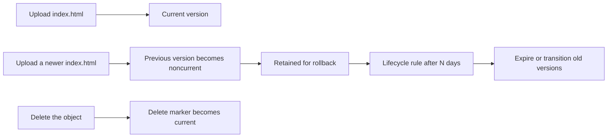
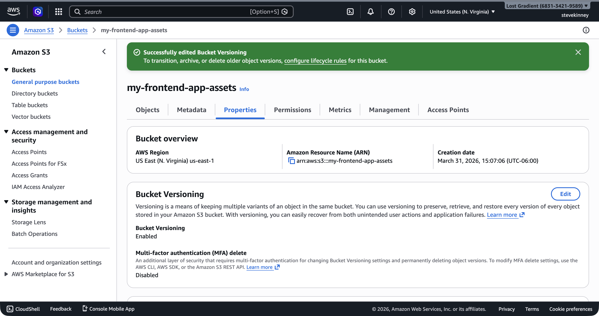
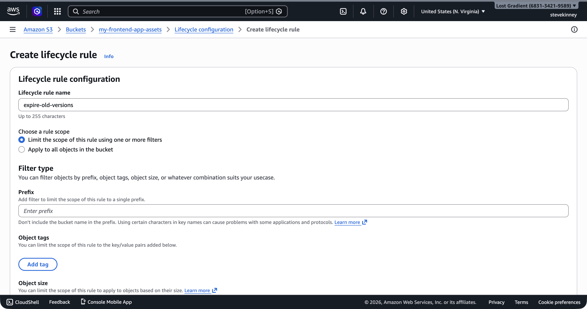

You have a working static site on S3. Now you need to protect it. Every deployment you run overwrites the previous version of your files. If a bad build goes out and you want to roll back, those old files are gone. If someone on your team accidentally runs `aws s3 sync --delete` against the wrong directory, everything is gone. (Ask me how I know.) **Versioning** solves this by keeping every version of every object in the bucket, and **lifecycle rules** keep versioning from running up your storage costs.

If you want the AWS source material next to this lesson, keep the [S3 Versioning guide](https://docs.aws.amazon.com/AmazonS3/latest/userguide/Versioning.html), the [lifecycle rules reference](https://docs.aws.amazon.com/AmazonS3/latest/userguide/intro-lifecycle-rules.html), and the [Amazon S3 pricing page](https://aws.amazon.com/s3/pricing/) handy.

## Why Versioning Matters

Without versioning, S3 is a "last write wins" system. When you upload a new `index.html`, the old one is silently replaced. When you delete `main.js`, it's permanently gone. There's no recycle bin, no undo, no "are you sure?" prompt.

With **versioning** enabled, S3 keeps every version of every object. Upload a new `index.html` and the old version is still there, accessible by its version ID. Delete `index.html` and S3 adds a **delete marker** instead of actually removing the object—the current version becomes invisible, but all previous versions are still retrievable.

This is your safety net. A bad deployment? Roll back to the previous version. Accidental delete? Remove the delete marker. Someone overwrote the wrong file? Every version is still there.



## Enabling Versioning

Enable versioning on your bucket:

```bash
aws s3api put-bucket-versioning \
  --bucket my-frontend-app-assets \
  --versioning-configuration Status=Enabled \
  --region us-east-1
```

Verify it:

```bash
aws s3api get-bucket-versioning \
  --bucket my-frontend-app-assets \
  --region us-east-1 \
  --output json
```

```json
{
  "Status": "Enabled"
}
```

From this point forward, every object you upload gets a version ID, and overwriting or deleting an object preserves the previous versions.



> [!WARNING]
> Versioning can't be disabled once enabled—only suspended. When suspended, new objects are stored without version IDs, but existing versioned objects remain. If you enable versioning, plan to keep it on and use lifecycle rules to manage old versions. Toggling versioning on and off creates a confusing mix of versioned and unversioned objects.

## Working with Versions

After enabling versioning and uploading a file a few times, you can list all versions:

```bash
aws s3api list-object-versions \
  --bucket my-frontend-app-assets \
  --prefix "index.html" \
  --region us-east-1 \
  --output json
```

```json
{
  "Versions": [
    {
      "Key": "index.html",
      "VersionId": "3HL4kqtJvjVBH40Nrjfkd",
      "IsLatest": true,
      "LastModified": "2026-03-18T14:00:00.000Z",
      "Size": 1234
    },
    {
      "Key": "index.html",
      "VersionId": "2LB2z3tPdN2aRFGhK0mRr",
      "IsLatest": false,
      "LastModified": "2026-03-18T12:00:00.000Z",
      "Size": 1180
    }
  ]
}
```

To retrieve a specific version:

```bash
aws s3api get-object \
  --bucket my-frontend-app-assets \
  --key "index.html" \
  --version-id "2LB2z3tPdN2aRFGhK0mRr" \
  --region us-east-1 \
  --output json \
  index-previous.html
```

This downloads the older version to a local file called `index-previous.html`. You can inspect it, diff it against the current version, or re-upload it to roll back.

## The Cost Problem

Versioning is great for safety, but it has a cost: every version of every object takes up storage. If you deploy your frontend three times a day and your build output is 50 MB, that's 150 MB of versioned objects per day—roughly 4.5 GB per month. At S3 Standard pricing ($0.023 per GB per month), that's about $0.10 per month. Not much.

But if you've been running for a year without lifecycle rules, you have 54 GB of old versions sitting around costing you about $1.25 per month. Still not much, but the principle matters: unused data shouldn't accumulate indefinitely. This is where lifecycle rules come in.

## Lifecycle Rules

A **lifecycle rule** tells S3 what to do with objects (or old versions of objects) after a certain number of days. The two most useful actions for frontend deployments:

1. **Transition** old versions to a cheaper storage class
2. **Expire** (delete) old versions after a certain number of days

For a static site, the pragmatic approach is to delete noncurrent versions after a reasonable retention period. You'll rarely need to roll back more than a few days.

### Creating a Lifecycle Rule

Create a lifecycle configuration file:

```json
{
  "Rules": [
    {
      "ID": "DeleteOldVersions",
      "Status": "Enabled",
      "Filter": {
        "Prefix": ""
      },
      "NoncurrentVersionExpiration": {
        "NoncurrentDays": 30
      }
    }
  ]
}
```

This rule applies to all objects in the bucket (empty prefix means everything) and deletes noncurrent versions after 30 days. Current (latest) versions are never affected by this rule.

In the console, the **Create lifecycle rule** form on the bucket's **Management** tab lets you configure the same rule visually—giving it a name, setting the scope, and choosing the expiration action.



Apply it:

```bash
aws s3api put-bucket-lifecycle-configuration \
  --bucket my-frontend-app-assets \
  --lifecycle-configuration file://lifecycle.json \
  --region us-east-1
```

Verify it:

```bash
aws s3api get-bucket-lifecycle-configuration \
  --bucket my-frontend-app-assets \
  --region us-east-1 \
  --output json
```

> [!TIP]
> Thirty days is a reasonable default for frontend deployments. You get a full month of rollback capability without accumulating years of old versions. If your deployment frequency is high and you're confident in your CI/CD pipeline, you could reduce this to 7 or 14 days.

### A More Advanced Rule

If you want to save a bit more before deleting, you can transition old versions to a cheaper storage class first:

```json
{
  "Rules": [
    {
      "ID": "ManageOldVersions",
      "Status": "Enabled",
      "Filter": {
        "Prefix": ""
      },
      "NoncurrentVersionTransitions": [
        {
          "NoncurrentDays": 30,
          "StorageClass": "STANDARD_IA"
        }
      ],
      "NoncurrentVersionExpiration": {
        "NoncurrentDays": 90
      }
    }
  ]
}
```

This moves noncurrent versions to **S3 Standard-IA** (Infrequent Access) after 30 days, then deletes them after 90 days. Standard-IA costs about $0.0125 per GB per month—roughly half the price of Standard storage. For a frontend site, the savings are tiny, but the pattern is worth knowing for when you're managing buckets with more data.

## Understanding S3 Pricing

S3 pricing has three components:

**Storage.** You pay for the total volume of data stored. S3 Standard costs $0.023 per GB per month for the first 50 TB. For a typical frontend application with a 50 MB build output and 30 days of versioned history, your monthly storage cost is well under $1.

**Requests.** You pay per request. PUT, COPY, POST, and LIST requests cost $0.005 per 1,000 requests. GET and SELECT requests cost $0.0004 per 1,000 requests. For a low-to-moderate-traffic static site, this is pennies.

**Data transfer.** You pay for data transferred out of S3 to the internet. The first 100 GB per month is free. After that, it's $0.09 per GB for the next 10 TB. For most frontend sites, you'll stay well within the free tier—especially once you put CloudFront in front of S3, because CloudFront serves cached content from its edge locations instead of hitting S3 for every request.

> [!TIP]
> The AWS Free Tier includes 5 GB of S3 Standard storage, 20,000 GET requests, and 2,000 PUT requests per month for the first 12 months. A personal project or course exercise will comfortably fit within these limits.

## Storage Classes at a Glance

S3 offers several **storage classes** with different price and access characteristics. For frontend deployments, you'll almost exclusively use S3 Standard, but here's the landscape:

| Storage Class                 | Cost per GB/month | Use Case                                      |
| ----------------------------- | ----------------- | --------------------------------------------- |
| S3 Standard                   | $0.023            | Frequently accessed data (your current build) |
| S3 Standard-IA                | $0.0125           | Infrequently accessed (old versions)          |
| S3 One Zone-IA                | $0.01             | Infrequent, no need for multi-AZ resilience   |
| S3 Glacier Flexible Retrieval | $0.0036           | Archive (retrieval takes minutes to hours)    |
| S3 Glacier Deep Archive       | $0.00099          | Long-term archive (retrieval takes hours)     |

For this course, you only need Standard and possibly Standard-IA for lifecycle transitions. The Glacier classes are for archival workloads that don't need fast access—not for serving a website.

## What You Have Built

At this point, you have a complete S3 static site setup:

- A bucket in `us-east-1` with a globally unique name
- Build files uploaded via `aws s3 sync`
- A bucket policy granting public read access
- Static website hosting enabled with index and error documents
- Versioning enabled to protect against accidental overwrites
- A lifecycle rule to clean up old versions after 30 days

This is a working, publicly accessible website. It's HTTP-only, served from a single region, and uses an ugly S3 endpoint URL—but it works. More importantly, you now understand the storage layer well enough to stop treating it like magic.

Next, you're going to switch to the domain side of the story: how to control a domain, how Route 53 becomes authoritative for it, and why that has to exist before ACM validation can work cleanly. Then you'll come back and build the production path on top of this S3 foundation.
