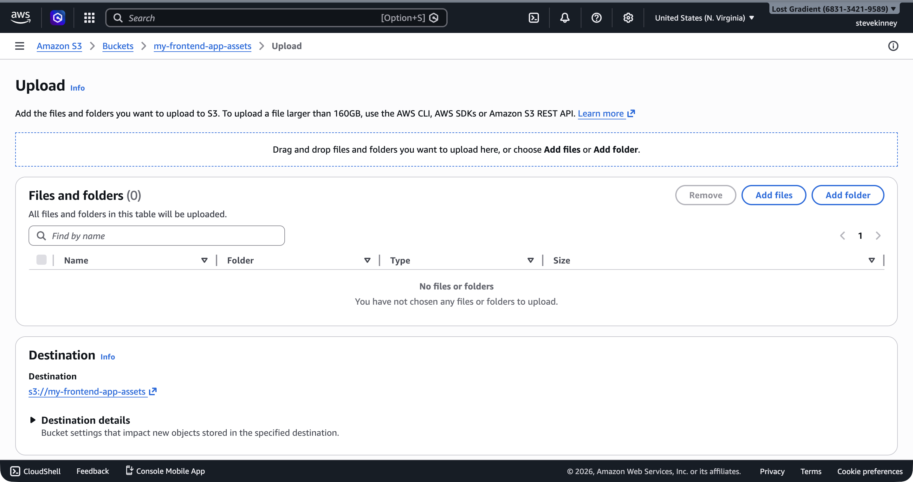
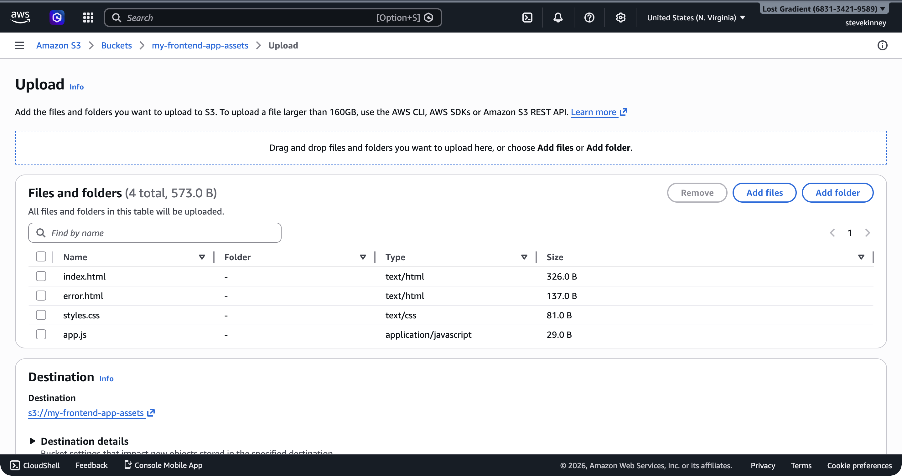
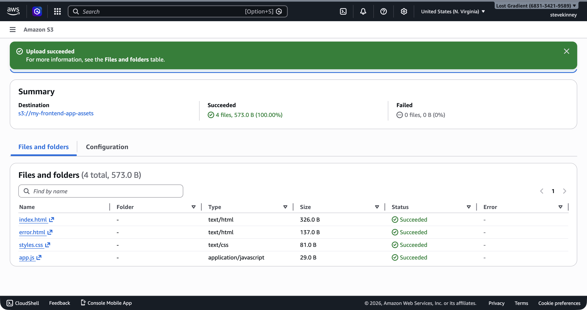
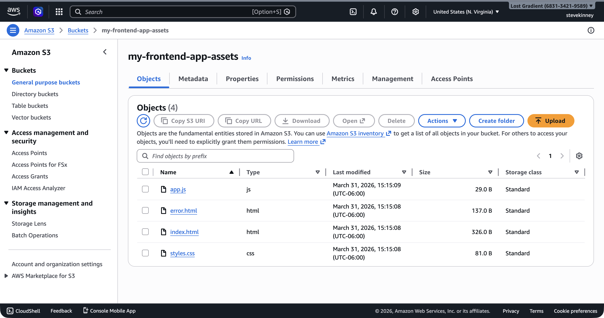
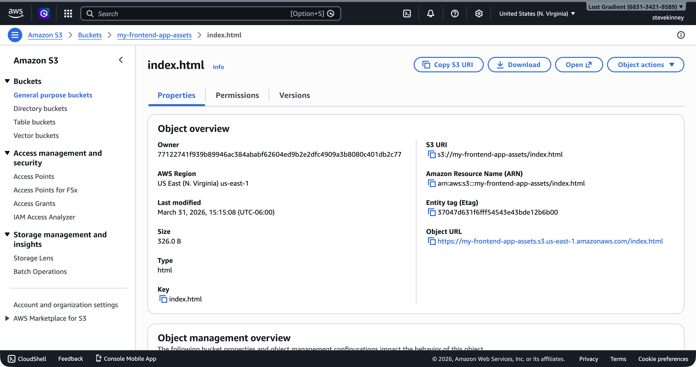

You have a bucket. Now you need files in it. This is your `npm run build` output going to the cloud—the HTML, CSS, JavaScript, and images that make up your frontend application. The AWS CLI gives you two primary commands for getting files into S3: `aws s3 cp` for copying individual files and `aws s3 sync` for keeping a local directory and a bucket in sync. Both are essential, and knowing when to use each saves you time and bandwidth.

If you want the AWS version of the command surface nearby, keep the [Amazon S3 User Guide](https://docs.aws.amazon.com/AmazonS3/latest/userguide/Welcome.html) and the [`aws s3 sync` command reference](https://docs.aws.amazon.com/cli/latest/reference/s3/sync.html) open.

## Copying Files with `aws s3 cp`

The `cp` command works the way you would expect—it copies a file from one place to another. You can copy from your local machine to S3, from S3 to your local machine, or from one S3 location to another.

Upload a single file:

```bash
aws s3 cp ./build/index.html s3://my-frontend-app-assets/index.html \
  --region us-east-1
```

Upload an entire directory by adding the `--recursive` flag:

```bash
aws s3 cp ./build/ s3://my-frontend-app-assets/ \
  --recursive \
  --region us-east-1
```

This copies every file in your local `build/` directory to the root of your S3 bucket, preserving the directory structure. If your build output looks like this:

```
build/
├── index.html
├── assets/
│   ├── main.js
│   ├── main.css
│   └── logo.png
└── favicon.ico
```

The resulting S3 objects will have these keys:

- `index.html`
- `assets/main.js`
- `assets/main.css`
- `assets/logo.png`
- `favicon.ico`

Remember: there's no actual `assets/` folder in S3. The forward slash is part of the key string. But every tool—the CLI, the console, the SDK—treats it as a virtual folder, and for practical purposes that's all you need to know.

## Syncing with `aws s3 sync`

The `sync` command is what you'll use for deployments. Unlike `cp`, it only uploads files that have changed—it compares file sizes and timestamps between your local directory and the bucket, and only transfers the differences.

```bash
aws s3 sync ./build s3://my-frontend-app-assets \
  --region us-east-1
```

Run this after every build and only the files that changed will be uploaded. On a typical deployment where you changed a few components, this means uploading a handful of JavaScript chunks instead of the entire build directory.

### The `--delete` Flag

By default, `sync` doesn't remove files from S3 that no longer exist locally. If you renamed a file or removed a page, the old version stays in the bucket. The `--delete` flag fixes this:

```bash
aws s3 sync ./build s3://my-frontend-app-assets \
  --region us-east-1 \
  --delete
```

This makes the S3 bucket an exact mirror of your local `build/` directory. Files that exist in the bucket but not locally are removed.

> [!WARNING]
> The `--delete` flag permanently removes objects from S3. If you don't have versioning enabled (we'll cover this in [S3 Versioning, Lifecycle, and Cost](s3-versioning-lifecycle-and-cost.md)), those files are gone. Always double-check that you're syncing the right directory before using `--delete` in production.

### The `--exclude` and `--include` Flags

Sometimes you want to sync most of your build output but exclude certain files—maybe a `.DS_Store` that macOS leaves behind, or a `sourcemap` you don't want publicly accessible:

```bash
aws s3 sync ./build s3://my-frontend-app-assets \
  --region us-east-1 \
  --delete \
  --exclude "*.map" \
  --exclude ".DS_Store"
```

## Content Types Matter

Here's the gotcha that trips up every frontend engineer the first time they deploy to S3: **content types**. When you upload a file to S3, the CLI guesses the MIME type based on the file extension. It gets most of them right—`.html` becomes `text/html`, `.css` becomes `text/css`, `.js` becomes `application/javascript`. But it doesn't always guess correctly, especially for newer file formats like `.woff2`, `.webp`, or `.mjs`.

If S3 serves a JavaScript file with the wrong content type, the browser will refuse to execute it. You'll see an error in the console like "Refused to execute script because its MIME type is not an executable MIME type." I've spent more time than I'd like to admit debugging this exact issue.

You can set the content type explicitly when uploading:

```bash
aws s3 cp ./build/assets/main.js s3://my-frontend-app-assets/assets/main.js \
  --content-type "application/javascript" \
  --region us-east-1
```

For bulk uploads, you can combine `--exclude` and `--include` with `--content-type` to handle specific file types:

```bash
aws s3 sync ./build s3://my-frontend-app-assets \
  --region us-east-1 \
  --exclude "*.js" \
  --delete

aws s3 sync ./build s3://my-frontend-app-assets \
  --region us-east-1 \
  --exclude "*" \
  --include "*.js" \
  --content-type "application/javascript"
```

> [!TIP]
> In practice, the CLI's MIME type guessing works fine for the most common frontend file types. You typically only need to override content types for edge cases. But if your site loads and your JavaScript isn't executing, check the content type first—it's almost always the problem.

## Organizing Files with Key Prefixes

S3 doesn't have real directories, but **key prefixes** give you a way to organize objects that works well enough. Most frontend build tools already output files into a sensible structure, and that structure translates directly to S3 keys.

A common pattern for frontend deployments:

```
my-frontend-app-assets/
├── index.html
├── assets/
│   ├── main.a1b2c3d4.js
│   ├── main.e5f6g7h8.css
│   └── vendor.i9j0k1l2.js
├── images/
│   ├── logo.png
│   └── hero.webp
└── fonts/
    ├── inter.woff2
    └── mono.woff2
```

The hashed filenames (`main.a1b2c3d4.js`) are important. Most frontend build tools (Vite, webpack, Next.js) add content hashes to filenames so that when you deploy a new version, the new files have different names and the old cached files don't interfere. This is called **cache busting**, and it plays nicely with S3 and CloudFront's caching behavior.

### Listing Objects by Prefix

You can list all objects under a specific prefix:

```bash
aws s3 ls s3://my-frontend-app-assets/assets/ \
  --region us-east-1
```

Or get a detailed listing with the `s3api` command:

```bash
aws s3api list-objects-v2 \
  --bucket my-frontend-app-assets \
  --prefix "assets/" \
  --region us-east-1 \
  --output json
```

```json
{
  "Contents": [
    {
      "Key": "assets/main.a1b2c3d4.js",
      "LastModified": "2026-03-18T12:00:00.000Z",
      "Size": 245678,
      "StorageClass": "STANDARD"
    },
    {
      "Key": "assets/main.e5f6g7h8.css",
      "LastModified": "2026-03-18T12:00:00.000Z",
      "Size": 34567,
      "StorageClass": "STANDARD"
    }
  ]
}
```

## Uploading from the Console

The AWS console works fine for uploading a file or two during development. Navigate to S3, click your bucket, click "Upload," and drag your files in. The console even lets you set metadata (including content type) per file.



After dropping your files in, the upload dialog queues them for review before you click **Upload**.



Once the upload completes, the console shows a success summary and you can see all four files listed in the bucket's **Objects** tab.





You can also inspect an individual object to check its content type. Click any file in the Objects tab to open its detail page, then scroll to **Metadata**.



But don't rely on the console for deployments. It's slow, error-prone, and impossible to automate. The CLI is the right tool for anything you'll do more than once—and later in this course, you'll automate the entire deployment process with the CLI and GitHub Actions.

## A Deployment Script

Here's a practical deployment pattern that combines what you've learned. After running your build, sync the output to S3:

```bash
# Build the frontend
npm run build

# Sync to S3, removing old files
aws s3 sync ./build s3://my-frontend-app-assets \
  --region us-east-1 \
  --delete \
  --exclude ".DS_Store"
```

That's a two-command deployment. Not quite as slick as `git push` to Vercel, but you have full control over what gets uploaded, where it goes, and how it's served. And when you add CloudFront invalidation to this script in the CloudFront section, you'll have a deployment pipeline that rivals anything Vercel or Netlify provides, except you own every piece of it.

Your files are in the bucket, but nobody can see them yet. The bucket is locked down by default with Block Public Access enabled. Next, you'll write a **bucket policy** that grants public read access to your static assets—and understand how bucket policies relate to the IAM policies you wrote in [Writing Your First IAM Policy](writing-your-first-iam-policy.md).
