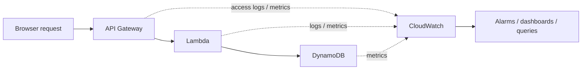
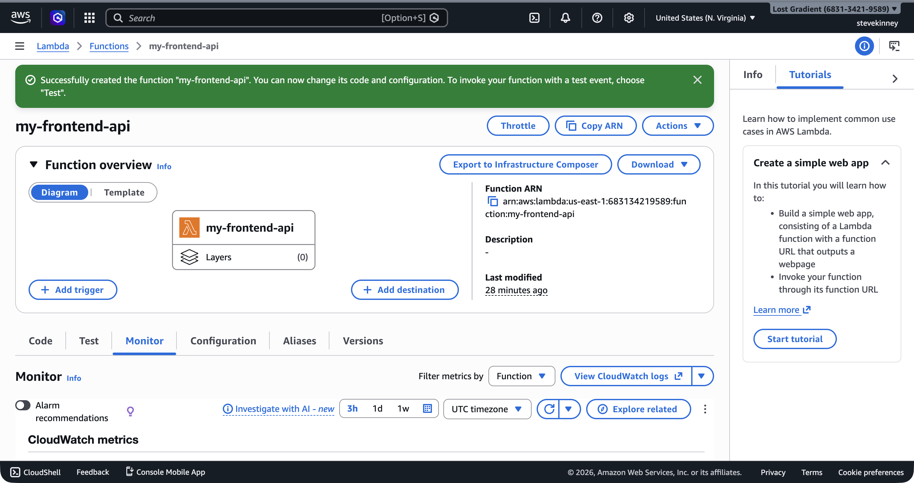

The Summit Supply storefront is live, people are clicking around, and now the worst kind of bug shows up: "I clicked the button and nothing happened." No stack trace. No obvious repro. Just vibes and disappointment. This is the part where monitoring stops feeling like enterprise garnish and starts feeling like the only way you get your evening back.

If you want AWS's canonical framing for the service while you read, the [CloudWatch overview](https://docs.aws.amazon.com/AmazonCloudWatch/latest/monitoring/WhatIsCloudWatch.html) is the official reference.

On Vercel, you get a dashboard. You can see your function invocations, check error rates, and read logs—all in one place, with zero configuration. AWS gives you the same capabilities through **CloudWatch**, but with more power and more to configure. CloudWatch is the monitoring and observability service that collects data from every AWS service you've built in this course—Lambda, API Gateway, DynamoDB, S3, CloudFront—and gives you a single place to watch what's happening.

You've already seen CloudWatch in passing. Back in [What is Lambda?](what-is-lambda.md), you learned that `console.log` output goes to CloudWatch Logs. In this module, you're going to learn how to actually use that data: how to search logs, track metrics, set up alarms, and trace requests across your entire stack.

## Why This Matters

Logs, metrics, and alarms are how the backend becomes observable instead of mysterious. Once your frontend depends on a Lambda function, an API Gateway route, and a DynamoDB table, "it works on my machine" is no longer a serious debugging plan. You need a record of what happened, where it happened, and whether it is getting worse.

## Builds On

- [What Lambda Is and Why Frontend Engineers Care](what-is-lambda.md)
- [Creating an HTTP API](creating-an-http-api.md)
- [What DynamoDB Is and When to Use It](what-is-dynamodb.md)



## The Three Pillars

CloudWatch organizes observability around three concepts: **logs**, **metrics**, and **alarms**. These aren't unique to AWS—they're the same three pillars you'll find in any observability platform (Datadog, New Relic, Grafana). AWS just happens to bake them into the platform itself.

### Logs

Logs are the raw text output from your services. When your Lambda function runs `console.log('Processing request')`, that string ends up in CloudWatch Logs. When API Gateway receives a request, it can log the request details. Every AWS service that produces output writes it to CloudWatch Logs.

Logs are organized into **log groups** and **log streams**. A log group is a container—usually one per service resource (your Lambda function gets `/aws/lambda/my-frontend-app-api`). A log stream is a sequence of events within that group, typically one per execution environment or instance.

If you've ever opened the browser DevTools console to debug a frontend issue, CloudWatch Logs is the same idea for your backend. Except instead of `console.log` disappearing when you close the tab, CloudWatch stores everything and lets you search through it.

### Metrics

**Metrics** are numeric measurements published at regular intervals. Lambda publishes how many times your function was invoked, how long each invocation took, and how many failed. API Gateway publishes request counts, latency percentiles, and error rates. DynamoDB publishes read and write throughput, throttled requests, and consumed capacity.

These metrics are published automatically—you don't have to configure anything. The moment you deployed your Lambda function in [Deploying and Testing a Lambda Function](deploying-and-testing-a-lambda-function.md), Lambda started pushing `Invocations`, `Errors`, `Duration`, and `Throttles` metrics to CloudWatch.

Metrics are time-series data. You can graph them, aggregate them over time windows, and compare them across services. This is how you answer questions like "is my API getting slower?" or "are errors increasing after my last deployment?"

The Lambda function's **Monitor** tab gives you a quick view of these metrics in the console—invocation counts, error counts, and duration percentiles over configurable time windows.



### Alarms

An **alarm** watches a single metric and triggers an action when that metric crosses a threshold. The most common action is sending a notification—"your Lambda error rate exceeded 5% for three consecutive minutes, here's an email."

Alarms have three states:

- **OK**: The metric is within the threshold.
- **ALARM**: The metric has crossed the threshold for the specified number of evaluation periods.
- **INSUFFICIENT_DATA**: CloudWatch doesn't have enough data to determine the state. This is the initial state of every new alarm and is also common when a function hasn't been invoked recently.

Alarms connect to **SNS topics** (Simple Notification Service) to deliver notifications. An SNS topic is a channel—you subscribe your email address to the topic, and when an alarm fires, SNS sends you an email. You'll set this up in [CloudWatch Alarms and SNS](cloudwatch-alarms-and-sns.md).

## How Services Publish to CloudWatch

Here's what makes CloudWatch different from bolting on a third-party monitoring tool: AWS services publish to CloudWatch automatically. You don't install an agent, you don't add a library, and you don't configure an API key. The data just flows.

| Service     | What It Publishes                                                                                               | Where to Find It                                                      |
| ----------- | --------------------------------------------------------------------------------------------------------------- | --------------------------------------------------------------------- |
| Lambda      | Logs (`console.log` output), metrics (`Invocations`, `Errors`, `Duration`, `Throttles`, `ConcurrentExecutions`) | Log group: `/aws/lambda/my-frontend-app-api`, Namespace: `AWS/Lambda` |
| API Gateway | Access logs (if enabled), metrics (`Count`, `4XXError`, `5XXError`, `Latency`, `IntegrationLatency`)            | Namespace: `AWS/ApiGateway`                                           |
| DynamoDB    | Metrics (`ConsumedReadCapacityUnits`, `ConsumedWriteCapacityUnits`, `ThrottledRequests`, `SystemErrors`)        | Namespace: `AWS/DynamoDB`                                             |
| CloudFront  | Metrics (`Requests`, `BytesDownloaded`, `4xxErrorRate`, `5xxErrorRate`)                                         | Namespace: `AWS/CloudFront`                                           |
| S3          | Metrics (`NumberOfObjects`, `BucketSizeBytes`), access logs (if enabled)                                        | Namespace: `AWS/S3`                                                   |

The **namespace** is how CloudWatch organizes metrics by service. When you query metrics, you specify the namespace to tell CloudWatch which service you're asking about. All Lambda metrics live under `AWS/Lambda`, all API Gateway metrics under `AWS/ApiGateway`, and so on.

> [!TIP]
> Lambda logs are always enabled—there's nothing to turn on. API Gateway access logging, on the other hand, requires explicit configuration. For this module, you'll focus on Lambda logs and built-in metrics across all three backend services (Lambda, API Gateway, DynamoDB).

## CloudWatch vs. What You Already Know

If you've used Vercel Analytics or Netlify's function logs, CloudWatch covers the same ground—and more. The tradeoff is configuration.

|            | Vercel/Netlify                      | CloudWatch                                                    |
| ---------- | ----------------------------------- | ------------------------------------------------------------- |
| Logs       | Automatic, visible in dashboard     | Automatic, but you navigate log groups/streams                |
| Metrics    | Pre-built charts in dashboard       | You choose which metrics to graph                             |
| Alerts     | Basic (Vercel has limited alerting) | Fully configurable alarms with multiple notification channels |
| Querying   | Limited search                      | CloudWatch Logs Insights—a full query language                |
| Dashboards | One-size-fits-all                   | You build your own                                            |
| Cost       | Included in your plan               | Free tier is generous, then pay-per-use                       |

The key difference: Vercel gives you opinions. CloudWatch gives you primitives. You get to decide what to monitor, what thresholds to set, and how to be notified. That's more work up front, but it means your monitoring actually matches your application instead of a generic dashboard. Honestly, I've come to prefer this—once you've set up your own alarms and dashboards, the canned metrics from other platforms start to feel like they're answering questions you never asked.

## The CloudWatch Free Tier

CloudWatch has a generous free tier that covers most small-to-medium applications:

- **Logs**: 5 GB of data across ingestion, archive storage, and Logs Insights scanning per month
- **Metrics**: 10 custom or detailed monitoring metrics, plus 1 million API requests per month
- **Dashboards and alarms**: 3 custom dashboards with up to 50 metrics each, plus 10 standard alarm metrics

Built-in metrics from AWS services (the ones in the table above) don't count against your custom metrics quota. You only pay for custom metrics if you publish your own.

> [!WARNING]
> CloudWatch Logs retention defaults to **never expire**. Your logs will accumulate forever, and you'll eventually pay for the storage. In the next lesson, you'll learn how to set a retention policy—30 days is a reasonable default for development, 90 days for production.

## What You'll Build in This Module

Over the next four lessons, you'll:

1. Navigate log groups, implement structured JSON logging in your Lambda function, and query logs with CloudWatch Logs Insights.
2. Identify the key metrics for Lambda, API Gateway, and DynamoDB, and create a CloudWatch dashboard.
3. Create alarms that send you email notifications when error rates spike or latency degrades.
4. Trace a single request from API Gateway through Lambda to DynamoDB using correlation IDs and Insights queries.

By the end of this module, you'll have monitoring coverage across every backend service you've deployed in this course: the Lambda functions from [What Lambda Is and Why Frontend Engineers Care](what-is-lambda.md), the API Gateway endpoints from [Creating an HTTP API](creating-an-http-api.md), and the DynamoDB tables from [What DynamoDB Is and When to Use It](what-is-dynamodb.md).

## Verification

Before moving deeper into the module, make sure CloudWatch is already telling you the truth about one real request:

```bash
aws logs describe-log-groups \
  --log-group-name-prefix /aws/lambda/my-frontend-app-api \
  --region us-east-1 \
  --output json

aws cloudwatch list-metrics \
  --namespace AWS/Lambda \
  --region us-east-1 \
  --output json
```

If those commands return your function's log group and Lambda metrics, the observability pipeline exists. You are not starting from zero. You are learning how to read the signals you already have.

## Common Failure Modes

- **Assuming logs equal observability:** raw `console.log` output is better than nothing, but it turns into a junk drawer fast.
- **Treating metrics like logs:** metrics tell you that the shape of the system changed. They do not tell you why.
- **Skipping retention settings:** CloudWatch's default is "keep it forever," which is a lovely way to buy storage for logs you will never read.
- **Expecting every AWS service to log the same way:** Lambda logs by default. API Gateway access logging requires explicit configuration. DynamoDB mostly shows up as metrics unless you add your own instrumentation around the calls.
