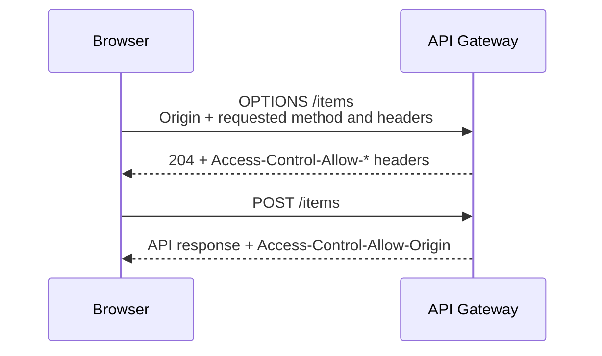
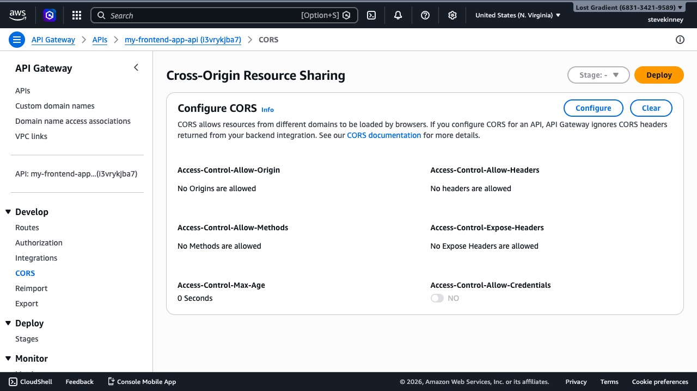
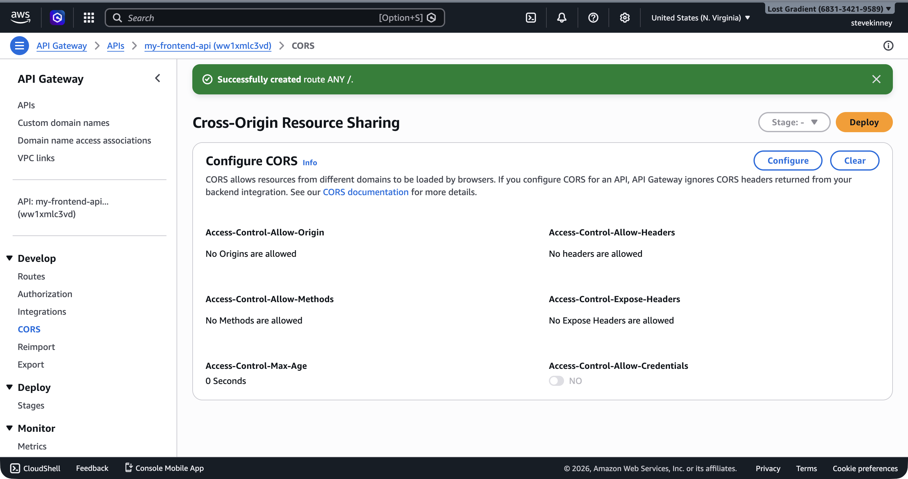

You've fought CORS errors before. Every frontend engineer has stared at `Access-Control-Allow-Origin` errors in the browser console, scrambled to add headers somewhere, and eventually gotten it working through a combination of Stack Overflow answers and blind luck. The difference now: you own the API. You're not waiting for a backend team to fix their headers. You configure CORS yourself, on your own HTTP API, and understand exactly what each setting does.

If you want AWS's exact CORS behavior next to this lesson, the [HTTP API CORS guide](https://docs.aws.amazon.com/apigateway/latest/developerguide/http-api-cors.html) is the official reference.



## Why CORS Exists

Your React app runs on `http://localhost:3000` during development. Your API Gateway endpoint is at `https://abc123def4.execute-api.us-east-1.amazonaws.com`. Different origins. The browser's **same-origin policy** blocks requests between different origins unless the server explicitly allows them with CORS headers.

CORS isn't an API Gateway concept—it's a browser security mechanism. You first encountered it when you configured CORS headers on S3 in [Bucket Policies and Public Access](bucket-policies-and-public-access.md), and again when setting up CloudFront response headers in [CloudFront Headers, CORS, and Security](cloudfront-headers-cors-and-security.md). The mechanics are the same here: the server must return headers that tell the browser "yes, this origin is allowed to call me."

## How Preflight Requests Work

Not every cross-origin request triggers a preflight. Simple GET requests with standard headers go through directly—the browser sends the request and checks the CORS headers on the response. But POST requests with `Content-Type: application/json`, or any request with custom headers like `Authorization`, triggers a **preflight request**: the browser sends an `OPTIONS` request to the same URL first, asking "is this allowed?"

The preflight flow:

1. Your React app calls `fetch('https://your-api.example.com/items', { method: 'POST', headers: { 'Content-Type': 'application/json' }, body: '...' })`
2. The browser sends an `OPTIONS /items` request with `Origin`, `Access-Control-Request-Method`, and `Access-Control-Request-Headers` headers
3. API Gateway responds with `Access-Control-Allow-Origin`, `Access-Control-Allow-Methods`, and `Access-Control-Allow-Headers`
4. If the response headers permit the request, the browser sends the actual `POST /items` request
5. If the response headers don't permit the request, the browser blocks it and you see the CORS error

HTTP APIs handle preflight requests automatically when you configure CORS on the API. You don't need to create an OPTIONS route or write Lambda code to respond to preflight requests. This is one of the advantages of HTTP APIs over REST APIs, where CORS setup requires configuring OPTIONS methods on every resource.

## Configuring CORS on Your HTTP API

By default, your HTTP API has no CORS configuration. In the console, navigating to **CORS** in the left sidebar shows all fields empty—no origins, no methods, no headers allowed.



CORS configuration is a property of the API itself—which is honestly one of my favorite things about HTTP APIs. Use `aws apigatewayv2 update-api` to set it:

```bash
aws apigatewayv2 update-api \
  --api-id abc123def4 \
  --cors-configuration '{"AllowOrigins":["http://localhost:3000","https://example.com"],"AllowMethods":["GET","POST","PUT","DELETE"],"AllowHeaders":["Content-Type","Authorization"],"MaxAge":86400}' \
  --region us-east-1 \
  --output json
```

The response includes the CORS configuration:

```json
{
  "ApiEndpoint": "https://abc123def4.execute-api.us-east-1.amazonaws.com",
  "ApiId": "abc123def4",
  "CorsConfiguration": {
    "AllowHeaders": ["Content-Type", "Authorization"],
    "AllowMethods": ["GET", "POST", "PUT", "DELETE"],
    "AllowOrigins": ["http://localhost:3000", "https://example.com"],
    "MaxAge": 86400
  },
  "Name": "my-frontend-app-api",
  "ProtocolType": "HTTP"
}
```

In the console, the **CORS** section in the left nav shows all six CORS fields with a **Configure** button that opens the settings panel.



### What Each Field Does

**`AllowOrigins`**—The origins that are permitted to call your API. Each value must include the scheme (`http://` or `https://`), hostname, and port (if non-standard). During development, you typically include `http://localhost:3000` (or whatever port your dev server uses). In production, this is your domain: `https://example.com`.

You can use `*` to allow any origin, but don't do this if your API uses authentication. A wildcard origin combined with credentials means any site on the internet can make authenticated requests to your API using your users' tokens.

**`AllowMethods`**—The HTTP methods the browser is allowed to use. List only the methods your API actually supports. If your API only has `GET` and `POST` routes, there's no reason to allow `DELETE`.

**`AllowHeaders`**—The request headers the browser is allowed to send. `Content-Type` and `Authorization` are the two you almost always need. If you use custom headers, add them here.

**`MaxAge`**—How long (in seconds) the browser should cache the preflight response. Setting this to `86400` (24 hours) means the browser only sends one preflight request per endpoint per day, rather than one before every request. This reduces latency and network traffic.

**`ExposeHeaders`**—Response headers that the browser is allowed to read. By default, the browser only exposes a limited set of "safe" response headers to JavaScript. If your API returns custom headers that your frontend needs to read, list them here.

**`AllowCredentials`**—Set to `true` if your API uses cookies or the `Authorization` header with credentials. When this is `true`, `AllowOrigins` can't be `*`—you must list specific origins.

```bash
aws apigatewayv2 update-api \
  --api-id abc123def4 \
  --cors-configuration '{"AllowOrigins":["https://example.com"],"AllowMethods":["GET","POST"],"AllowHeaders":["Content-Type","Authorization"],"AllowCredentials":true,"ExposeHeaders":["X-Request-Id"],"MaxAge":86400}' \
  --region us-east-1 \
  --output json
```

> [!WARNING]
> Setting `AllowCredentials=true` with `AllowOrigins="*"` is rejected by browsers. If you need credentials, you must specify exact origins. This is a browser-enforced rule, not an API Gateway limitation.

## With the SDK

```typescript
import { ApiGatewayV2Client, UpdateApiCommand } from '@aws-sdk/client-apigatewayv2';

const apigw = new ApiGatewayV2Client({ region: 'us-east-1' });

await apigw.send(
  new UpdateApiCommand({
    ApiId: 'abc123def4',
    CorsConfiguration: {
      AllowOrigins: ['https://example.com'],
      AllowMethods: ['GET', 'POST'],
      AllowHeaders: ['Content-Type', 'Authorization'],
      AllowCredentials: true,
      ExposeHeaders: ['X-Request-Id'],
      MaxAge: 86400,
    },
  }),
);
```

## Testing CORS

After configuring CORS, test with `curl` to see the headers API Gateway returns:

```bash
curl -i -X OPTIONS \
  https://abc123def4.execute-api.us-east-1.amazonaws.com/items \
  -H "Origin: http://localhost:3000" \
  -H "Access-Control-Request-Method: POST" \
  -H "Access-Control-Request-Headers: Content-Type"
```

The response should include the CORS headers:

```
HTTP/2 204
access-control-allow-headers: Content-Type, Authorization
access-control-allow-methods: GET, POST, PUT, DELETE
access-control-allow-origin: http://localhost:3000
access-control-max-age: 86400
```

A 204 status with the correct headers means CORS is configured properly. If you see a 403 or missing headers, double-check your `AllowOrigins`—the origin in the request must exactly match one of the allowed origins (including the scheme and port).

## CORS in Your Frontend Code

With CORS configured on the API side, your frontend `fetch` calls work without any special configuration:

```typescript
const response = await fetch('https://abc123def4.execute-api.us-east-1.amazonaws.com/items', {
  method: 'POST',
  headers: { 'Content-Type': 'application/json' },
  body: JSON.stringify({ name: 'TypeScript in Action', price: 29.99 }),
});

const data = await response.json();
```

No `mode: 'cors'` needed—`fetch` uses CORS mode by default for cross-origin requests. No proxy needed. No `no-cors` workaround (which swallows the response body). The CORS headers from API Gateway tell the browser to allow the request.

> [!TIP]
> During local development, you might prefer to use a proxy in your Vite or Next.js dev server to avoid CORS entirely. This works fine for development but masks CORS configuration issues that will surface in production. Test against the real API Gateway endpoint at least once before deploying.

## Development vs. Production Origins

A common pattern is to include both your local development origin and your production domain. Inside the JSON `--cors-configuration` blob, that looks like:

```json
"AllowOrigins": ["http://localhost:3000", "http://localhost:5173", "https://example.com"]
```

Port `3000` is the typical React dev server port. Port `5173` is the default Vite port. Include whichever ports your development tools use.

In a more sophisticated setup, you would use API Gateway stages (covered in [API Gateway Stages and Custom Domains](api-gateway-stages-and-custom-domains.md)) to separate development and production configurations, with different CORS origins per stage. But for getting started, listing all your origins on a single API works fine.

## Common Mistakes

**Including a trailing slash in the origin.** `https://example.com/` isn't the same as `https://example.com`. The origin must match exactly, and browsers send origins without a trailing slash.

**Forgetting to include the port for localhost.** `http://localhost` and `http://localhost:3000` are different origins. If your dev server runs on port 3000, the origin must include `:3000`.

**Setting CORS headers in your Lambda function instead of the API configuration.** For HTTP APIs (which this course uses throughout), this is fragile—you have to handle OPTIONS requests in your handler and remember to include CORS headers in every response. Let API Gateway handle it. That's what the built-in CORS configuration is for.

> [!NOTE] REST APIs are different
> If you later find yourself on a REST API (the older API Gateway flavor) or a non-proxy integration, CORS is configured differently: there's no `--cors-configuration` flag, and you'll need to configure an OPTIONS method per resource and either enable the CORS helpers in the console or set headers in the method response mapping. The rule "don't put CORS in the handler" still holds, but the place to put it moves.

Your API is callable from your frontend. But right now it has a single URL: the auto-generated `execute-api` endpoint. You probably want a custom domain like `api.example.com`, and you might want separate environments for development and production. The next lesson covers stages, deployments, and custom domain names.
